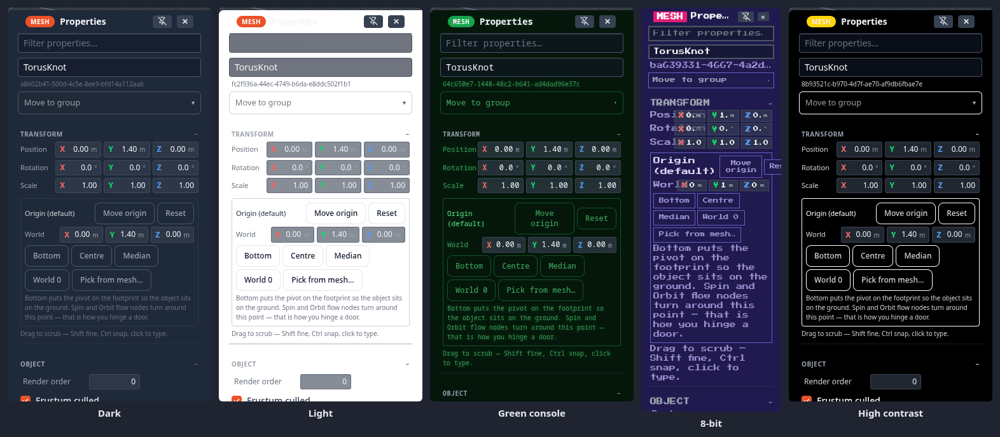

# Themes & Appearance

How the app's own interface looks is a choice **for this device only** — your theme is never sent to anyone, and the 3D
viewport keeps following the scene's environment (sky, background, grid), whatever the theme.

## Choosing a theme

**Settings ▸ Interface ▸ Appearance ▸ Theme** has five built-in themes:

| Theme | Look |
|---|---|
| **Dark** | the default — dark grey panels, blue accents |
| **Light** | light panels and dark text |
| **Green console** | green-on-black, like an old terminal |
| **8-bit** | a retro palette |
| **High contrast** | strong borders and maximum text contrast, for readability |

Since 1.21 every theme is checked for readable contrast: the Profiler's numbers, the number fields, the Explorer's
sidebar, the shader and node editors and the light theme's drawers all keep their text legible (at least 4.5:1 for the
Profiler's text).

The theme applies at once and is remembered on this device; a built-in theme is painted before the first frame on the
next visit, so it never flashes the default. Icons follow the theme's colours too.

## Making your own theme

**Settings ▸ Interface ▸ Appearance ▸ Custom theme**:

1. **Export template** downloads the active theme as an editable `.theme.json` — every colour the interface uses, by
   name (surfaces, fields, text, muted text, borders, accents, menus, scrollbars…). Since 1.21 a theme also carries
   **state colours** — `--ink-bad`, `--ink-warn`, `--ink-good` for error, warning and good text, and `--accent-fill` /
   `--on-accent` for a filled accent chip and the text on it, and a custom theme may set them.
2. Change the colours in any text editor.
3. **Browse…** loads it back. It appears in the **Theme** list under its own name, and as a chip under *Custom theme*;
   the chip's **✕** removes it.

Custom themes are saved in this browser. To use one on another device, copy the `.theme.json` across and load it there.

## Other things that are yours to set

- **Line colours** — the wireframe, the selection outline and the Edit Mesh overlay: **Settings ▸ Scene ▸ Wireframe &
  outline** (see [Mesh Editing](mesh-editing.md#display)).
- **Render mode** — Shaded, Shaded + AO or Wireframe, per device: see [Camera & View](camera.md#render-mode-view).
- **Toolbar** — which buttons the bottom bar shows, in what order and where: see [The toolbar](controls.md#the-toolbar).
- **FPS and draw calls** — a small counter in any mode: **Settings ▸ Interface ▸ Viewport ▸ Show FPS + draw calls**.

- **Text selection** — menus and panels do not select text when you drag across them;
  **Settings ▸ Interface ▸ Allow text selection everywhere** turns it back on (see [Text selection](controls.md#text-selection)).

!!! tip "Finding a setting"
    The search box at the top of Settings matches row names, groups, sections and keywords — search **dark** for the
    theme. <kbd>Esc</kbd> clears it.
