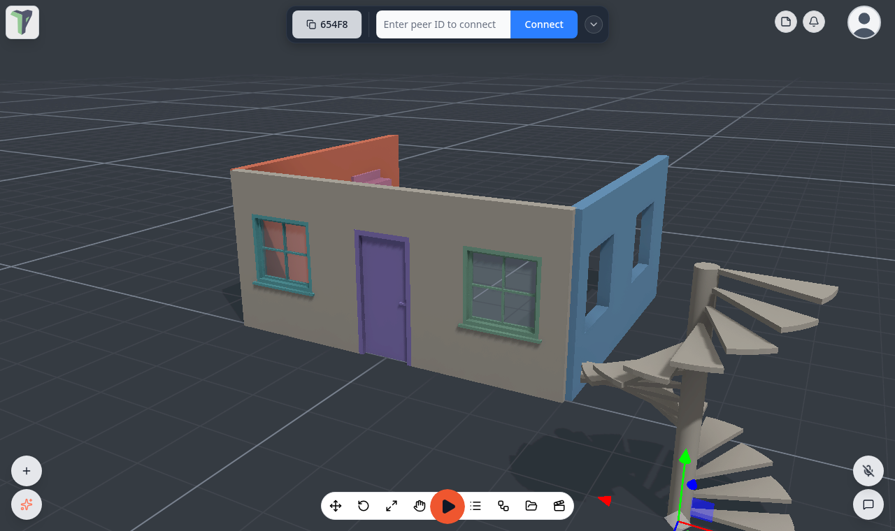
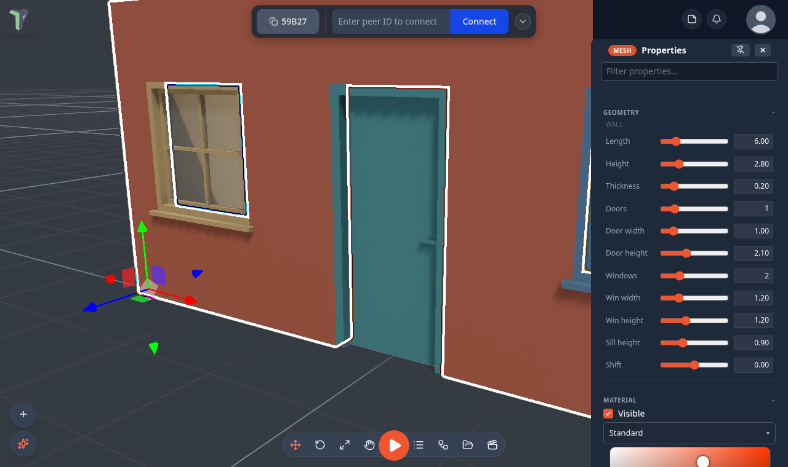
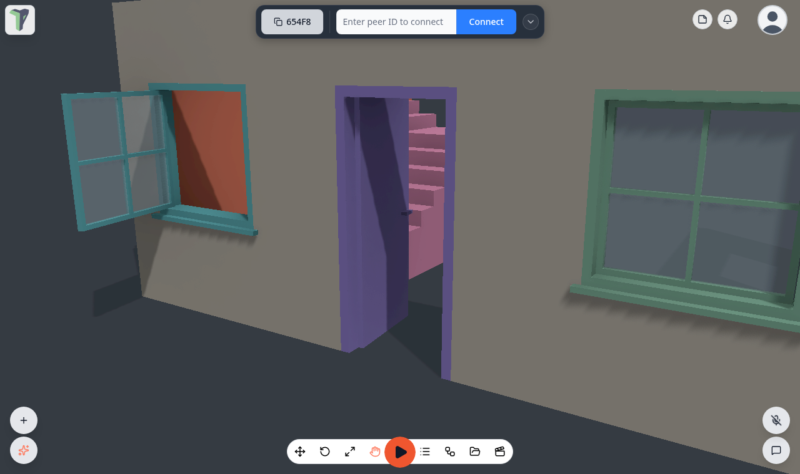

# Architecture

Since 1.27 you can build rooms and houses from parametric pieces: walls with doorways and window openings, doors and
windows that open, and four kinds of stairs. Every piece is a set of numbers you can change at any time, and doors swing
open for everyone in the session.

## Adding a piece

Right-click the viewport ▸ **Add ▸ Architecture** (or type the name into the Add menu's search):

| Group | Items |
|---|---|
| Walls | **Wall** · **Wall with door** · **Wall with windows** · **Wall with door and windows** |
| Doors | **Door** · **Double door** |
| Windows | **Window** · **Casement window** |
| Stairs | **Stairs (straight)** · **Stairs (L)** · **Stairs (U)** · **Stairs (spiral)** |

Pieces from the Add menu land on the 1 m grid.

## Editing a piece

Select the piece and open its **Properties**: the **Geometry** section holds every number. Rows that do not apply are
hidden — a wall with no doors has no *Door width* row.

### Wall

| Row | What it sets |
|---|---|
| **Length** · **Height** · **Thickness** | the size of the wall |
| **Doors** · **Door width** · **Door height** | how many doorways and their size |
| **Windows** · **Win width** · **Win height** | how many window openings and their size |
| **Sill height** | how far above the floor the window openings start |
| **Shift** | slides the openings along the wall |

Openings are spread evenly along the wall, centred on half metres, and a 10 cm pier always stays between them. The
wall's origin is its **start end**, on the floor, so walls of a whole number of metres snap end to end on the grid.

### Door

| Row | What it sets |
|---|---|
| **Width** · **Height** | the opening the door fills |
| **Frame depth** · **Frame** | how deep and how wide the frame is |
| **Leaves** | single or double |
| **Hinge** | left or right (a single door) |
| **Opens** | in or out |
| **Swing °** | how far it opens |
| **Glass panes** | panes of glass in the leaf (0 for a solid door) |
| **Sill** | a threshold at the bottom |
| **Opens on** | **click**, or **proximity** — it opens when someone walks up to it |

### Window

| Row | What it sets |
|---|---|
| **Width** · **Height** | the size of the window |
| **Sill height** | how far above the floor it sits |
| **Frame depth** · **Frame** | how deep and how wide the frame is |
| **Panes across** · **Panes up** | the glazing bars |
| **Sill ledge** | a ledge under the window |
| **Opens** | **fixed**, or **casement** (it swings open) |
| **Hinge** | left or right (a casement) |

### Stairs

| Row | What it sets |
|---|---|
| **Shape** | straight, L, U or spiral |
| **Width** · **Steps** | how wide the stair is and how many steps it has |
| **Rise** · **Run** | the height and depth of each step |
| **Turn** | left or right (L, U and spiral) |
| **Flight gap** | the space between the two flights of a U stair |
| **Column** | the thickness of a spiral stair's centre column |
| **Solid** · **Tread** | a solid stair, or open treads of this thickness |

## Fitting a door or window into a wall

A door and a window both sit centred on their opening, at floor level. To fit one into a wall, place it on the same
grid point as the centre of the wall's opening, with the same size as the opening (and, for a window, the same **Sill
height**). The pieces from the Add menu already match each other.

## Doors and windows that open

In **Interact** and **Play**, click a door to open or close it, or walk up to a door set to open on proximity.
Casement windows open the same way. Every peer sees the same swing, and a player who joins later sees the door already
open. In **Edit** a door always shows shut, so it is easy to place.

## Collisions

- Walls and stairs collide with their exact shape: doorways stay open, and a walking player climbs steps up to 0.3 m
  high.
- A door's frame blocks around the doorway, and its leaf blocks only while it is shut.
- A window is a solid slab.

## Limits

- The parts of a door or window are rebuilt from its numbers on every device, so [editing the mesh](mesh-editing.md) of
  a door changes only its frame.
- Very steep stairs (a **Rise** near 0.3 m) are the most a walking player can climb.
