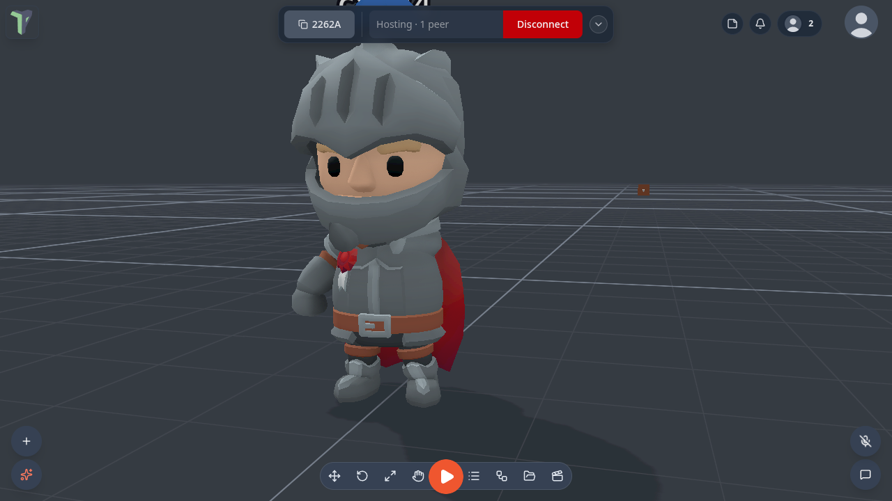
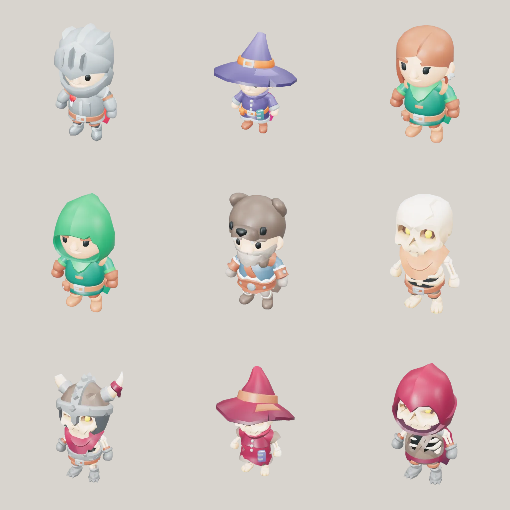
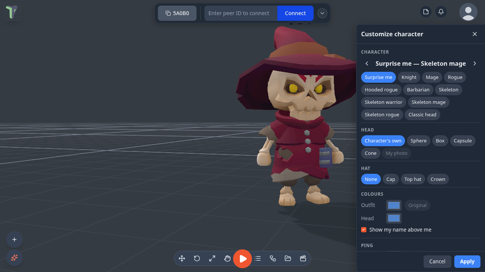

# Your Character

Since 1.24 everyone in a session appears as a **rigged, animated character** instead of a floating head. The body
stands under the person's viewpoint, **walks, runs, strafes, jumps and idles** with the way they move, turns to face
where they look, and — when they are in **VR** — reaches for their controllers with its arms. The classic floating head
is still there as a choice.

## The characters

Nine characters ship with the app: **Knight**, **Mage**, **Rogue**, **Hooded rogue**, **Barbarian**, **Skeleton**,
**Skeleton warrior**, **Skeleton mage** and **Skeleton rogue**, from Kay Lousberg's free CC0 KayKit packs.

If you never pick one, you get **Surprise me**: a character chosen from your id, so everyone sees the same one for you.
The same characters are also an Explorer pack, **Packs ▸ Adventurers**, that you can place in a scene as animated
models (see [Packs](packs.md#adventurers-124)).

## Customize Character

Profile menu (your picture, top right) ▸ **Customize Character** — also **Settings ▸ Interface ▸ Avatars ▸ Customize
character…**. A side panel opens and the camera moves to **your own character**, standing where you are, so you see
yourself the way other people do.

| Section | What you choose |
|---|---|
| **Character** | one of the nine — step through them with ‹ › — or **Surprise me** or **Classic head** |
| **Head** | the character's own head, a stylised **Sphere**, **Box**, **Capsule** or **Cone** in your colour, or **My photo** (your profile picture on a card; needs a profile photo) |
| **Hat** | None, Cap, Top hat or Crown — it sits on whatever head you chose |
| **Colours** | **Outfit** recolours the character's clothes (skin and face keep theirs; **Original** puts them back); **Head** colours a stylised head or the classic avatar |
| **Show my name above me** | your name label |
| **Ping** | the colour and chime of *your* [pings](notifications.md#pinging); **Preview** pings beside your character (only you see and hear it) |

Every change shows on your character at once; nothing reaches other people until you press **Apply**, which saves it and
shows it to everyone. **Cancel**, <kbd>Esc</kbd> or ✕ throw the changes away. Either way the camera flies back to where
you were.

## Showing everyone as classic heads

**Settings ▸ Interface ▸ Avatars ▸ Show everyone as classic heads** draws other people as the floating head instead of
their character — on **this device only**, and lighter on a headset with many people in the room. They still see your
character.

## In VR

A VR user's character follows their head, and its arms reach for their controllers; a hand held out of the arm's reach
falls back to the floating controller marker. Pointing at an object puts the character's hand on it.

## Limits

- The bodies are stylised (big heads): a character is about 2.2 m tall so its eyes sit where the person's are.
- In the editor, a character follows the editor camera — flying the camera makes the body float.
- Characters add no network traffic: each screen works the bodies out from the position and hand data already shared.
- Each character is at most about 6,000 triangles with one material, so eight people stay inside a Quest's budget.
