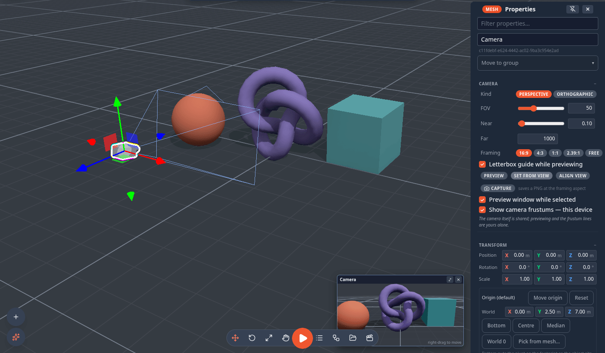
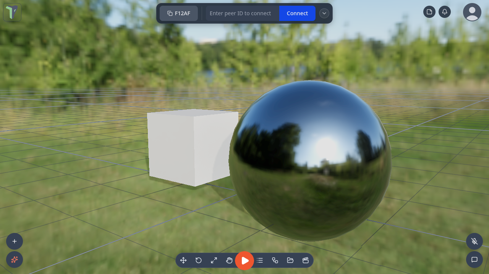
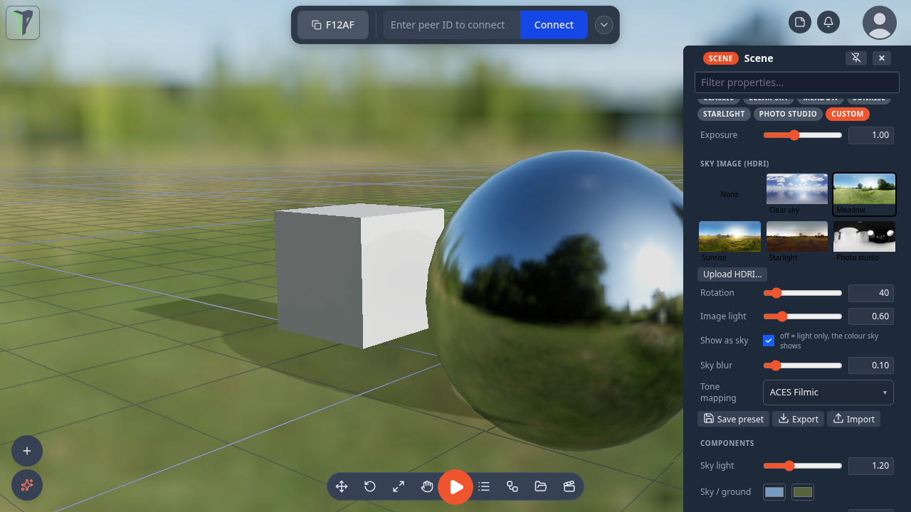

# Camera & View

Everything about how the scene *looks on your screen* — the camera lens, render mode, shadows, the grid and the environment — lives in one place: **Configure Scene**.

## Opening Configure Scene

Click **🎛️ Configure Scene** in the sidebar menu. It opens a panel on the right with these sections:

- **Environment** — lighting preset, exposure, [sky image](#sky-images-hdri), saved presets (shared).
- **Music** — the shared background track and your local volume (see [Music & Sound](audio.md)).
- **View** — render mode, camera lens, clip planes (your device only).
- **Background** and **Fog** (shared).

A dot appears next to the menu item while the panel is open; click it again to close.

!!! note "Shared vs. this device"
    The **Environment**, **Background** and **Fog** settings replicate to everyone. The **View** section — render mode, camera lens and clip planes — is **local to your device**, so you can zoom, wireframe or dim shadows without changing what your peers see.

## Render mode (View)

Three per-device render modes under **Viewport — this device**:

| Mode | Look |
|---|---|
| **Shaded** | Plain lit shading. |
| **Shaded + AO** | Adds ambient occlusion — soft contact shadows in creases and corners (the default on a desktop; phones and tablets start in plain **Shaded**). |
| **Wireframe** | Shows every edge. |

<kbd>Z</kbd> in the 3D view cycles them: Shaded → Shaded + AO → Wireframe (Shaded + AO is skipped when the scene's own
look already sets ambient occlusion). Rebind it in **Settings ▸ Shortcuts**.

Ambient occlusion and wireframe are **desktop-only** and never shown to peers. AO detail follows your shadow-quality setting (below), so lowering shadow quality also lightens the AO cost.

These are SHADING modes — they are not how you see the scene's own look. A
[scene look](post-processing.md) renders for everyone in every mode except Wireframe, and
you switch it off for yourself under **Overrides — this device**. If the scene sets its own
ambient occlusion, **Shaded + AO** switches off and says so: the scene's setting is used
instead of yours.

The **Show light helpers** toggle here draws icons for lights so you can see where they are — in the editor only; see [Helpers hide in Play](#helpers-hide-in-play).

## Camera objects

Besides your own view, a scene can hold **cameras** of its own — the shot a game starts from, a cutscene angle, a
security monitor. Add one from **right-click ▸ Add ▸ Camera ▸ Perspective** (or **Orthographic**). It appears as a small
camera marker you move and turn like any object; selecting it opens **Properties ▸ Camera**:

| Row | What it does |
|---|---|
| **Kind** | Perspective or Orthographic |
| **FOV** (perspective) | field of view, 10–140° |
| **Size** (orthographic) | how much of the scene fits, 0.5–50 |
| **Near / Far** | the clip planes |
| **Framing** | 16:9 · 4:3 · 1:1 · 2.39:1 · free (follows the viewport) |
| **Letterbox guide while previewing** | bars that show the framing while you look through it |
| **Preview** | look through the camera. A banner says *Previewing ‹camera›*; its **Control** button lets you fly the camera with <kbd>W</kbd><kbd>A</kbd><kbd>S</kbd><kbd>D</kbd> and the mouse (its new pose is kept, as one undo step) |
| **Set from view** | move the camera to where your view is (and take its FOV) |
| **Align view** | fly *your* view to look through this camera (it stays your camera) |
| **Capture** | render one frame through this camera and download it as a PNG at the framing aspect |
| **Preview window while selected** | the picture-in-picture window (below), on by default |
| **Show camera frustums — this device** | draw every camera's viewing pyramid |

The camera itself — including its *Letterbox guide* and *Preview window while selected* switches — is shared with
everyone; previewing and the frustum lines are yours alone. The object's right-click menu has **Preview camera** and **Set from current view** too.

**Picture-in-picture.** While a camera is selected, a small window shows what it sees, live. **⤢** looks through it full
screen, **✕** hides the window (the *Preview window while selected* row brings it back), and right-drag moves it.

A game uses cameras through the [Set Active Camera](nodes/setcamera.md) node, the [Game Start](nodes/gamestart.md) node's
camera, [Set Look](nodes/setlook.md) for each camera's own [look](post-processing.md), and since @@VER@@ the
[Camera Rig](nodes/camerarig.md) node, which makes a camera follow or watch an object.

## Camera lens

The default camera is a **40° field of view** — a natural, product-viz look with real depth and little wide-angle distortion. You can change it under **Camera lens**:

**Lens presets** (labelled by their full-frame focal-length equivalent):

| Preset | Feel |
|---|---|
| **Wide** (24 mm) | Roomy, exaggerated depth. |
| **Classic** (35 mm) | Reportage, slightly wide. |
| **Natural** (50 mm) | Close to how the eye sees. |
| **Portrait** (85 mm) | Compressed, telephoto. |

Below the presets, the **Camera FOV** slider gives fine control (15°–120°).

!!! note
    Your FOV is broadcast, but a peer only *sees through* it while they're spectating your view — during normal editing everyone keeps their own camera.

## Clip planes

Also in **View**, the near/far clip planes control the depth range the camera renders (per-device):

- **Near clip** (0.01–2) — surfaces closer than this are cut away. Lower it if very close objects vanish.
- **Far clip** (from 10) — the far limit. It **grows automatically to fit the scene**, and the orbit zoom-out limit is paired to it so you can never dolly past the far plane and blank the scene.

## Shadow quality

Shadow quality is a **per-machine** performance knob in the **Settings** dialog: **Off · Low · Medium · High** (default High). It caps every light's shadow-map size on your computer — *Off* disables shadows entirely. Per-light shadow settings still replicate; this only changes what your machine renders.

## The grid

The floor grid can be toggled from the viewport right-click menu ▸ **View ▸ Show/Hide grid**, or the **Show grid** checkbox in Settings. Its fade distance scales with how far you've zoomed out, so it stays visible when you pull the camera way back. The grid hides itself in wireframe mode.

## Environment presets

The **Environment** section sets the scene's lighting and sky. Pick a preset chip:

| Preset | Look |
|---|---|
| **Studio** | Neutral grey studio (the default). |
| **Daylight** | Bright sky, strong sun, soft fog. |
| **Sunset** | Warm, low sun. |
| **Night** | Dim and cool. |
| **Classic** | The pre-lighting look with the rig **off** — bring your own lights. |

Since @@VER@@ five more chips — **Clear sky**, **Meadow**, **Sunrise**, **Starlight** and **Photo studio** — use a real sky
photo; see [Sky images](#sky-images-hdri).

An **Exposure** slider tunes overall brightness. The lit presets add a sun that casts shadows, with a shadow-catcher disc under the scene so shadows land even on the infinite grid.

Environment is a **shared, latest-wins** setting — the most recent change wins for everyone. You can also **save**, **export** and **import** custom presets (stored locally), and adopt presets other peers have shared.

Below Environment, **Background** sets the clear color and **Fog** adds distance fog (color + near/far), both shared. A fog you set by hand keeps exactly the near and far you typed; a preset's fog still grows with a big scene.

## Sky images (HDRI)

Since @@VER@@ a sky image — an HDRI, a 360° photo that keeps the real brightness of the sun and the sky — can be the
scene's sky **and** its light. Every object picks up the image's colours and brightness, shiny objects reflect it, and
[water](water.md) mirrors the real clouds. The scene's sun is placed where the photo's sun is, so shadows agree with the
sky.

It lives in **Configure Scene ▸ Environment ▸ Sky image (HDRI)**, under the preset chips and the Exposure slider. Click
a card to switch to that sky; like every Environment setting, everyone in the session sees it.

| Sky | What it looks like |
|---|---|
| **Clear sky** | open blue sky with clouds, haze on the horizon |
| **Meadow** | a sunny meadow with trees |
| **Sunrise** | a low warm sun and long shadows |
| **Starlight** | dusk under the stars |
| **Photo studio** | softbox lighting over a plain grey backdrop — light only; reflections show the studio |

The five skies are also preset chips, and in VR they are in the radial menu's **Scene ▸ Environment**. All five are CC0
images from [Poly Haven](https://polyhaven.com).

| Row | What it does |
|---|---|
| **Upload HDRI…** | use your own equirectangular `.hdr` or `.exr` file (up to 25 MB; 1k–2k is plenty). It is added to the [Explorer](explorer.md), your peers download it from you automatically, and it is saved inside `.tpscene` files and exports |
| **Rotation** | turns the sky; the sun and its shadows turn with it |
| **Image light** | how strongly the image lights objects (the sky itself is unchanged) |
| **Show as sky** | off keeps the image's light and reflections but shows the colour sky instead |
| **Sky blur** | softens the background — handy behind a product shot |
| **Tone mapping** | **ACES Filmic** (the default), **AgX** or **Neutral**: how the bright image is fitted to the screen |
| **None** (the first card) | back to the colour sky and the light rig |

**Exposure**, above the cards, brightens or darkens the whole picture, and while a sky image shows it works on the
desktop whatever else is on. Editing any of these turns the preset into *Custom*, like any other sky edit; **Save
preset** keeps it.

A short tour points at the cards the first time you see them (**Settings ▸ Interface ▸ Tours ▸ Reset all** shows it
again).

### Sky image quality

How sharp the sky and its reflections are is a setting for **this device only** — **Settings ▸ Scene ▸ Performance ▸
Sky image quality**:

| Choice | What it does |
|---|---|
| **Auto** (the default) | **Low** in a headset, in VR, or once the scene is too heavy for effects; **Full** otherwise |
| **Full (1k)** | prepares the image at 1024 px |
| **Low (headset)** | prepares it at 512 px — a quarter of the memory |

The scene and your peers are unaffected.

### Limits

- Only equirectangular images (twice as wide as they are tall); cube-map files are not supported. An `.exr` must be RGB
  or RGBA.
- Files over 25 MB are refused — your peers could not receive them.
- Someone on an app older than @@VER@@ in the same session sees the preset's flat colours instead of the image.
- A [scene look](post-processing.md) with its own [Tone mapping](post-processing.md#tone-mapping) effect keeps its own curve.

## Lights

A **directional** or **spot** light shines where it points. Turn it with the rotate gizmo — or type into the rotation rows — and the beam and its shadow follow, the way a light behaves in any 3D tool. Older scenes that aimed a spot at a saved point load aimed the same way.

**Aim at**, in the Properties panel's Light section, points the light once at a spot: type a world **X / Y / Z**, or press **Pick in viewport** and click a surface (<kbd>Esc</kbd> cancels). It writes the rotation, so the gizmo and the rows agree afterwards.

A directional light has a direction, not a distance. Its helper line reaches as far as **Settings ▸ Scene ▸ Light helper length** says — display only.

### A light with an origin

Lights have an [origin](controls.md#each-objects-origin) like any other object. Give a sun one — type it in the Transform section's Origin block, or press **World 0** — and **Rotate** swings the light around that point instead of turning it in place: a sun on an orbit, in one gesture. *Move* still moves the light and carries its origin along.

### Helpers hide in Play

Light helpers, camera frustums and camera markers are editor furniture. They disappear when Play starts, and camera previews and captures never show them, so a screenshot is the game and nothing else.

**Show helpers in Play (debug)** — on the viewport menu under **View**, and in **Settings ▸ Controls** — brings them back while you debug a scene, with an amber **DEBUG · HELPERS** chip in the corner so a capture cannot be mistaken for the real thing. It is your setting alone.
