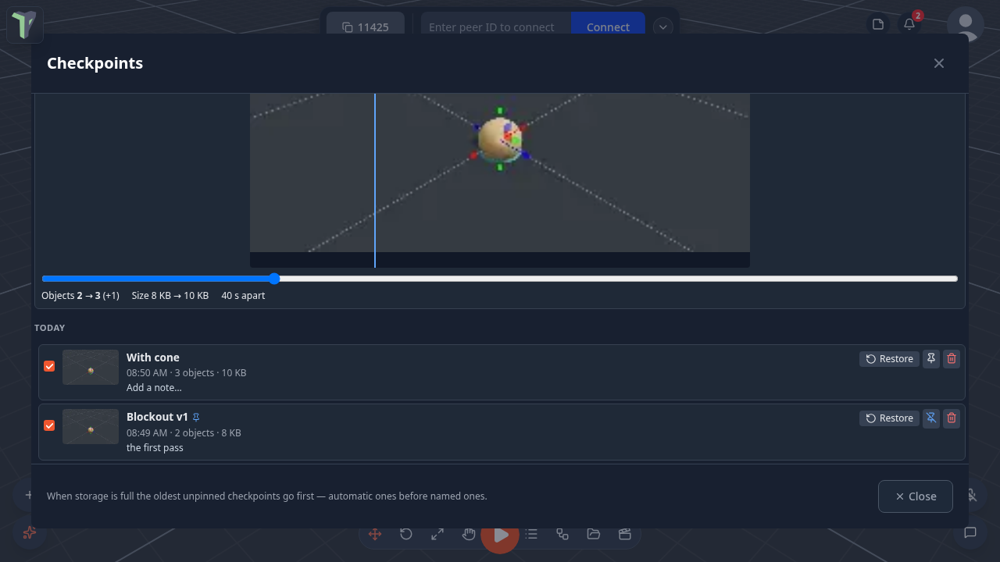

# Checkpoints

A **checkpoint** is a copy of the scene as it is right now — objects, node graphs, HUD, sky, physics, the camera — kept
**on this device**, with a name, an optional note, a picture and a time. [Autosave](saving.md#autosave) only remembers
the *last* state; checkpoints let you go back to *any* earlier one.

## Saving a checkpoint

**Menu** (the logo button) ▸ **Save checkpoint…**, or press <kbd>Ctrl</kbd>+<kbd>Shift</kbd>+<kbd>S</kbd>. Type a name and, if you like,
a note ("before lighting", "try the red version next"), then press **Save checkpoint**.

## The timeline

**Menu ▸ Checkpoints** lists every checkpoint, newest first, grouped by day. In it you can:

| Action | How |
|---|---|
| **Restore** | replaces the open scene with the checkpoint. The scene you leave is kept in the timeline as **"Before restoring …"**, so a restore can itself be undone. With people connected, they are asked to accept first (the same as opening a saved session) |
| **Rename** | double-click the name |
| **Note** | click the note line to edit it (<kbd>Ctrl</kbd>+<kbd>Enter</kbd> saves) |
| **Pin** | a pinned checkpoint is never removed to make room |
| **Delete** | removes the checkpoint |
| **Compare** | press **Compare**, then tick two checkpoints: their pictures sit on top of each other with a swipe slider, plus what changed (object count, size, time apart, "same content"). Tick just one to compare it with the scene as it is now |

Two filters narrow the list: show only **This scene**'s checkpoints, or hide the **Automatic** ones.

## Automatic checkpoints

While you work, autosave also adds an **automatic** checkpoint every few minutes — only when the scene actually changed
since the last one, and never while a scene is loading or a simulation is running.

In the Checkpoints window the **Automatic** switch shows or hides the automatic checkpoints in the timeline.

## Settings

**Settings ▸ Scene ▸ Checkpoints**:

| Setting | Default | What it does |
|---|---|---|
| Keep automatic checkpoints | on | autosave adds rows to the timeline |
| Automatic checkpoint every | 10 min | 5 / 10 / 30 / 60 min — the shortest gap between two |
| Checkpoint storage | 250 MB | 100 MB / 250 MB / 500 MB / 1 GB that this device may use |

## Limits

- Checkpoints stay on this device (this browser). They are not shared with other people and are not part of a project
  file — use **Save** and scene versions ([Saving & Sessions](saving.md)) for that.
- When a new checkpoint would not fit, the **oldest unpinned** ones are removed — automatic ones before named ones. If
  even that is not enough (everything else is pinned), the save is refused and a message says so. At most 60 checkpoints
  are kept.
- A scene larger than the storage limit cannot be checkpointed.
