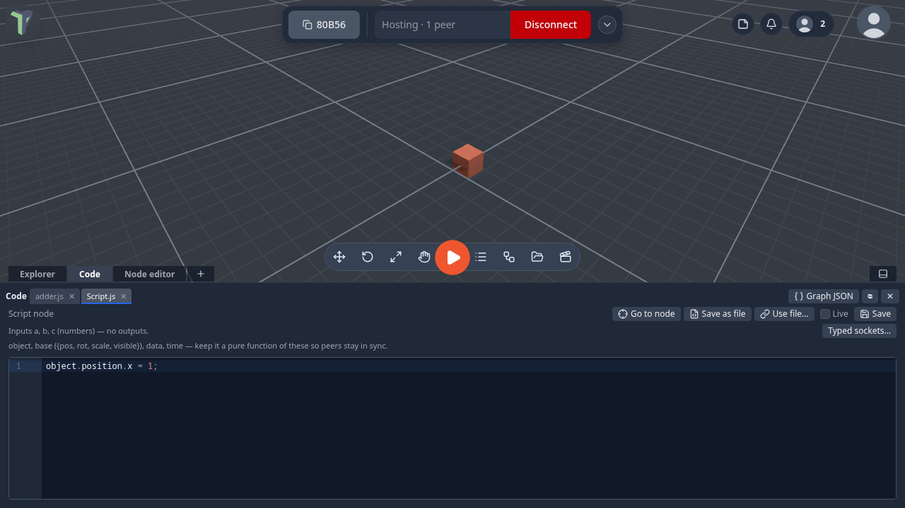
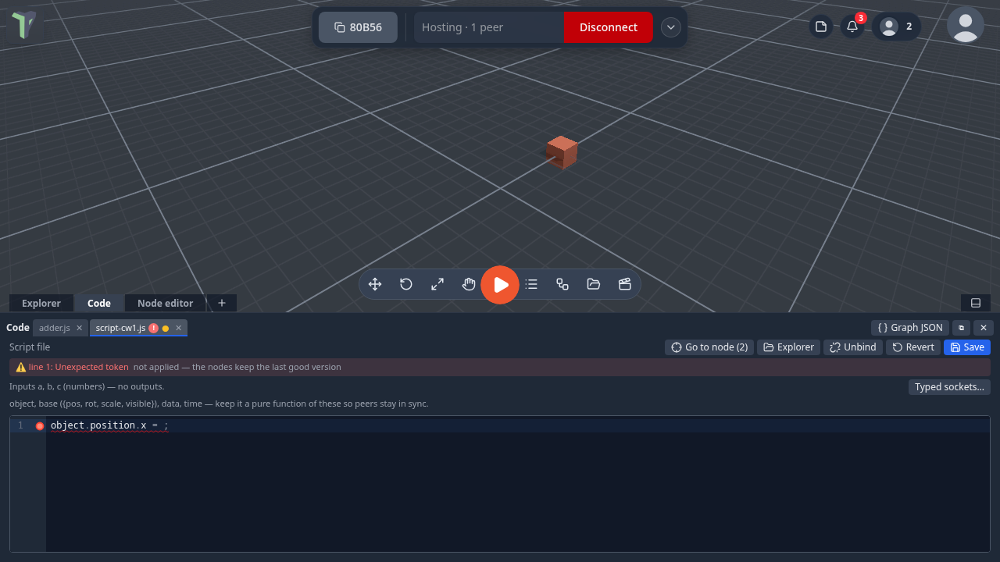
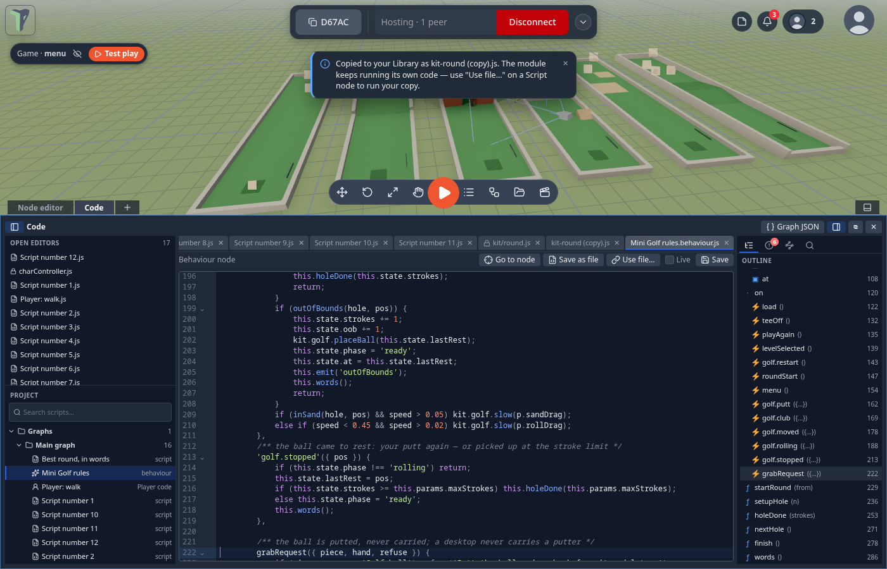
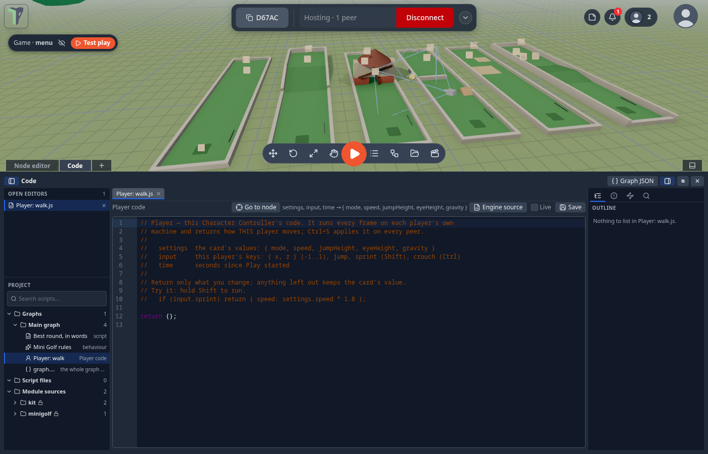

# Code workspace

The code workspace is one place for every piece of code in a scene: a [Script](nodes/script.md) node's code, a
[behaviour](behaviours.md), a `.js` script file from your Library, a module's own source (read-only), and the flow graph
itself as JSON. Each source is a **tab**, and your edits stay in the tab until you save.



## Where it is

It opens by itself when you ask for code:

- **Edit code** on a Script node, **Code** on a Behaviour node, or a double-click on any node that has code (see
  [Open code](main-graph.md#open-code)) — since 1.25 that includes a game's [Player](#the-players-code);
- a double-click on a `.js` file in the [Explorer](explorer.md), or right-click it ▸ **Open in code editor**;
- the dock's **＋** menu ▸ **Code**, or the optional `{}` toolbar button (add it with *Customize the toolbar*);
- **Graph JSON** in the workspace's header opens the graph the Node editor is showing.

It docks as a tab at the bottom, beside the Node editor and the Explorer, or floats as a window (**⧉** to float,
**⇩ Dock** to put it back). Everything on this page works in both. In a narrow window or on a phone the
[sidebars](#sidebars) open **over** the editor, one at a time (toggle buttons in the header).

When the workspace has the keyboard, it keeps it: <kbd>W</kbd><kbd>A</kbd><kbd>S</kbd><kbd>D</kbd> never fly the camera
from here (see [Keys follow the panel you are in](controls.md#keys-follow-the-panel-you-are-in)). In the undocked
window the tabs sit in the title bar and can be clicked; the title bar around them still drags the window.

## Editing and saving

Type, then press <kbd>Ctrl</kbd>+<kbd>S</kbd> (<kbd>Cmd</kbd>+<kbd>S</kbd> on a Mac) or **Save**. A **●** on a tab
means it has unsaved edits; **Revert** throws them away.

Saving checks the code first. If it does not parse, **nothing is applied**: the tab shows a red **!**, the banner names
the line (click it to jump there), and every node the code feeds shows an amber *edit not applied* badge while it keeps
running the last good version.



When the code is good, everything that runs it reloads — on every player's screen.

**Unsaved changes are guarded.** Closing a tab with unsaved edits asks first. Closing the whole workspace with unsaved
files asks **Save all / Don't save / Cancel** — a file whose code has an error is not saved, and the dialog says so.
Leaving the page with unsaved code shows the browser's warning.

**Undo and redo** (<kbd>Ctrl</kbd>+<kbd>Z</kbd> / <kbd>Ctrl</kbd>+<kbd>Y</kbd>) step through saved code edits, on every
peer; an open tab follows them.

## Sidebars



### Left: Open editors and Project

<kbd>Ctrl</kbd>+<kbd>B</kbd> shows or hides the left sidebar.

- **Open editors** lists every open tab, in the same order as the tab strip. Drag a row to reorder (the strip follows);
  **✕** closes it (unsaved files ask first).
- **Project** lists every script in the scene as a tree, with a search box:
    - **Graphs** — per graph (Main first, then each object's), its Script nodes, Behaviour nodes and the
      [Player's code](#the-players-code), plus `graph.json` (the whole graph as editable [JSON](#graph-json)).
    - **Script files** — the `.js` files in your Library, with how many nodes run each.
    - **Module sources** — the module and kit files the game uses, **read-only** (see [Module code](#module-code)).
- The search also matches folder names (*minigolf rules*).
- Drag the line between the two sections to share the height; double-click it to reset. Drag the sidebar's edge to
  resize it — the width is remembered.

### Right: Outline, Problems, Bound nodes, Find

<kbd>Ctrl</kbd>+<kbd>Alt</kbd>+<kbd>B</kbd> shows or hides the right sidebar. It has four tool tabs:

- **Outline** — the active file's params, state, handlers, methods and functions, a script's inputs and returned
  outputs, a graph's nodes. Click one to jump to its line.
- **Problems** — syntax errors and lint advice (for example, `Math.random` breaks peer sync) for every open file *as you
  type*, plus anything a node reported while running. The tab shows a count; click a problem to jump to it.
- **Bound nodes** — which graph nodes run this file. Click one to select it in the Node editor (entering its group if
  it is inside one).
- **Find in files** (<kbd>Ctrl</kbd>+<kbd>Shift</kbd>+<kbd>F</kbd>) — searches every script in the project, open files'
  unsaved text first. Toggles: match case, whole word, regular expression, include module sources. Click a result to
  open it at its line.

## Tabs, quick open and the keyboard

- With many tabs the **tab strip** scrolls: the mouse wheel scrolls it sideways and a thin scrollbar shows. The active
  tab is always scrolled into view. Drag a tab to reorder it.
- <kbd>Ctrl</kbd>+<kbd>P</kbd> — **quick open**: open any script in the project by typing part of its name (letters in
  order: `plwa` finds *Player: walk*). <kbd>↑</kbd>/<kbd>↓</kbd> and <kbd>Enter</kbd>.
- <kbd>Ctrl</kbd>+<kbd>Shift</kbd>+<kbd>O</kbd> — **go to symbol**: jump to a function, handler, param or state key of
  the current file.
- The tab strip, Open editors, the Project tree and the tool tabs are each one <kbd>Tab</kbd> stop. <kbd>←</kbd>/<kbd>→</kbd>
  (strip, tools) and <kbd>↑</kbd>/<kbd>↓</kbd> (lists) move, <kbd>←</kbd>/<kbd>→</kbd> in the tree close and open
  folders, <kbd>Enter</kbd> opens, <kbd>Delete</kbd> closes a tab.

## The Player's code

Since 1.25 the **Player** card in a game's graph (a *Character Controller*, such as *Player: walk* in Mini Golf, Escape
Room, Sky Run and Towers) opens its code like any other code node: **double-click it**, or right-click ▸ **Open code**.
The code runs every frame on each player's own machine and decides how *that* player moves:

```js
// settings = the card's values { mode, speed, jumpHeight, eyeHeight, gravity }
// input    = this player's keys { x, z, jump, sprint (Shift), crouch (Ctrl) }
// time     = seconds since Play started
if (input.sprint) return { speed: settings.speed * 1.8 };   // hold Shift to run
return {};                                                  // anything left out keeps the card's value
```

- <kbd>Ctrl</kbd>+<kbd>S</kbd> saves it — checked first (broken code never applies), sent to everyone, one undo step.
- A wrong key or type in what you return shows on the node's red error badge.
- **Engine source** (toolbar) shows the built-in walker code it steers, read-only.
- With no code saved, the Player behaves exactly as before.



## Code and files

- **Save as file** turns a node's inline code into a script file in your Explorer and binds the node to it.
- **Use file…** binds a node to a script file you already have.
- Several nodes can run one file. Saving the file reloads every one of them, on every peer, as **one** undo step.
- **Unbind** keeps the code in the node and forgets the file.
- **Go to node** shows the node in the Node editor — or lets you pick one, when several run the same file.

If someone else changes the same code while you have unsaved edits, the tab says so: **Load theirs** takes their
version, **Keep mine** keeps yours (your next save wins).

## Module code

A module's source opens **read-only** (a lock on its tab): it runs the same for everyone. A Script or Behaviour node that
a module binds to its own file offers **Make editable copy**, which copies the code into a script the scene owns and
points the node at it — see [Make editable copy](main-graph.md#make-editable-copy).

A file opened from **Module sources** in the [Project tree](#left-open-editors-and-project) has a copy button (or
**Make editable copy** in the toolbar) that puts a copy in your Library for you to edit. The module keeps running its own
code, so use **Use file…** on a Script node to run your copy.

## Graph JSON

**Graph JSON** opens the graph as JSON. Edit the nodes and edges and press **Apply** (<kbd>Ctrl</kbd>+<kbd>S</kbd>).
Invalid JSON, two nodes with the same id or a wire to a node that does not exist are refused with the line; a good apply
is one undo step and reaches every peer. ([Flow Code](node-system.md#flow-code-the-graph-as-text) shows the same graph as
compact text.)

## Live

The **Live** checkbox on a node or behaviour tab applies inline edits as you type instead of on
<kbd>Ctrl</kbd>+<kbd>S</kbd> — how the Script panel felt before 1.23. It is a setting of this browser, off by default.

## Limits

- The Player's code can change speed, jump height, eye height, gravity and walk/fly each frame; it cannot replace the
  walker itself (collisions, steps) — that is the engine source.
- Other built-in nodes have parameters only (edited in the ⓘ panel); Script, Behaviour, Custom nodes and the Player are
  the nodes with code.
- Find in files stops at 400 results.

- A node bound to a file still carries its code, so a scene runs the same whether or not the file is in anyone's
  Library.
- Files are addressed by their content: two files with byte-identical content are the same file.
- The second-monitor window (**⧉ Window**) is an experiment, switched on with
  `localStorage['code:popout'] = 'true'` in the browser console.
