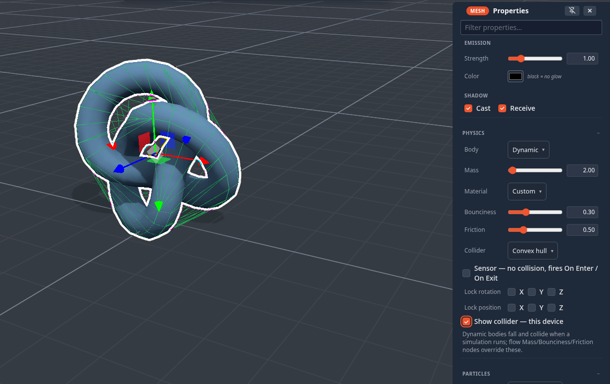

# Colliders

Physics never collides your triangles. It collides a simple stand-in — a **collider** — that is fast to test and
forgiving: a box, a sphere, a capsule, a convex skin, or a handful of convex pieces you build yourself. Picking the right
one is the difference between a ball that rolls and a ball that slides like a crate. This page covers every collider
setting; for running a simulation, gravity, joints and grabbing see [Physics & Simulation](physics.md).

## Where the settings are

Select an object and open **Properties ▸ Physics**:

| Row | Options / range | Default |
|---|---|---|
| **Body** | Auto (scenery) · Static · Dynamic | Auto (scenery) |
| **Mass** (Dynamic only) | 0.1 – 100 kg | 1 |
| **Material** | Custom · Ice · Rubber · Wood · Metal | Custom |
| **Bounciness** | 0 – 1 | 0.3 |
| **Friction** | 0 – 2 | 0.5 |
| **Collider** | Box · Sphere · Capsule · Cylinder · Cone · Convex hull · Custom (edit…) | inferred from the shape (below) |
| **Sensor** | no collision, fires On Enter / On Exit | off |
| **Lock rotation** (Dynamic only) | X · Y · Z | off |
| **Lock position** (Dynamic only) | X · Y · Z | off |
| **Show collider — this device** | draws the collider as a wireframe | off |

With several objects selected, every change applies to all of them as **one undo step**. Everything here replicates and
saves with the scene — except *Show collider*, which is only for you.

**Body**: *Auto (scenery)* and *Static* never move — things land on them and bounce off them. *Dynamic* falls and
collides. An Auto or Static object that the flow graph animates (a [Path Patrol](nodes/pathpatrol.md) platform, a
[Spin](nodes/spin.md) paddle) becomes a **moving platform** automatically: it pushes dynamic bodies, and a player
standing on it is carried along.

## Collider shapes

| Shape | Best for |
|---|---|
| **Box** | crates, walls, floors, anything boxy — the fastest, and the fallback for everything |
| **Sphere** | balls; they roll |
| **Capsule** | characters and posts — rounded ends slide off edges instead of catching |
| **Cylinder** | barrels, columns, wheels |
| **Cone** | cones and spikes |
| **Convex hull** | irregular shapes: a skin shrink-wrapped around the mesh. Exact for ramps, gems and rocks; it seals over any opening (a bowl becomes a lump) |
| **Custom** | anything concave — an L-shape, a frame, a chair: several convex pieces you build (below) |

Primitive colliders are sized from the object's own extents and **follow its rotation** — a tilted box collides as a
tilted box, a rotated ramp is really a ramp.

**The default is inferred from the object**, so most objects need no choice at all:

| Object | Default collider |
|---|---|
| Sphere · Cylinder · Capsule · Cone | the matching shape |
| Torus, Torus knot, the polyhedra, Lathe, Tube, Wedge, Stairs, Arch, Corner | Convex hull |
| everything else (cubes, imported models, groups) | Box |

**Limits.** A convex hull works on a single mesh of up to 5000 vertices; a denser mesh — and **any group** — falls back
to a box. When a collider looks wrong, turn on *Show collider* first: a fallback box is nearly always the answer.

## Materials: bounciness and friction

**Material** sets bounciness and friction together, so you pick a feel instead of two numbers:

| Material | Friction | Bounciness | Feels like |
|---|---|---|---|
| **Ice** | 0.02 | 0.05 | slides forever, dead on landing |
| **Rubber** | 0.9 | 0.85 | grippy and bouncy |
| **Wood** | 0.55 | 0.25 | the everyday default feel |
| **Metal** | 0.3 | 0.1 | slick and heavy |

Move either slider afterwards and the dropdown reads *Custom*. **Configure Scene ▸ Physics ▸ Defaults ▸ Material** sets
the material of every object that does not set its own — the fastest way to make a whole scene icy.

## Sensors: trigger volumes

Tick **Sensor** and the object stops colliding: things pass straight through it — players included. Instead, every
overlap fires [On Enter](nodes/onenter.md) when something comes in and [On Exit](nodes/onexit.md) when it leaves, once per
entry, on every peer. Use it for a doorway that opens as you approach, a lava pit, a scoring zone, a checkpoint, a
finish line.

A sensor is still a visible mesh, so give it a transparent material (or hide it) once it works. With *Show collider* on,
a sensor draws **amber** instead of green.

## Locking axes

A **Dynamic** body can be pinned per axis:

- **Lock rotation** X / Y / Z stops it tipping — a character capsule that must stay upright, a spinning top that only
  turns around Y.
- **Lock position** X / Y / Z keeps it on rails — a lift that only goes up and down, a puck that stays on the table.

## Gravity and damping

Gravity is a **scene** setting: **Configure Scene ▸ Physics ▸ World ▸ Gravity**, from −20 to 5 (positive falls *up*),
shared by every object. There is no per-object gravity scale; to make one object float, lock its Y position, give it a
lighter material, or push it with an [Impulse](nodes/impulse.md) or [Set Velocity](nodes/setvelocity.md) node.

**Drag** and **spin drag** (linear and angular damping) and **Continuous collision** are scene-wide too, under
**Defaults (advanced)**. A body moving faster than about 5 m/s switches continuous collision on for itself, so a hard
throw does not pass through a thin wall.

## Seeing the collider

**Show collider — this device** draws the collision shape as a wireframe over the object: **green** for a solid
collider, **amber** for a sensor. It is local to you — peers do not see your debug wireframes — and it is hidden in the
Wireframe render mode and in Interact and Play. **Configure Scene ▸ View ▸ Show colliders** shows every object's at once, and
draws the ground plane as a translucent sheet.

Turn it on when something rests oddly, hovers above the floor or falls through it.

## Custom compound colliders

For a shape no single convex piece can represent, pick **Collider ▸ Custom (edit…)** — later, **Edit collider…** re-opens
it. The [mesh editor](mesh-editing.md) opens on a **stand-in copy** of the object, where you build the collision shape with
the ordinary mesh tools.

- **Each separate piece becomes its own convex hull**, so an L-shape is two boxes, a hollow frame four, a chair five or
  six.
- The **Collider** section of the toolbox has **add box** and **add sphere** buttons to drop a primitive piece straight in,
  and shows how many pieces you have.
- **✓** stores it; **✕** or <kbd>Esc</kbd> cancels — the visible mesh is never touched either way.
- A custom collider holds up to about **400 vertices** in all; a larger one is refused with a toast. Mass is shared evenly
  between its pieces.

!!! tip "Keep it rough"
    A collider only has to be right where things touch. Three boxes that cover a sofa's seat, back and arms collide better
    — and faster — than a hull of every cushion.

## Changing colliders while it runs

Collider settings apply **live**: change a shape, a material, a sensor flag, a locked axis or the mass while a simulation
is running and the body is rebuilt in place — joints, velocity and momentum survive — so you can tune a contraption
without restarting it. The one exception is **Body**: switching between Auto, Static and Dynamic takes effect the next
time the simulation starts.

## From the flow graph

The [Collider](nodes/collider.md) node overrides the shape (and can make it a sensor, scale it, or borrow **another
object's** geometry); [Mass](nodes/mass.md), [Bounciness](nodes/bounciness.md) and [Friction](nodes/friction.md) override
those rows. A node wired to an object **wins** over its Properties settings. A wired Mass node also makes its object
dynamic.

## Doors and other moving pack items

The functional pack items — doors, gates, lids, trapdoors — come with colliders that do the right thing on their own. A
door's frame becomes solid slabs with the doorway left open, and the moving leaf follows its animation while a
simulation runs, so you can walk through an open door and not through a shut one. (Pack authors: this is the item's
`collider: 'follow'` behaviour, the default for a door — see [Packs](packs.md).)
