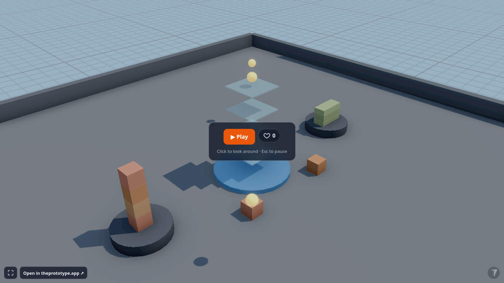
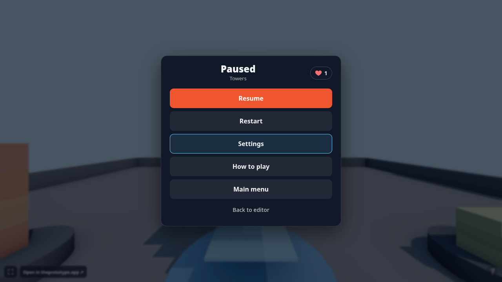
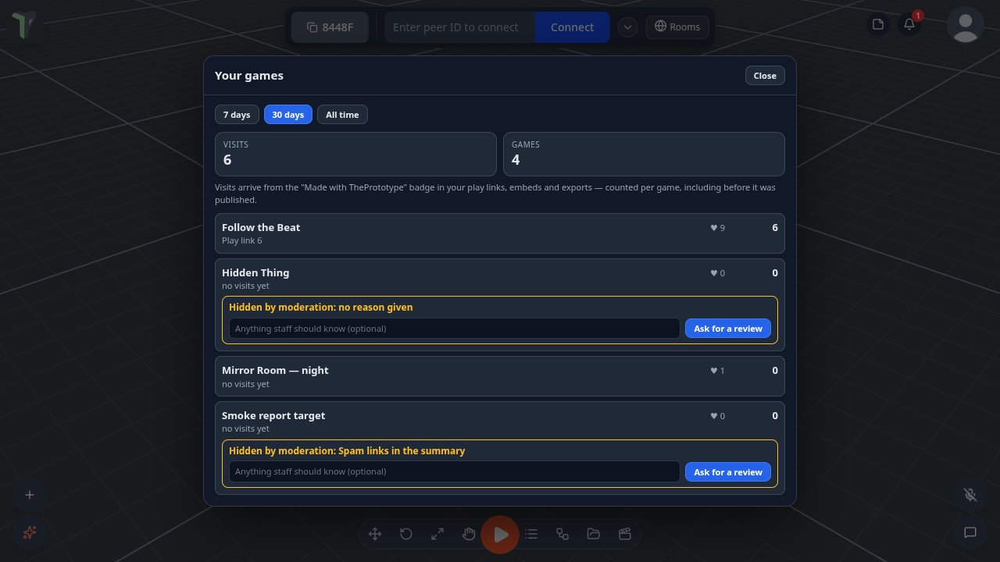

# Community

Publish the scene you are looking at, hand somebody a link, and they can play it in their browser, open it in the editor, or remix it into something of their own. Contests give you a reason to publish every couple of weeks.

Everything on this page lives on **theprototype.app** — the hosted app loads it as a cloud plugin. **Community** in the
profile (avatar) menu, right under **♥ Support the project**, opens [theprototype.app/community](https://theprototype.app/community)
in a new tab: the published scenes and the contests. Browsing, playing and remixing never need an account; publishing, liking, commenting and entering a contest do.

!!! note "Self-hosted and local builds"
    A copy you build yourself has none of this: no **Publish** row, and the Templates window's **Community** tab shows the open GitHub gallery with **Submit yours on GitHub** instead.

## Publish

The **Publish** row sits in the logo menu directly under **Save**. Its hint tells you what a click will do: *Publish · sign in* when you are signed out, *Publish · update* when this scene is already published by you, *Publish · remix* when you loaded somebody else's scene from a link, *Publish · to ‹contest›* when you arrived through a contest link. With a view-only role it is greyed out (*View-only — ask an editor*).

The first click walks you through what is missing, once:

1. **Sign in** — **Continue with GitHub** or **Continue with Google**.
2. **Pick your handle** — your pages live at `/u/‹handle›`. Lowercase letters, digits and dashes, 3–24 characters, and it is claimed **once**: there is no rename. Your peer nickname in sessions is a separate thing and is never touched.

Then the dialog itself:

| Field | What it does |
|---|---|
| **Destination** | **Community** — your account, instant, with likes, comments and contests. **GitHub gallery** — the open archive, via a pull request a maintainer reviews. |
| **Hero shot** | The image on the card and the page. **Current view**, or pick a saved camera bookmark; **Use current view** re-captures. |
| **Title**, **Summary** | 80 and 300 characters. The summary is what a stranger reads first: say what to look at and how to play it. |
| **Tags (up to 6)** | Type and press <kbd>Enter</kbd>; suggestions come from tags already in use. |
| **License** | **CC-BY-4.0** (the default: use and remix with credit), **CC0-1.0** (public domain) or **MIT**. There is deliberately no all-rights-reserved option — remix is the product. |
| **Visibility** | **Public** — listed on `/community`. **Unlisted** — only people with the link; the page is not indexed. |
| **Contest** | **None**, or an open contest to enter with this scene. |
| **Includes** | Read-only chips built from the scene: objects, flow, audio, game, modules, size. |

Publishing sends a **copy** of the open scene, with its assets and flow graph, exactly like saving a `.tpscene`. Nothing is saved or renamed locally. The bundle must stay under 25 MB; if it does not, the dialog names the largest files. By publishing you agree to the **Terms** and the **Content policy**, both linked from the dialog.

When the upload finishes the dialog shows **Published** with the link — `https://theprototype.app/s/‹id›` — plus **Copy link** and **Open page**.

### Updating, and publishing as new

Publish again from the same scene and the dialog offers **Update "‹title›" — same link, likes and comments stay** or **Publish as new**. Update replaces the file, the hero shot and the card facts on the same page. Publish as new makes a second scene; if the original was somebody else's, the new one is recorded as a remix of it.

There is no unpublish button in the app yet.

When you publish or update a game, the dialog also shows a **This game: …** line with its visits — see
[Your games & stats](#your-games-stats).

### The GitHub gallery destination

Choosing **GitHub gallery** builds the same submission zip as the **Community gallery** tab of Publish / Export, with
the same two GitHub steps — see [The Community gallery tab](publish-export.md#the-community-gallery-tab). Contest entries
need the Community destination, and the dialog says so if you pick both.

## A scene's page

Every published scene has a page at `/s/‹id›`: the hero shot, the title, the author's `@handle`, the license, a **♥** like button (sign in to use it; the same like as the [hearts in the app](#hearts)), the summary, the tags, and four actions:

- **▶ Play** — opens the app with the scene loaded and Play mode already running.
- **Open in ThePrototype** — the same, in the editor.
- **Remix** — opens it in the editor and remembers where it came from, so your Publish credits the original.
- **Download .tpscene** — the file itself, to keep or import anywhere.

A public scene also has an **Embed** button — see [Embedding a scene](#embedding-a-scene).

Below that: what the scene includes, its lineage (*Remix of … by @handle*, and how many remixes it has), and comments. **Report this scene** is at the bottom — see [Reporting](#reporting).

`/community` is the browse page: **Featured**, **Recent** and **Top**, tag chips, a **Mine** chip while you are signed in
(see [below](#mine)), and a strip for the contest that is open.

### Links that open the app

A scene link is `https://theprototype.app/?s=‹id›`, and the app treats it like an invite: the first-run welcome stands down so the scene you were sent is the first thing you see. Two flags ride on it — `&play=1` starts in Play mode, `&remix=1` loads it for editing and toasts *Remixing "‹title›" by @handle — Publish when you're done.* If you are already in a session, your peers get the usual load proposal before anything changes. A scene that was hidden or never existed says *That scene is not available* and leaves you with an ordinary empty app.

### Embedding a scene

**Embed** on a public scene's page copies an `<iframe>` snippet for your own site or blog. The frame shows
`/e/‹id›`, which opens the app with the scene already playing and with **no editor around it**: no menus, panels or
toasts — just the viewport, the game's HUD and the touch controls. A small corner link, *Open in theprototype.app ↗*,
opens the same scene in the full app in a new tab, and a ▶ button re-enters play after <kbd>Esc</kbd>.

The same player is available on any scene link by adding **`&embed=1`**: `https://theprototype.app/?s=‹id›&play=1&embed=1`.
The flag lasts for the life of the page.

## Play and remix

**The editor is the player.** Play opens the real app with the full scene, not a preview: the game's HUD, its flow graph, its physics and its sound all run, and a click on the viewport takes the pointer.

**Remix is a local load.** Nothing is created on the server until you publish. When you do, the dialog shows a ticked *Remix of "‹title›" by @handle* line and the new scene carries that lineage on its page. Every license in the picker allows this; a remix of your own scene is simply a new scene, with no lineage line. A remix is also a **new game** with its own [game id](#one-game-one-count).

## The Community tab in Templates

**Menu ▸ Templates ▸ Community** lists published scenes inside the app — featured ones first, then the most recent — with the author's handle, the license, the size and the like count on each card. Tag chips narrow the list; **Clear** resets it. Clicking a card loads the scene through the ordinary template path: a backup of your current scene is stashed first, and connected peers are asked before anything changes. The small button in a card's corner saves the scene to your Library instead, without loading it.

When a contest is open a notice row says so (*Contest: Make a mirror — 9 days left*) with a **More** link to its page, and the tab's **Publish yours** link opens the Publish dialog.

### Hearts

Like a published scene without leaving the app: the **heart** button sits on every card in **Templates ▸ Community**, on
the start card of a **play link** (`/p/‹id›`) and in a published game's **pause menu** (<kbd>Esc</kbd>, top right).
Press it and the count updates at once (and goes back if the like could not be saved). Signed out, it asks you to sign in
(profile menu, top right). It is the same like as the ♥ on the scene's page — one like per person per scene.

### Mine

While you are signed in, the **Mine** chip in **Templates ▸ Community** (and on theprototype.app/community) shows only
your own published scenes — unlisted ones too. A scene staff hid shows *Hidden by moderation: ‹reason›*, so you know why.

## Your games & stats

Profile menu ▸ **📈 Your games & stats** shows how many people arrived from the **Made with ThePrototype** badge in your
play links, embeds and exported builds — for the last **7 days**, **30 days** or **all time**, split by source (play
link, itch.io, static host, embed). The [Publish](#publish) dialog shows the same count for the game you are publishing
or updating.

### One game, one count

Every scene gets a permanent **game id** the first time you save, export or publish it. Re-exporting, a new itch.io build
and the play link all count toward the **same game** — including visits from before you published it. A **copy**
(Explorer ▸ Duplicate, Save to Library) or a **remix** of someone else's scene becomes a **new game**.

- Visits are counted per game, never per visitor: no cookies, no IP addresses.
- Builds exported before 1.24 count under their own old id.
- Exports made while signed out still count, but show in your stats only once the game is published or exported again
  while you are signed in.

### If a scene of yours is hidden

If staff hide or remove one of your scenes, **Your games** (and the Publish dialog, when you update it) says *Hidden by
moderation: ‹reason›*. Press **Ask for a review** — once a day, with an optional note — and staff get it in their queue.

## Contests

A contest is a brief, a starter scene, a two-week window and a page at `/c/‹slug›`: the rules, a live countdown, the starter, the entries, and the results once it ends. The first two are **Make a mirror** and **Follow the beat**; windows overlap by a week, so there is always one open and one closing.

Three ways in:

- **Start from the starter scene** on the contest page — it opens in the editor as a remix with the contest preselected in Publish.
- Pick the contest in the **Contest** field when you publish any scene.
- **Enter with a scene I published** on the contest page, from a list of your public scenes.

One entry per scene per contest — a second attempt says *Already entered*. Once a day, while a contest is open and you have not entered, the app reminds you with a toast and points at Templates ▸ Community. Winners are picked from likes plus a judge's pick, get **Featured**, and wear a badge on their profile.

## Profiles and handles

Your profile is `/u/‹handle›`: your avatar, your public scenes, your total likes and any contest badges (*Winner*, *Judge's pick*). The handle is the one you claimed the first time you published. There is no profile editor yet, so the page shows what the sign-in provided.

The site and the app share one sign-in. **Sign in** in the site header offers the same GitHub and Google buttons; signed in, the menu under your name has **My profile**, **Open the app** and **Sign out**. Inside the app the same account is under the logo menu's profile block as **Sign in to cloud**.

## Reporting

Every scene page ends with **Report this scene**: pick a reason — **Spam**, **Not safe for work**, **Stolen work**, **Illegal content** or **Other** — add a note if you like, and send it (this needs a sign-in, and counts once per person per scene). A scene reported by three different people — counting only accounts older than three days — is hidden from every list and page until a maintainer has looked at it.

Staff accounts have a **Staff · Insights & moderation** entry in the profile menu for the report queue and the visit
totals; it is not shown to anyone else. Assets an author had no right to license are exactly what *Stolen work* is for: the license picker cannot express "all rights reserved", so a report and a takedown are how that is handled.
