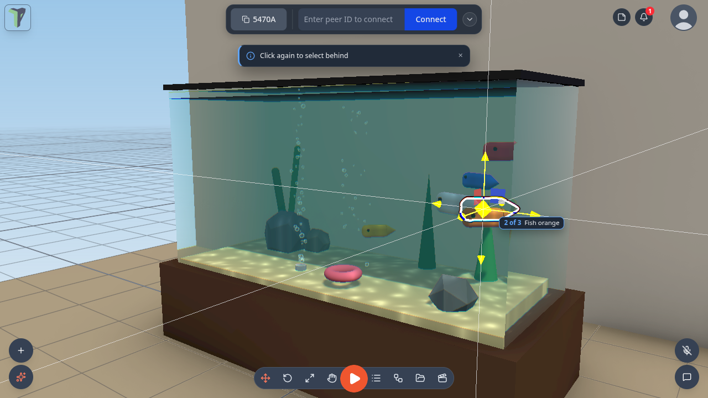
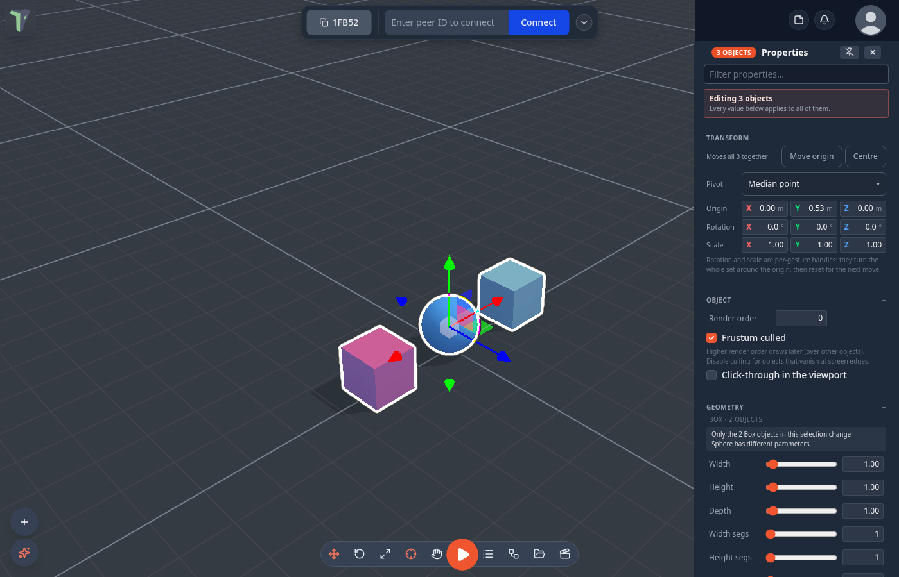
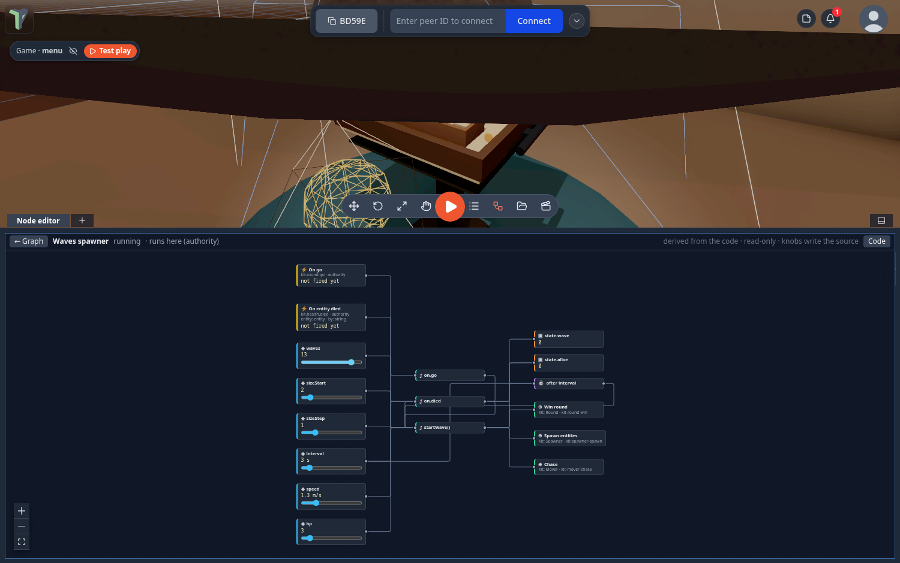

# Controls

How to move the camera, select and transform objects, and find every keyboard shortcut — on desktop and in VR.

## Viewport navigation

- **Orbit** — drag with the left mouse button (right-drag also orbits; a quick right-click *tap* opens the context menu instead).
- **Zoom** — mouse wheel. A two-finger swipe on a trackpad pans instead; see [The mouse wheel](#the-mouse-wheel) if yours does the wrong thing.
- **Fly** — hold <kbd>W</kbd><kbd>A</kbd><kbd>S</kbd><kbd>D</kbd> to pan on the camera's horizontal plane, <kbd>Q</kbd>/<kbd>E</kbd> to fly down/up, hold <kbd>Shift</kbd> for 3× speed. These keys fly only while the 3D view has the keyboard — if a panel has it, click the 3D view first (see [Keys follow the panel you are in](#keys-follow-the-panel-you-are-in)).
- **Focus** — <kbd>F</kbd> frames the selected object.
- **Camera bookmarks** — save the current view from the right-click menu (**Camera bookmarks ▸ Save current view**), recall with <kbd>Shift</kbd>+<kbd>1</kbd>…<kbd>5</kbd>.

### The mouse wheel

A scroll over the viewport is classified by **what the device is**, not by how big one tick was: a mouse wheel zooms, a two-finger swipe pans, and a pinch zooms. High-resolution wheels — a Steam Deck trackpad in wheel mode, a hi-res mouse on Linux — send tiny ticks that used to be mistaken for a swipe; they zoom now.

If the guess is still wrong on your hardware, pick it yourself: right-click the viewport ▸ **View ▸ Mouse wheel** and choose **Zoom (mouse wheel)**, **Pan (trackpad swipe)** or **Auto-detect**. The same switch is **Settings ▸ Controls ▸ Trackpad gestures**, next to the two-finger pan, pinch zoom and reverse-pan toggles. The first time a scroll pans, a one-time toast points you at that menu.

**Settings ▸ Controls ▸ Wheel diagnostics** shows the last eight wheel events over the viewport — the delta on each axis, the browser's wheel value, and how each one was classified and why. It is there for the odd machine: if a wheel refuses to zoom, copy those rows into a bug report.

## Selection

- **Click** an object to select it — the transform gizmo attaches.
- **Double-click** it to open its properties (right-click ▸ *Properties* and the object list do the same). Pin the properties panel if you'd rather it followed every selection.
- **Click empty space** to deselect.
- **Shift+click** adds or removes objects from a multi-selection (the last-picked object is the primary).
- **Shift+drag** on empty space draws a box-select marquee.
- **Alt+click** cycles through everything under the cursor, front to back — see [Inside and behind water](#inside-and-behind-water).
- **Ctrl+A** selects everything in the scene. Inside a mesh editing session it keeps its other meaning — select every face, edge or vertex — so the two never collide.
- **Ctrl+D** duplicates the selection — see [Duplicating](#duplicating) for what a copy brings with it.
- Selecting an object **locks it for other peers** (one lock per person); a locked object shows who holds it, and its right-click menu offers **Request control** to ask for a handover.

### Edit and Interact

The editor has two click modes. Switch with the **Interact mode** cell on the bottom bar (it sits
between the transform tools and Play — the default order is Move, Rotate, Scale, Pivot, Interact, Play,
Object list, Node editor, Explorer, Animation), or press **I**:

- **Edit** (the default) — every click selects, so every object, module pieces included, can
  be picked and moved.
- **Interact** — clicks and drags work the way they do in play, without starting the game:
  piano keys play, buttons press, On Click nodes fire, and a press on a crate carries it while a
  simulation runs. Nothing gets selected.

**Play** is the third mode, entered with the play button as before.

In **Edit inside a running game**, every object can be moved: a body you drop stays where you put
it (it is parked out of the simulation) until you leave Edit.

**FPS and draw calls** — *Settings ▸ Interface ▸ Viewport* shows a small counter in any mode:
frames per second, frame time, draw calls and triangles. Draw calls turn amber above 120 and red
above 150, the budget of a Quest headset; in VR the same counter is a strip in front of you.

### Clicking through glass

A see-through wall no longer steals the click from what is behind it: shells that are nearly
transparent, or marked **Click-through in the viewport** (Properties ▸ Object), are skipped. To
reach something that is still covered, **click the same spot again** (a moment after the first
click, so it is not a double-click) — each repeat selects the next object down under the cursor,
and wraps round.

### Inside and behind water

Since 1.25 a click selects what is **inside or behind** a water volume — the fish in the Aquarium, the duck in the Fluid
tank toy, the stones on the seabed. With nothing behind it (the open ocean, the very edge of a surface) the click takes
the water itself.

- **<kbd>Alt</kbd>+click cycles** through everything under the cursor, front to back: the first <kbd>Alt</kbd>+click
  takes the frontmost (often the water), the next one on the same spot the object behind it, and so on, wrapping round.
  A small chip by the cursor says **"2 of 4 · Fish orange"**; screen readers hear *"Selected 2 of 4: Fish orange"*.
- **Hold <kbd>Alt</kbd>** to preview: a box marks what an <kbd>Alt</kbd>+click would select, with the same chip. Let go
  of <kbd>Alt</kbd> and the preview disappears.
- The object list always reaches every object, whatever is in front of it.

**Configure Scene ▸ Advanced ▸ Selection passes through** chooses what clicks go through:

| Option | Default | What it does |
|---|---|---|
| **Water** | on | water volumes and particle-fluid tanks let clicks through |
| **Transparent surfaces** | off | any see-through material (glass, a 0.5-opacity panel) lets clicks through |
| **Triggers** | off | trigger volumes (physics sensors, the *Water/trigger* collision group) let clicks through |

It is saved with the scene and shared with everyone in it. Surfaces below 25 % opacity and objects marked
**Click-through in the viewport** always let clicks through, as before.

**In games**, clicking, carrying and the VR laser skip water and trigger volumes: the laser ends on the fish, not on the
water in front of it, and a press reaches what it ends on. A lone trigger with nothing behind it can still be clicked. A
game that wants its rays to stop at water or triggers sets `play.rayHits: {water: true, triggers: true}` in its scene's
play block.

!!! note "Ping moved"
    Since 1.25 <kbd>Ctrl</kbd>+<kbd>Alt</kbd>+click pings a spot for everyone (it used to be <kbd>Alt</kbd>+click).
    **Ping here** in the right-click menus is unchanged.

The <kbd>Alt</kbd> preview and the chip are desktop-only; in VR the laser itself shows the target. The cycle order is by
distance along the ray, and objects nested inside a group are picked as the group.

### Module content in the object list

Things a module builds outside the scene (the Untangle board, a piano, a generated dungeon) are
listed in the object list's **Module content** section. Click a row to frame it; its menu hides
it on your screen or opens the module's toolbox. The rows are read-only — the module rebuilds
that content itself.

### The object list from the keyboard

Click anywhere in the object list (<kbd>O</kbd> opens it) to give it focus, and the tree walks from the keyboard:

| Keys | Does |
|---|---|
| <kbd>↑</kbd> / <kbd>↓</kbd> | Move through the visible rows, selecting as you go |
| <kbd>Shift</kbd>+<kbd>↑</kbd> / <kbd>↓</kbd> | Extend the selection |
| <kbd>→</kbd> | Expand a group — or step into its first child if it is already open |
| <kbd>←</kbd> | Collapse a group — or jump to the parent if it is already closed |
| <kbd>Home</kbd> / <kbd>End</kbd> | First / last row |
| <kbd>Enter</kbd> | Open the object's Properties |
| <kbd>F2</kbd> | Rename inline (<kbd>Enter</kbd> commits, <kbd>Esc</kbd> cancels) |
| type a name | Jump to the first object starting with those letters; one letter pressed again cycles |
| <kbd>Delete</kbd> / <kbd>Backspace</kbd> | Delete the selection |
| <kbd>F</kbd> | Frame the selection in the 3D view |
| <kbd>Ctrl</kbd>+<kbd>D</kbd> / <kbd>Ctrl</kbd>+<kbd>A</kbd> | Duplicate the selection / select all |
| <kbd>Esc</kbd> | Hand the keyboard back to the viewport |

The list never flies the camera: <kbd>W</kbd><kbd>A</kbd><kbd>S</kbd><kbd>D</kbd> and <kbd>Q</kbd>/<kbd>E</kbd> do
nothing while it has the keys.

<kbd>↓</kbd> in the list's **Search objects…** box drops you into the results. Type-ahead matches what you typed first, so a Cyrillic name is reachable by its own letters, and falls back to the physical key so a Latin name is still reachable on a non-Latin layout.

### Dragging a selection in the object list

Drag any **selected** row in the object list and the whole selection comes along:

- drop it on a **group** and they move into it;
- drop it on **any other object** and they become its children;
- drop it on the list's empty area or its header and they go back to the top level.

World positions are kept and a drop is one undo step. An object cannot be dropped into its own child. Local-only objects
(ones not shared with the session) dropped onto a shared parent become shared, as before.

### What double-click does

Opening properties is the default, but it is a setting: **Settings ▸ Scene ▸ Selection ▸ Double-click action** offers *Open properties*, *Edit mesh*, *Focus and isolate* and *Select same type*.

**Isolate** hides everything else rather than fading it — fading would mean writing to materials that other people are sharing.

### Very small objects

An object scaled — or animated — down to almost nothing has no surface left to click. It gets a small dot drawn at its origin so there is something to aim at, and a click near that dot selects it.

!!! note
    At *exactly* zero scale the viewport click does not reach it yet; select it from the object list instead. That one is a known gap.

### Selecting without a keyboard

On a phone or tablet there is no <kbd>Shift</kbd> to hold and no right-click, so the same
two gestures are available as a **mode**. *Settings ▸ Interface ▸ Touch tools* puts round
**Undo**, **Redo** and **Multi-select** buttons beside the logo — on by default on phones
and narrow windows.

With **Multi-select** on:

- a **tap adds** to the selection instead of replacing it, and
- a **drag on empty space** draws the box-select marquee.

It works the same inside a mesh editing session, on vertices, edges and faces. Everything
else already has a touch path: long-press the viewport for the right-click menu, and the
**+** button opens the same create menu.

### Duplicating

**Ctrl+D** (or right-click ▸ *Duplicate*) makes a working copy of what is selected — right after you create something,
that is the new object. With nothing selected, Ctrl+D says so and creates nothing. A copy is a copy of
everything that belongs to the object, not just its shape:

| Comes along | |
|---|---|
| geometry, transform, children | always |
| material and its texture slots | its own detached copy — unless you ask them to be [shared](#sharing-one-material) |
| physics, origin, camera settings | always |
| **animation clips** | yes — the copy plays its own |
| **object flow graph** | yes, with fresh node ids |
| **shader graph** | yes — otherwise the copy would render frozen |

An embedded **Object Flow** node inside a copied graph keeps pointing at the object it
referenced. Re-aiming it at the copy is a decision only you can make, so it is left alone.

Each of the last three can be switched off in *Settings ▸ Scene ▸ Duplicate* if you would
rather a copy came out bare. An object that inherits the **scene default** shader keeps
inheriting it — it does not get a private snapshot.

### Sharing one material

*Settings ▸ Scene ▸ Duplicate ▸ **Share materials*** changes what a copy gets. Off — the
default — a duplicate gets its own copy of the material, so editing one leaves the other
alone. On, the copy and the original are **one material**: an edit to either changes both,
for everyone in the session. Geometry is always copied either way.

It is your setting, not the scene's: two people in one session can reasonably disagree
about how *they* duplicate. What it produces — the link itself — is scene data, and
replicates like anything else.

An object whose material is shared says so in its **Material** section: *This material is
shared with N other objects — editing it here changes them too, for everyone.* **Unlink**
beside it gives that one object its own copy back and leaves the rest sharing.

The link survives everything a copy normally survives: saving and reloading the scene,
undo, a peer duplicating the object again, and a late joiner arriving afterwards. The one
thing that cannot share is an object with **more than one material slot** — it is left
copying, rather than half-linked.

### Editing a multi-selection

Select several objects (<kbd>Shift</kbd>+click, box select, <kbd>Ctrl</kbd>+<kbd>A</kbd>) and open **Properties**: the
panel says **Editing N objects**, and every row applies to all of them.

- **Shared values show; differing values show a dash.** A slider, number or list whose objects disagree reads **—**, a
  checkbox shows the in-between state, and a material or emission colour says *(mixed)* under the picker.
- **Setting a dashed row sets every object** to the new value — type into a dashed Roughness, tick an in-between
  **Cast shadow**, pick any entry in a dashed list.
- **One edit is one undo step** for the whole selection, and <kbd>Ctrl</kbd>+<kbd>Z</kbd> puts each object back to
  *its own* previous value. Since 1.26 **Visible**, **Cast / Receive shadow**, **Render order**, **Frustum culled** and
  every **Light** row (colour, intensity, distance, decay, angle, penumbra, shadow bias / softness / map size) undo too.
- **Several lights** selected together are edited together; a row only some light types have (a spot light's
  **Angle**) reaches the lights that have it.
- Your peers see the change **in one step**: the whole selection's edit travels as one message.

Name, uuid, LOD, Water and particle emitters stay single-object, and **Geometry** reaches only the objects of one shape
type (the panel says which) — click the one object for those. Transform rows on a multi-selection move, turn and scale
the **set** about its [pivot](#the-pivot-of-a-multi-selection) rather than each object's own numbers: typing a value
moves the set as a whole instead of collapsing it onto one plane.

## Transform gizmo

| Key | Mode |
|---|---|
| <kbd>1</kbd> | Move (translate) |
| <kbd>2</kbd> | Rotate |
| <kbd>3</kbd> | Scale |

Snapping is configured from the right-click menu under **Snapping** — grid steps and snap-to-surface, plus snapping onto real geometry: vertices, edges, faces and other objects, optionally turning the object onto the surface it lands on. See [Snapping](snapping.md).

### Hiding the gizmo, and getting the selection back

Pressing the key of the mode that is **already active** hides the gizmo and the selection, so you can look at the object with nothing in the way. Pressing **any** mode key brings the same selection back in that mode — a multi-selection comes back whole, with the origin you placed by hand, and inside [Edit Mesh](mesh-editing.md) the face, edge or vertex you had picked comes back too. The gizmo button under **Gizmo & pivot** in the Edit Mesh toolbox does the same thing as the key, and <kbd>G</kbd> counts as a mode key, so it recalls as well.

An object that was deleted, or that a peer locked in the meantime, is left out and a toast says how many were skipped.

!!! note "Inside mesh edit"
    <kbd>1</kbd>/<kbd>2</kbd>/<kbd>3</kbd> keep meaning Move / Rotate / Scale inside an [Edit Mesh](mesh-editing.md) session — they are what you reach for mid-edit. The element modes (vertices, edges, faces) are on <kbd>Tab</kbd> and <kbd>Shift</kbd>+<kbd>Tab</kbd>.

### Each object's origin

Every object carries its own **origin** — the point it rotates, scales and hinges around. The properties panel's Transform section has one-click presets — **Bottom**, **Centre**, **Median**, **World 0**, and **Children** for a group — or you can place it by hand:

- **Move origin** switches the gizmo to the pivot: drag it (or type coordinates) and the mesh stays put. Grid and surface snapping still apply. Press **Done** when it's where you want it.
- **Pick from mesh…** opens [Edit Mesh](mesh-editing.md) so you can put the origin on real geometry: click a vertex — or Ctrl+click both ends of an edge to hinge on it — then press **Set origin here**.
- **Bottom** puts the pivot on the footprint, so the object sits on the ground.
- Flow **Spin** and **Orbit**, and physics joints, all turn about the origin you set — that is how you hinge a door.

The origin travels with the object: it replicates, saves, undoes, and is baked in on GLTF export.

**Typing a rotation honours it.** Once an object has an origin, a rotation or scale typed into the Transform rows turns it about that origin — the same thing a gizmo drag does — instead of about its own local zero. That matters most for a **group**: a group made by dragging objects together, or with `/group`, sits at world zero, so its origin is one right-click away — **Origin ▸ Centre of children**, **World zero** or **Reset origin** on the group's right-click menu. Lights have an origin too: give a sun one and Rotate swings it around that point (see [Lights](camera.md#lights)).

### The pivot of a multi-selection

With several objects selected, what the set rotates and scales about is a choice — one setting, in three places:

- the **Pivot** button on the [toolbar](#the-toolbar), next to Scale: its icon and tooltip name the current mode, and a
  click steps to the next one;
- the **Pivot** dropdown in the properties panel's Transform section, or right-click ▸ **Pivot point**;
- in VR, **Settings ▸ Editing ▸ Pivot point** (see [Grabbing a selection](vr.md#grabbing-a-selection)).

| Mode | Turns about |
|---|---|
| **Median point** | the centre of the selection (the default) |
| **Active object** | the origin of the object you picked last — in VR, the one you grip |
| **Individual origins** | each object's own origin, so a row of doors all swing on their own hinges |
| **Parent origin** | the origin of the parent they all share — offered only when they share one |

The gizmo drag, the typed rows and a VR grip all obey it. Moving is never per-object: a translation moves the set as
one. An origin you placed by hand with **Move origin** overrides the mode until you select again.

### Numeric fields

Every number in the app is the same control: **drag** it to scrub, or **type** into it for live updates. <kbd>↑</kbd>/<kbd>↓</kbd> step by one unit — hold <kbd>Ctrl</kbd> for ×10, <kbd>Shift</kbd> for ×100 — and <kbd>Esc</kbd> reverts what you typed.

That includes the numbers inside **node editor cards**, **shader nodes** and the
**animation window** — dragging one of those scrubs the value without dragging the card.
Scrubbing an animation key or a shader parameter is **one undo step**, not one per pixel.

Since 1.25 that holds for **every slider and number field inside a node** — every node type, and the knobs in a
behaviour's [Open view](behaviours.md#the-live-node-view): a drag changes the value, never the node and never the whole
graph, and the behaviour view no longer flickers the cursor.

Fields that hold a distance or an angle also accept a typed **unit** (`12cm`, `4in`,
`90deg`) — see [Units](units.md).

#### Number fields and undo

Since 1.27 every number field you can drag — the Inspector's **Position** / **Rotation** / **Scale** and its other
values, shader-node vectors, and the [Animation window](animation.md)'s length, speed, fps, step and key fields — works
the same way with undo:

- **One drag is one undo step.** However far you scrub, one <kbd>Ctrl</kbd>+<kbd>Z</kbd> puts the value back where the
  drag started. (Before, a shader vector took two, and the Animation window's length, fps and step took one per pixel
  moved.)
- **One typed edit is one undo step.** Click a field, type a value (it applies as you type) and press <kbd>Enter</kbd>:
  that is one step, even if you paused between keys.
- **<kbd>Esc</kbd> cancels typing.** It puts back the value the field had before you started, as it already did for
  arrow-key steps, and leaves nothing on the undo stack.
- **Undo shows at once.** After <kbd>Ctrl</kbd>+<kbd>Z</kbd> the Position / Rotation / Scale rows show the restored
  numbers straight away — before, they kept the old number until you clicked something, and dragging from it made the
  object jump.
- The Animation window's playback **Speed** is undoable now too.
- **Selecting a shader node is not an edit.** Clicking a node in the [Shader editor](shader-graph.md) selects it on your
  screen only: it adds no undo step and is not sent to the other people in the session.

### Text selection

Dragging across a menu, a toolbar or a panel does not paint a text selection, and a drag that starts in the 3D view or
the node editor never selects text. Text fields, code, chat, logs and help text stay selectable as usual.
**Settings ▸ Interface ▸ Allow text selection everywhere** turns selection back on in all the interface (this device
only).

### The menu on a phone

The logo menu fits a short screen — a landscape phone, or a docked Connect bar — and scrolls with a finger, with no
visible scrollbar. On a folding phone it stays right through folding and unfolding with the page open.

### Floating windows

The toolboxes, the Explorer, the flow and animation windows and the panels all behave the same way: drag the header to move, drag the bottom-right corner to resize. A window can never be sized past the edge of the screen — the resize corner always stays reachable — and **double-clicking** the corner resets it to its default size while leaving it where you parked it. Size and position are remembered per window.

A window also **keeps its header**: it cannot be dragged so far down that the header hides under the Controls pill, the bottom band on a touch or narrow screen, the dock, or a browser overlay — there is always something left to grab. A tall toolbox parked near the bottom scrolls its body instead of losing its head.

A **right-click while you drag a window** — by its title bar, a resize corner or a tab — no longer pops up the browser's
menu; a normal right-click elsewhere behaves as before. Tabs that sit in a window's title bar, like the undocked
[Code](code-workspace.md) window's, can be clicked, while the title bar around them still drags the window.

### Docking to a screen edge

Drag a window's header to the **left or right edge** of the screen and a blue strip appears:
let go and it becomes a full-height panel on that edge, out of the way of the viewport. Drag
its header back into the middle and it floats again, where it was before. Drag the panel's
inner edge to set its width.

**Two windows fit on one edge.** Drop a second window onto a docked panel — or onto the same
edge — and the column splits into two stacked panels. The half of the panel your pointer is
over is highlighted with **⊟ Split panel**, so you choose which one ends up on top. A
divider between them sets the share: drag it up or down, and that share is remembered **per
side**, so the left and right edges keep their own. Undock either one and the other takes the
whole column back.

That is the ceiling: a third window dropped on a full edge is refused, and the panel it
landed on wiggles to say so.

Docking is **desktop only** — on a touch screen there is no room for a full-height side panel
and it would fight scrolling, so windows there simply stay floating.

### Workspace layouts

Save the windows you have open — which panels, docked or floating, their sizes, the side and bottom docks, tab groups —
under a name, and switch between arrangements in one click.

- **Where:** **Menu ▸ Layouts**, or **Settings ▸ Interface ▸ Windows & chrome ▸ Workspace layouts**.
- **Save:** arrange the windows, type a name, press **Save**. Saving under a name you already have (in any case)
  updates that layout.
- **Use:** click a saved layout to apply it. Rename or delete it from the same list.

Layouts are kept on this device. A reload still starts with a clean slate: a layout is applied only when you pick one.

## The toolbar

Pressing a toolbar button never takes the keyboard: the keys stay with whatever had them — this holds for the bottom
toolbar, the Connect bar, the touch tools, the draw, sculpt, spline and mesh-edit toolboxes and module toolboxes. So
"press Move, then <kbd>F</kbd>" still frames the selection from the 3D view.

The bar at the bottom of the screen is yours to arrange. **Right-click** (or long-press) any of its buttons:

| Entry | What it does |
|---|---|
| **Swap with ▸** | exchange this button for one that is not on the bar |
| **Move left / Move right** | one place along the bar — past the play button when it is next |
| **Hide button** | take it off the bar (Customize toolbar brings it back) |
| **Move toolbar** | slide the whole bar along the bottom: click to place it, the arrow keys nudge, <kbd>Esc</kbd> puts it back. Disabled on a screen too narrow to move it |
| **Reset toolbar position** | back to the middle |
| **Always on top** | paint the bar over the dock and floating windows (by default they cover it) |
| **Collapse / Expand toolbar** | shrink the bar down to the play button, and back |
| **Customize toolbar…** | a checklist of every tool: tick to show, untick to hide, ▲/▼ to reorder; **Reset toolbar** goes back to the default buttons and order |

The **play button**'s right-click menu chooses how you play — **Play (desktop)**, **Enter VR**, **Enter AR passthrough**
(greyed out where the device cannot) — and, in a scene that is a game, **Test play (start from the menu)**, which resets the
game to its menu and starts from the Start screen. See [Build a Game Loop](build-a-game.md#test-play).

## The Settings window

**Settings** (logo menu ▸ Settings) is a window with a grouped menu of categories on the left — on a phone, a list you
tap into — a search box in the header, and one row per setting. Changes save as you make them. Since 1.26 it has its
own page: see [Settings](settings.md).

## Keyboard shortcuts

Shortcuts are inert while you type in a text field and while play mode owns the keyboard. The same list is shown in **Settings ▸ Shortcuts** (<kbd>Ctrl</kbd>+<kbd>/</kbd> opens it directly), where a click on a shortcut's keys rebinds it and **Reset all** puts the defaults back.

The keys in the table are the **3D view's**: they fire while the 3D view has focus. A panel you click in gets its own keys — see [Keys follow the panel you are in](#keys-follow-the-panel-you-are-in).

**Every keyboard layout works.** A letter shortcut is matched by the letter printed on the key when there is one — AZERTY, Dvorak and QWERTZ keep their own labels — and by the key's **physical position** otherwise, so <kbd>G</kbd>, <kbd>F</kbd>, <kbd>Ctrl</kbd>+<kbd>Z</kbd> and <kbd>W</kbd><kbd>A</kbd><kbd>S</kbd><kbd>D</kbd> work on Russian, Greek, Hebrew, Arabic and CJK layouts without switching. Where the browser can tell, **Settings ▸ Shortcuts** shows your layout's own label beside each letter (*п on your layout*); where it cannot, a note says letter shortcuts follow the QWERTY position.

!!! tip "Finding a setting"
    Settings is grouped into **General** (Interface, Controls, Input, Touch controls, Shortcuts), **Workspace** (Scene,
    Explorer, Node types, Export) and **Devices & services** (VR, AI, Connection), with **About & what's new** at the
    bottom. If you don't know which one holds what you want, type in the search box: it matches names, descriptions and
    the words people use — **dark** finds the theme, **southpaw** finds Swap sticks. See
    [Finding your way](settings.md#finding-your-way).

| Keys | Action |
|---|---|
| <kbd>1</kbd> / <kbd>2</kbd> / <kbd>3</kbd> | Gizmo: move / rotate / scale (again on the active mode: hide; any mode key: bring the selection back) |
| <kbd>G</kbd> | Move (grab) — same as <kbd>1</kbd> |
| <kbd>W</kbd> <kbd>A</kbd> <kbd>S</kbd> <kbd>D</kbd> | Fly the camera (horizontal) |
| <kbd>Q</kbd> / <kbd>E</kbd> | Fly down / up |
| <kbd>Shift</kbd> (hold) | Fly 3× faster |
| <kbd>F</kbd> | Focus the selected object |
| <kbd>Ctrl</kbd>+<kbd>D</kbd> | Duplicate the selection (whole set) |
| <kbd>Ctrl</kbd>+<kbd>A</kbd> | Select all objects (inside Edit Mesh: every element) |
| <kbd>Delete</kbd> / <kbd>Backspace</kbd> | Delete the selection (a group asks first) |
| <kbd>Alt</kbd>+click | Cycle the selection through everything under the cursor ([inside and behind water](#inside-and-behind-water)) |
| <kbd>Ctrl</kbd>+<kbd>Alt</kbd>+click | [Ping](notifications.md#pinging) a spot for everyone |
| <kbd>Esc</kbd> | Leave isolation |
| <kbd>Z</kbd> | Cycle the [render mode](camera.md#render-mode-view): Shaded → Shaded + AO → Wireframe |
| <kbd>Tab</kbd> | Enter [mesh edit](mesh-editing.md) mode — inside it <kbd>Tab</kbd> cycles Vertices / Edges / Faces; <kbd>Esc</kbd> exits |
| <kbd>I</kbd> | [Edit / Interact](#edit-and-interact) mode — in Interact, clicks play with the scene instead of selecting |
| <kbd>M</kbd> | Toggle element [snapping](snapping.md) |
| <kbd>O</kbd> | Toggle the object list |
| <kbd>N</kbd> | Toggle the node editor |
| <kbd>T</kbd> | Show / hide the tool dock |
| <kbd>Alt</kbd>+<kbd>E</kbd> / <kbd>F</kbd> / <kbd>A</kbd> / <kbd>U</kbd> / <kbd>S</kbd> / <kbd>H</kbd> | Explorer / Flow Code / Animation / UV editor / Shader editor / HUD editor |
| <kbd>C</kbd> | Toggle chat (from the 3D view only) |
| <kbd>Shift</kbd>+<kbd>A</kbd> | Add an object at the cursor (enable in Settings) |
| <kbd>P</kbd> | Start / stop the physics [simulation](physics.md) |
| <kbd>Ctrl</kbd>+<kbd>Enter</kbd> | Play / enter VR (right-click the play button for modes) |
| <kbd>`</kbd> | Toggle the [AI](ai/assistant.md) quick-prompt bar |
| <kbd>Ctrl</kbd>+<kbd>S</kbd> | Save the scene |
| <kbd>Ctrl</kbd>+<kbd>Shift</kbd>+<kbd>S</kbd> | Save a [checkpoint](checkpoints.md) |
| <kbd>Ctrl</kbd>+<kbd>Z</kbd> | Undo |
| <kbd>Ctrl</kbd>+<kbd>Y</kbd> / <kbd>Ctrl</kbd>+<kbd>Shift</kbd>+<kbd>Z</kbd> | Redo |
| <kbd>Shift</kbd>+<kbd>1</kbd>…<kbd>5</kbd> | Recall camera bookmark 1–5 |
| <kbd>V</kbd> (hold) | Push-to-talk while the mic toggle is off |
| <kbd>Ctrl</kbd>+<kbd>/</kbd> | Show the shortcut list |
| <kbd>?</kbd> | Keyboard cheat sheet (every panel, the focused one first) |

Inside an Edit Mesh session the bare letters <kbd>E</kbd> <kbd>I</kbd> <kbd>G</kbd> <kbd>S</kbd> <kbd>B</kbd> <kbd>F</kbd> <kbd>X</kbd> / <kbd>W</kbd> <kbd>J</kbd> and the loop keys (<kbd>L</kbd>, <kbd>Ctrl</kbd>+<kbd>+</kbd>/<kbd>-</kbd>, <kbd>Ctrl</kbd>+<kbd>I</kbd>) belong to the mesh tools — see [Mesh Editing](mesh-editing.md). That is why the panel shortcuts above use <kbd>Alt</kbd>: they keep working while a mesh session is open. Since 1.23 the mesh tools' keys can be rebound too, in their own *Mesh edit* group of **Settings ▸ Shortcuts**.

### Keys follow the panel you are in

A shortcut fires only in the panel that has focus — the one you last clicked. The table above is the 3D view's, and the
node editor has its own set: see [Node editor: keyboard, groups and notes](node-editor.md). Press <kbd>?</kbd> anywhere
for a cheat sheet of every panel's keys, the focused panel first.

Since 1.25 this covers **every panel and tool window**, docked or floating: the Explorer, the Inspector, the node
editor's chrome, a behaviour's graph view, the [code workspace](code-workspace.md), the HUD editor, Animation, UV,
Shader, Flow Code, the Profiler, previews, chat… Clicking in one gives it the keyboard, and the panel that has the keys
shows an outline.

- **<kbd>W</kbd> <kbd>A</kbd> <kbd>S</kbd> <kbd>D</kbd> / <kbd>Q</kbd> <kbd>E</kbd> never fly the camera from a panel**,
  and the 3D view's own letters (<kbd>C</kbd> chat, <kbd>1</kbd>/<kbd>2</kbd>/<kbd>3</kbd>, <kbd>P</kbd>, <kbd>M</kbd>…)
  do nothing there. Click the 3D view to give it the keys back.
- **<kbd>T</kbd>, <kbd>N</kbd> and <kbd>O</kbd>** (the tool dock, the node editor, the object list) are window management,
  so they also work from a panel.
- **Global keys work everywhere**: <kbd>Ctrl</kbd>+<kbd>Z</kbd> / <kbd>Ctrl</kbd>+<kbd>Y</kbd> (also with a checkbox
  or slider focused, and inside the Profiler timeline), <kbd>Ctrl</kbd>+<kbd>S</kbd>, <kbd>Ctrl</kbd>+<kbd>Enter</kbd>,
  the <kbd>Alt</kbd>+letter panel toggles, <kbd>?</kbd> and <kbd>V</kbd> (push to talk).
- **The object list** keeps its own keys and the scene's selection keys — see
  [The object list from the keyboard](#the-object-list-from-the-keyboard).
- A panel that has no keys of its own simply ignores the 3D view's letters: click the 3D view first to fly. Inside a
  text field or the code editor, typing is always typing.

The <kbd>?</kbd> cheat sheet and **Settings ▸ Shortcuts** list *Panels and tool windows* and *Object list* among the
places keys belong to.

## Right-click menus

**Empty viewport** — a quick right-click opens the scene menu:

- **Search objects…** — find an object in the scene by name (off by default: **Settings ▸ Interface ▸ Lists & menus ▸ Object search in menu**).
- **Add** — the full primitive catalog (meshes, building blocks, [architecture](architecture.md) — walls, doors, windows and stairs — cameras, lights, [water](water.md), [effects](particles.md), a [fluid tank](simulation.md#fluid-tank)) plus empty groups; objects spawn at the clicked point.
- **Undo / Redo**, **Ping here**.
- **Selected ▸** — the selected object's own menu (shown only while something is selected).
- **Tools** — Node editor, Draw mode (drag 3D strokes on surfaces, or click out an editable [spline](splines.md)), Measure distance, Simulate physics (and *Reset simulation* while one runs), [Recording…](recording.md) (a turntable or flythrough video).
- **Snapping** — position / rotation / scale steps, snap to surface, element snapping, *More snapping settings…* (see [Snapping](snapping.md)).
- **View** — Show grid, Grid & axes settings…, Show helpers in Play (debug), the Mouse wheel mode, Scene look…, Screenshot.
- **Module tools** — the toolboxes of installed modules.
- **Camera bookmarks** — Save current view, the saved views, *Manage saved views…*, Clear bookmarks.

**An object** (viewport or object list) — Focus camera, Duplicate, Group selection / Ungroup, Origin and Pivot point, Convert to mesh, Align to ground, Preview camera (on a [camera](camera.md#camera-objects)); **Edit**: Properties, Rename, Edit shader, [Edit mesh](mesh-editing.md), Edit spline, Sculpt mesh; **Physics & effects**: Physics ▸ Weld / Hinge, Effects, Enable / Disable flow effects; **Share**: Add note, Ping this object, [Save as…](prefabs.md); and Delete. <kbd>Ctrl</kbd>+<kbd>Alt</kbd>+click pings anywhere in the scene (since 1.25; <kbd>Alt</kbd>+click now [cycles the selection](#inside-and-behind-water)).

**Every right-click menu can be typed into.** Start typing and the menu turns into a filtered list of every entry in it,
submenus included; <kbd>↑</kbd>/<kbd>↓</kbd> walk the rows, <kbd>Enter</kbd> runs one, and with nothing typed
<kbd>→</kbd> opens a submenu and <kbd>←</kbd> goes back. <kbd>Esc</kbd> unwinds one step at a time — the text, then
the search, then the submenu, then the menu. Rows show their keyboard shortcut on the right. The search list's height
can be dragged, and each kind of menu remembers it. On a touch screen nothing pops a keyboard up unless you tap the
search row.

With **several objects** selected, the menu acts on the whole set — the entries are counted ("Delete 4 objects") — and adds **Group selection**, **Convert to mesh** (merge them into one editable mesh, materials kept) and the Physics ▸ Weld / Hinge pair. With exactly two meshes selected, right-click the first one for **Boolean** (union, subtract, intersect — see [Mesh Editing](mesh-editing.md#boolean)).

## VR basics

Enter VR from the headset button (WebXR). The essentials below get you started; the [VR Guide](vr.md) has the full control and radial-menu map.

- **Radial menu** — press <kbd>B</kbd>/<kbd>Y</kbd> on your menu hand to toggle it (or, in hold mode, hold the button and release over a sector). Its first ring is Objects, Add, Scene, Tools, Redo, Undo, Chat and Settings (every VR setting, the microphone, exit VR); the hub is **Selected** when something is selected.
- **Hand tracking** — hands have no <kbd>B</kbd>/<kbd>Y</kbd>, so **pinch and hold** (about half a second) on the menu hand to toggle the radial menu; a quick pinch stays a normal click.
- **Trigger** points and selects; **grip** grabs and moves objects; gripping with **both hands** grabs the world itself to reposition yourself.
- Floating panels (menu, objects, properties, keyboard, chat…) can be grabbed and repositioned with the grip.

!!! note
    Everything above replicates: selection locks, transforms, notes, pings and draw strokes are all visible to your peers in real time.
