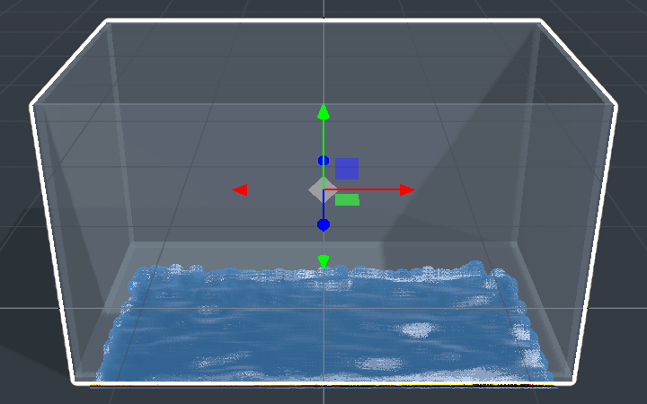

# Fluid Tank

A glass tank of **particle fluid** you can slosh, pour into and drain. Toys dropped in float and are pushed around.

<!-- 36-docs: from the 36-sim fragment; image is the lane's capture — re-shoot from the 1.22 preview -->

## Adding one

**Add ▸ Simulation ▸ Fluid tank** (right-click the viewport, or **+** on a phone). Its settings are in
**Properties ▸ Fluid tank**. Move or tilt the tank and the fluid sloshes; scale it and the fluid box resizes with it.

## Settings

| Setting | What it does |
|---|---|
| **Particles** | 200 – 8000: more particles, finer fluid, more cost |
| **Fill** | how full the tank starts |
| **Viscosity** | water-thin to honey-thick |
| **Surface tension** | how much the fluid holds together |
| **Gravity ×** | how hard it falls, relative to the scene |
| **Colour**, **Clarity** | how it looks |
| **Look** | **Auto**, **Smooth surface** or **Drops** |
| **Pour** (rate, speed) | pours more fluid in |
| **Drain** (rate) | lets it out |
| **Refill** | back to the starting fill |

## Limits

- Each player simulates their own fluid — only the settings are shared — so splashes differ slightly between players. The
  push on floating toys comes from the player running the physics simulation.
- A tank pauses while it is off-screen.
- On a Quest (and on slow devices) the fluid draws as **drops**, with at most 1500 particles.

For whole pools, lakes and oceans, use [Water](water.md) — it is a surface, not particles, and costs far less.
