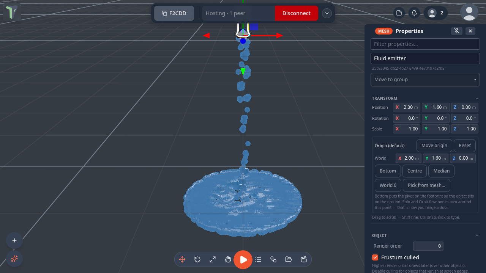
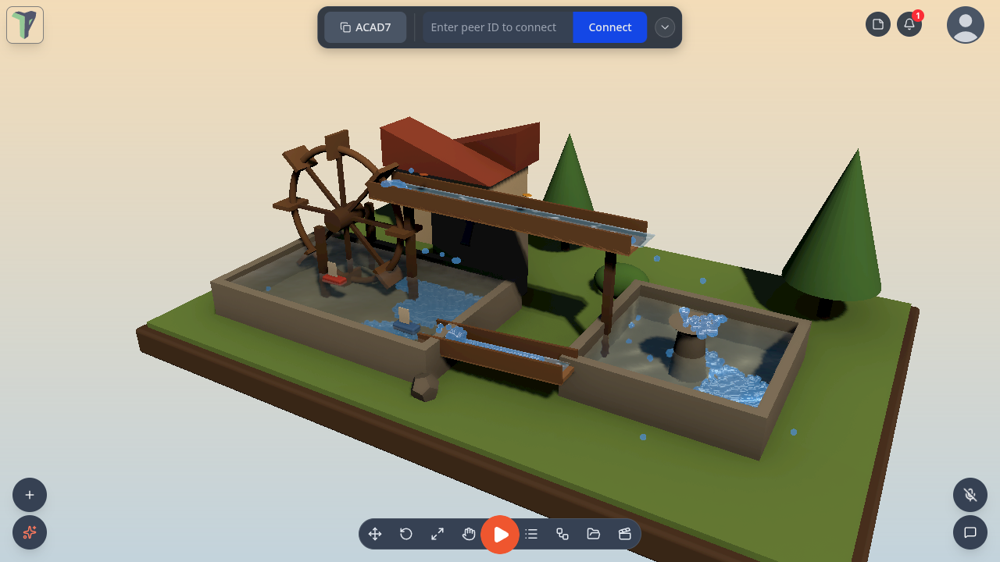

# Fluids: emitters, flow paths and motors

Since 1.25 you can pour **real particle water** into the open scene: it pools, splashes, lands on meshes and joins any
water it is poured into. **Flow paths** carry it along rivers, chutes and pipes, and two new nodes turn wheels and float
leaves and boats along the current. For water volumes (pools, tanks, oceans) see [Water](water.md); for a glass box of
particle fluid see [Fluid tank](simulation.md#fluid-tank).

## Fluid emitter

**Add ▸ Water ▸ Fluid** (right-click the viewport, or the **+** button). It pours from its spout, 1.6 m above where you
clicked; rotate it to aim, or pick **Aim** in its properties.

**Properties ▸ Fluid emitter**:

| Setting | What it does |
|---|---|
| **Emitting** | on / off |
| **Mode** | *Stream* (continuous) or *Spill* (releases **Spill amount** once — a bucket tipping, a leak) |
| **Rate /s** · **Speed** · **Spread °** | how much, how fast and how wide it pours |
| **Aim** | down, up, forward or sideways |
| **Fluid** | drop size, viscosity, surface tension, **cohesion** (drops gather into puddles), **friction** (a puddle settles instead of skating), colour, clarity, and the look (smooth surface on a desktop, drops on a Quest) |
| **Collide with the scene** | the water lands on meshes instead of falling through them |
| **Pouring into water joins it** | water reaching a pool or tank of water is absorbed, with a ripple |
| **Restart** | starts the emitter again |

**Hard caps** keep it bounded — any one of them is enough:

- **Max particles** — it waits at the cap;
- **Lifetime s** — older water disappears;
- **Area** (width / height / depth, and how far **below** the spout it reaches) — water leaving the area is gone. With
  **Area floor holds water** off, it falls out of the bottom.

Each player simulates their own splash; the settings are shared and undoable. An emitter pauses while it is off-screen,
and the simulation transport's **Pause** and **Reset** hold and clear it with the rest of the
[simulation](physics.md#the-simulation-controls-hud).

## How water meets an object

**Properties ▸ Physics ▸ Fluid** is shown when the scene has particle fluid, and sets how the water meets this object:

| Fluid | What happens |
|---|---|
| **Auto** | the water collides; dynamic bodies are pushed |
| **None** | the water passes through |
| **Collide** | the water collides, but never pushes the object |
| **Collide + push + float** | light objects float on the fluid's pools |

## Flow paths

**Add ▸ Water ▸ Flow path** places a path that carries water toward its end. **Kind** chooses what it is:

- **River / chute** — steers water along it at **Speed**, with **Pull /s** for how firmly. **Loop** sends water that
  reaches the end back to the start, so a closed loop never runs dry.
- **Pipe** — water at its first point comes out of its last point: a hidden pump.

A path also has a width and depth, an animated **water surface** (colour, opacity), its point list (**Add point**,
**✕** to remove one) and **Shape from a spline…**, which lets you draw the curve with the [spline](splines.md) tool.
Physics bodies pass through a path's surface. On a Quest the surface is what you see of a river.

## Nodes

Both are in the node editor's **Animation** group:

- **Rotate / Motor** — turns its object about one of its own axes, around its origin (a wheel on its hub), at **rpm**
  with a **spin-up**. Paddles and scoops it turns push and carry fluid. On a dynamic physics body during a simulation it
  is a motor of the given **torque** instead, so a load slows it. The **on** input switches it.
- **Float Along Flow** — carries its object (a leaf, a toy boat) along the nearest flow path, or the one wired in, at
  the path's speed × **speed**, bobbing, facing the current and looping.

## Fluid budget

**Configure Scene ▸ Physics ▸ Fluid budget** is one particle budget shared by every Fluid emitter in the scene; each
emitter gets a share in proportion to its own **Max particles**. The budget is lowered automatically when frames drop,
and a headset runs at most 1400 particles.

## Example: Water works

**Menu ▸ Templates ▸ Examples ▸ Water works** is a closed loop on a diorama: a scoop wheel lifts pond water into a
head-race, which spills into a fountain basin; the basin overflows down a chute back into the pond, and leaves and boats
ride along.

## Limits

- Particle water is simulated per player: it never travels over the network, only the settings do.
- A Fluid emitter's area is at most 16 m a side, and is shrunk to fit 600 k grid cells.
- Up to 6000 particles per emitter on a desktop; a headset shares at most 1400 across the scene.
