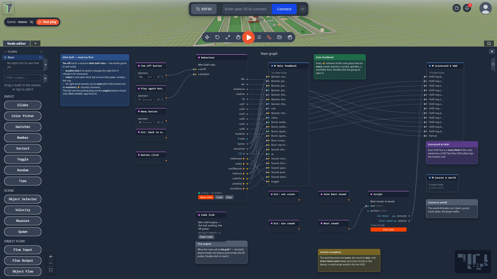
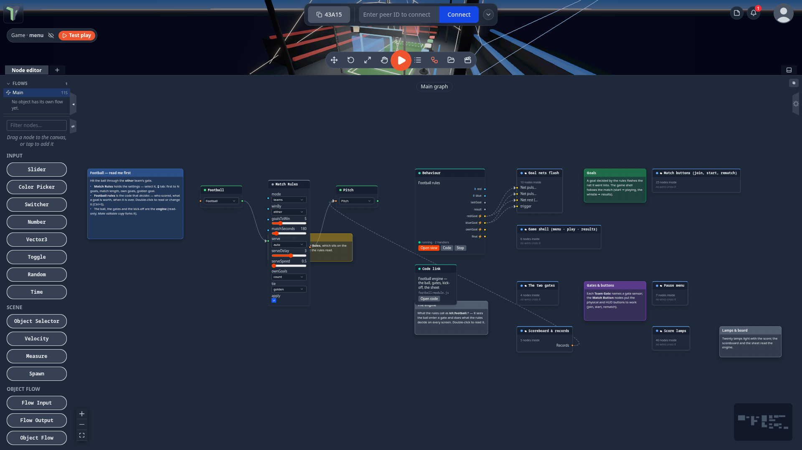

# Game rules on the Main graph

Every game rebuilt in 1.23 has **one readable script that is its rules**, sitting on the game's
[Main graph](main-graph.md). Open the game, open the node editor, and the whole game is in front of you: the rules in
the middle, wired to the buttons, the HUD, the sounds and the kit around it. Change a number in a panel, or change the
code and press <kbd>Ctrl</kbd>+<kbd>S</kbd>, and the game plays by your rules on every player's screen.

These games ship this way: **Mini Golf**, **Football**, **Dungeon Realms**, **The Alchemist's Escape**, **Sky Run**,
**Target Toss** and **Marble Maze** (see [The Games tab](games.md)).

## Where it is

Open a game from the **Games** tab, then open the **Node editor** (<kbd>N</kbd>). **Main** is the first entry under
**Flows**. The blue note *"… — read me first"* says where to start.

## What is on the graph

- **The rules node** — a [Behaviour](behaviours.md) node such as *Mini Golf rules*, *Football rules* or *Escape rules*.
  It holds the game's logic as plain JavaScript: holes and par, the cup, out of bounds, who scored, when a match is
  over, how many gems open a portal, the escape room's dial code and lever order, Sky Run's stages and fall depth, what
  each Target Toss target is worth and how a combo grows.
- **Its sockets** connect it to the rest of the graph:
    - **inputs** on the left — the menu buttons (*Tee off*, *Play again*…) are wired into them;
    - **outputs** on the right — its **state** (the words the HUD shows: *Hole 3 of 6 · Windmill*, *Strokes 2*,
      */ 8 needed*…) and its **moments** ⚡ (a stroke, out of bounds, the ball in the cup, a goal, a portal opening),
      wired into banners, sounds, sparkles, controller buzzes and [kit](game-kit.md) nodes (set score, win round).
- **The engine** — what rules cannot be: a ball's physics body, the drag-to-putt arrow, a VR putter, a generated
  dungeon. It stays in the game's module, and the rules reach it as `kit.golf.*`, `kit.football.*`, `kit.realms.*`,
  `kit.escape.*`, `kit.skyrun.*`, `kit.toss.*` or `kit.marble.*`. A **Code link** node on Main opens the engine's
  source, read-only.
- **Named groups** hold everything else — *Hole feedback*, *Scorecard & HUD*, *Score lamps*, *Start menu & buttons*… —
  with a **note** beside each one that explains it. Double-click a group to open it (see
  [Groups](node-editor.md#groups)).

## Change a number

You do not have to read code to tune a game. Select the rules node — or the game's settings node: Football's
**Match Rules**, Dungeon Realms' **Game Rules** — open the **ⓘ** tab of the properties panel, and change the value:

| Game | For example |
|---|---|
| Mini Golf | **Shot power** (the fastest putt, m/s), **Strokes before pick-up**, **Cup radius** |
| Football | goals to win, match seconds |
| Dungeon Realms | gem share |
| The Alchemist's Escape | crank turns |
| Sky Run | jump height, fall depth, countdown |
| Target Toss | combo window, biggest combo, grab reach |
| Marble Maze | board tilt limit, turn speed |

A knob on the rules node rewrites the number in the code itself, so the code and the panel always agree.

## Change the rules in code

Double-click the rules node (or right-click ▸ **Open code**). The [code workspace](code-workspace.md) opens it; edit it
and press <kbd>Ctrl</kbd>+<kbd>S</kbd>. The game reloads your rules on every player's screen, and the hole, match or
floor in play carries on. Broken code never applies: the old rules keep running, and an error badge says why.

Some things to try:

| Game | Change | Where |
|---|---|---|
| Mini Golf | make hole 1 a par 4 | the `HOLES` table |
| Football | make a goal worth 2 | `GOAL_POINTS` |
| Dungeon Realms | ask for one extra gem per floor | `EXTRA_GEMS` |
| The Alchemist's Escape | change the dial code | `CODE` |
| Sky Run | rename or re-time a stage | `STAGES` |
| Target Toss | make a can worth more | `POINTS` |
| Marble Maze | rename or re-time a maze | `MAZES` |

Both kinds of change are saved with the scene (they survive a reload) and reach everyone in the room.

**See the logic as nodes:** the rules node's **Open view** button shows its
[live node view](behaviours.md#the-live-node-view) — every event it listens to, every handler, the state it writes, the
kit and engine calls it makes, and the moments it emits.

## For module and game authors

The behaviour format grew the sockets these games use, and a module can lend its engine to rules — see
[For module and game authors](module-sdk.md#for-module-and-game-authors-123) on the Module SDK page.

## Limits

- Towers, Waves, Untangle, Stars Room and Jam Room are not rebuilt in 1.23: their logic stays in their module.
- A game's menu buttons may be wired straight into its rules node's inputs (Target Toss, Marble Maze): a press runs the
  rules on the authority, once.
- The rules run on one player's machine — the session's [authority](game-kit.md#one-peer-decides). A rules node edited
  while you are offline from the others applies when they reconnect; it is ordinary node data.
- The live node view is read-only: change the code or the knobs.
