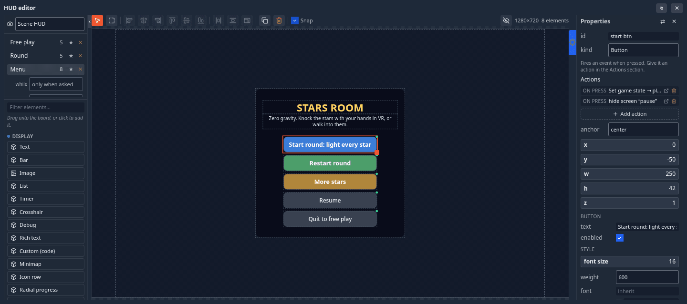

# HUD Editor

The **HUD** is the 2D layer over the game — a score, a health bar, a start menu, a pause screen. You lay it out in the
**HUD editor** and drive it from the flow graph. For a step-by-step game built this way, see
[Build a Game Loop](build-a-game.md); this page is the reference.

## Opening it

Press <kbd>Alt</kbd>+<kbd>H</kbd>, or the **＋** in the bottom dock's tab strip ▸ **HUD editor** (the toolbar can carry a
HUD button too — see [The toolbar](controls.md#the-toolbar)). Like every editor window it docks at the bottom or floats.

| Part | What it holds |
|---|---|
| **Left column, top** | which HUD you are editing (the document picker), then the **screens** of that HUD — click one to edit it; its **while** and **input** settings open under it; **★** makes it the default screen everyone starts on; **✕** deletes it; **+ Screen** adds one |
| **Left column, below** | the **palette**: every element kind, grouped *Display*, *Input* and *Layout*, with a filter box — click one to add it, or drag it onto the stage |
| **Toolbar** | the Select and Multi-select tools, the arrange buttons, Duplicate, Delete and **Snap**; on the right, the stage size and element count |
| **Stage** (centre) | a fixed reference stage; the **dashed outline** is the shape of *your* window on it, so you can see what falls outside the frame you are actually looking at |
| **Properties** (right) | the selected element's own fields, its style, and its **Actions** |

## Which HUD: the scene's, or a camera's

The document picker at the top of the left column chooses which HUD you edit:

- **Scene HUD** — shown whatever camera you look through.
- **A camera** — this HUD shows **only while you look through that camera**. Attach a menu to a title-shot camera and it
  travels with the shot (see [Camera objects](camera.md#camera-objects)).

## Screens

A HUD holds one or more **screens** — named layers of elements: *Menu*, *Playing*, *Paused*, *Results*. Only one screen
of a HUD shows at a time. Each screen has two settings:

| Setting | Options | Meaning |
|---|---|---|
| **while** | *only when asked*, or a game state (`menu`, `playing`, `paused`, `over`…) | show this screen automatically whenever the shared game state is that state — including for someone who joins later |
| **input** | **game** / **menu** | *game*: the pointer stays locked and the screen is a readout (a score, a timer). *menu*: while this screen shows in play mode the pointer is freed and movement pauses, so the player can click it; hiding it locks the pointer again |

Un-starring every screen means nothing shows until a node, a game state or a peer asks for one. A screen with *only when asked* is shown by an action (**Show a HUD screen**) or a [HUD Screen](nodes.md#hud) node.
A scene with at least one screen bound to a game state counts as a **game**: its menu waits for **Start** instead of
painting itself over the editor, and the play button's menu offers **Test play**.

## Placing elements

- **Click** an element to select it, **drag** to move, drag the grip at its bottom-right corner to resize; <kbd>Shift</kbd> adds to the selection.
  The **Multi-select** tool drags a box that selects everything it touches.
- Every element is **anchored** to one of nine points of the screen (the corners, the edge middles, the centre) plus a
  pixel offset, so it stays in its corner on any window size rather than stretching.
- **Snapping** (the **Snap** box in the toolbar, or right-click the stage) snaps to the grid, the stage centre lines and
  other elements' edges. With nothing selected, the properties pane's **Snapping** section sets the grid step and how
  close an edge must come.
- The **arrange** buttons need two or more selected: **Align** left / centres / right / top / middle / bottom,
  **Distribute** horizontally or vertically (three or more), **Equalize size**.
- <kbd>Ctrl</kbd>+<kbd>D</kbd> duplicates, <kbd>Del</kbd> deletes, <kbd>Ctrl</kbd>+<kbd>A</kbd> selects all.
- Right-click ▸ **Apply style to…** gives the selection (or the whole screen) a look in one go: **Sci-fi** (cyan edges,
  monospace), **Fantasy** (parchment and gold, serif), **Minimal** (no boxes, just text), **Clean** (light cards) or
  **Follow my theme** (each viewer's own [theme](appearance.md) colours).

A small mark on an element on the stage means something is wired to it — a button with no action is obvious at a glance.

## Element kinds

**Display**

| Kind | What it is |
|---|---|
| **Text** | a line of text. Wire a number into a HUD Text node to make it a live score |
| **Rich text** | text with `**bold**`, `*italic*`, `{color:accent}colour{/color}` and `{icon:heart}` glyphs |
| **Bar** | a filled bar, horizontal or vertical, optionally showing %: the fill is (value − min) / (max − min) — health, fuel, progress |
| **Radial progress** | a ring that fills — a cooldown, a charge. Takes the same value/min/max as a Bar |
| **Icon row** | N repeated icons off a number — hearts, ammo, keys |
| **Hotbar** | N slots with one selected |
| **Image** | an image from your [Explorer](explorer.md) (contain / cover / fill) |
| **List** | rows, one per line — a leaderboard, standings, an inventory |
| **Timer** | counts down (or up) from a HUD Timer node, off the shared clock, so everyone agrees |
| **Crosshair** | a centre reticle: thickness, gap, centre dot |
| **Key hint** | a key glyph and what it does — *[E] Interact* |
| **Minimap** | a top-down plot of the scene with you and your peers as dots |
| **Damage flash** | a full-screen tint that spikes when pulsed, then fades |
| **Debug** | level, game state, round, variables, players and fps — a pill that expands on click |
| **Custom (code)** | you write the render function; double-click it on the stage to edit the code |

**Input**

| Kind | What it is |
|---|---|
| **Button** | fires an event when pressed. Give it an action, or read it with a [HUD Button](nodes/hudbutton.md) node |
| **Slider** | drag for a number |
| **Toggle** | on or off (reads as 1 or 0) |
| **Dropdown** | one of a list (read its index or its text) |
| **Text field** | typed text — a player name, a room code |
| **Tabs** | a segmented pager; its value is the selected index |
| **Confirm** | a question and two buttons, which fire `‹id›-yes` and `‹id›-no` |

Slider, Toggle, Dropdown, Text field and Tabs are read with a **HUD Input** node and have a **shared** switch: off, the value is yours alone (a volume slider);
on, every player sees the same value (a host setting).

**Layout**: **Panel** (a background box to group things on — draw it first) and **Scroll panel** (a scrollable box of
rich text: credits, a rulebook, a quest log).

Modules can add element kinds of their own; they appear in the palette like the built-ins.

## Actions: a button in two clicks

Select a button and open **Actions ▸ ＋ Add action** in the properties pane. Actions are grouped — *Game* (start the
game, pause, resume, end the game, back to the menu, reset the game, set a variable, save best score, travel to a level,
reset a counter), *Camera* (look through a camera), *HUD* (show, hide or toggle a screen), *Scene* (count the presses,
play an animation, play a sound, fire particles, apply an impulse, toggle an object's visibility) — and several can hang off one press. The
pane lists them back in plain language. Behind the scenes an action is ordinary flow nodes, so you can open the node
editor and extend it.

## Driving the HUD from the graph

| Node | Does |
|---|---|
| **HUD Screen** | shows, hides or toggles a screen each time it is triggered (for this player only) |
| **HUD Text** | puts a value into a Text element — a live score |
| **HUD Timer** | runs a Timer element's countdown on the shared clock — duration, display format, start automatically or on a pulse |
| **HUD Bar** | drives a bar's (or radial's, icon row's, hotbar's) value from a number |
| **HUD Button** | fires a pulse when a button is pressed |
| **HUD List** / **HUD Rows** | fill a list, or append rows to it — a log, a scoreboard feed |
| **HUD Input** / **HUD Set Input** | read what a player typed, picked or dragged — or set it |

An element's own value in the properties pane is only the preview and the fallback — a node driving it always wins at
runtime. See the [HUD nodes](nodes.md#hud).

## In VR

A game's menu-like screens (menu, pause, results) appear on a **game board** in front of you; buttons there answer the
laser and a poke. Since 1.24 the playing screen you lay out here also shows in the headset, arranged as you placed it,
on a curved band in front of the player (or on their wrist) — see
[The game HUD in a headset](vr.md#the-game-hud-in-a-headset). The band is read-only; a crosshair, a minimap and a
full-screen flash have no headset form.
