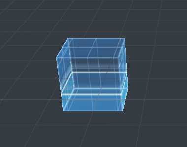
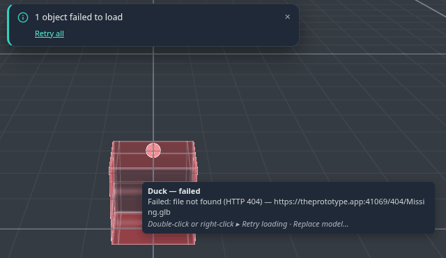
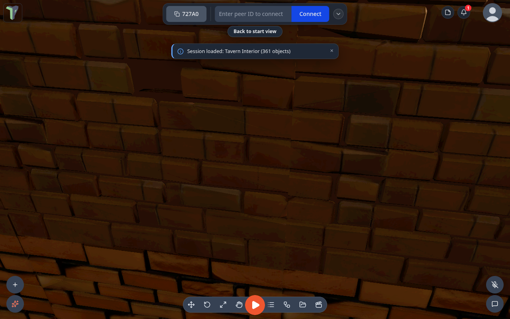
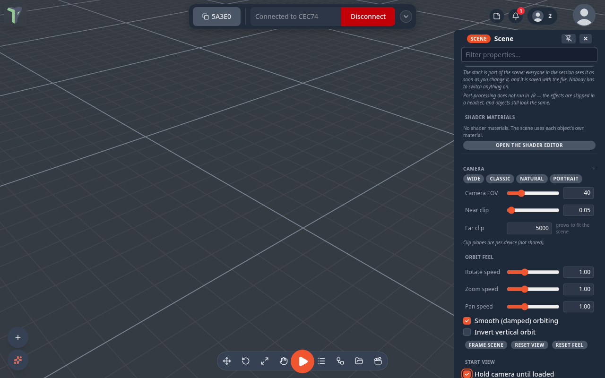

# Loading Placeholders

When you open a level built from kit pieces (Castle Courtyard, the Tavern, …) — or a peer sends you one — each piece
first appears as a **placeholder box** where it will stand, and the real model replaces it as its file arrives. Since
1.21 those boxes tell you what is happening, and you can work with them while you wait. Since 1.22 the camera starts on
the scene's [start view](#start-view) the moment the load begins, and you can look around while it builds.

<!-- 36-docs: these two images are crops of the lane's dev-server captures; re-shoot from the 1.21 preview before release -->

## Two looks

**Settings ▸ Scene ▸ Loading ▸ Loading placeholders**:

| Style | Looks like |
|---|---|
| **Modern** (default) | a translucent blue hologram box with a glowing rim, a slow pulse and a scan line sweeping up. It **fills from the bottom as that object's file downloads** — the fill level is the real download progress. An optional prototype **grid texture**, sized in world metres, shows the piece's scale |
| **Colored boxes** | solid grey blocks, as in 1.20 |

Modern is the default since 1.22. If you never changed this setting, you now get Modern; if you picked **Colored
boxes** in 1.21, you keep it.

Both styles turn **amber** when a piece is stuck and **red with a “!”** when it failed.

## Working while it loads

A placeholder is a real object: click it to select it, drag it with the gizmo, type a position, rotation or scale in the
Properties panel, <kbd>Shift</kbd>-click to select several. When the model arrives it lands exactly where the box is
**now** — your edit is kept, and everyone else in the session sees it like any other move.

## When a piece is stuck or fails

- **Amber** — no data for 10 seconds (the *Stuck after* setting), or the app is waiting to retry.
- The app **retries by itself** three times (after 1, 3 and 9 seconds) when that can help: a dropped connection, a server
  error, a download that stopped half-way, or a site that refused the request. A *file not found* (404) goes red at once —
  retrying would not fix it.
- **Red** — it gave up. Hover it to see the file address, the HTTP status and the reason.

To recover:

- **Double-click** a red box to try again, or **right-click** it ▸ **Retry loading**, **Replace model…** or **Delete**.
- Selected, a placeholder shows a **Loading** section in the Properties panel: the progress, the file, and **Retry**,
  **Replace model…** and **Remove** buttons.
- When anything is red, a toast says *“N objects failed to load”* with **Retry all**.
- **Replace model…** opens a picker of pack items and your library models. A **pack item** replaces the piece in place —
  the same object, so its flows, notes and links keep working — on every peer. A **library model** is added as a new
  object at the same position, rotation and scale.

Retrying one box retries its **file**, so every copy of the same piece comes back together.

## Start view

Every saved scene remembers the view it was saved with: where the camera stood and what it looked at. When you open the
scene, the camera goes to that **start view** straight away, before the first object appears, so you watch the scene
build up from the right place.

**Moving while it loads.** You can look around while a scene is still loading: orbit, pan, zoom, fly with
<kbd>W</kbd> <kbd>A</kbd> <kbd>S</kbd> <kbd>D</kbd>, use a trackpad or touch. Once you have moved the camera, loading
never moves it back. (Before 1.22, larger scenes such as Tavern Interior and Market Square jumped the camera back to the
start view a few seconds into the load.)

**Back to start view.** If you moved during the load, a small **Back to start view** button shows for about 6 seconds
once the scene has finished loading. Click it to fly back. You can also press <kbd>Home</kbd> at any time to return to
the start view of the scene you opened last.

To change a scene's start view, move the camera where you want it and save the scene again.

### Hold camera until loaded

**Configure Scene ▸ Camera ▸ Start view ▸ Hold camera until loaded** (off by default) keeps the camera on the start view
until the scene is ready. It is saved with the scene and shared with everyone in the session.

While the scene loads, the camera stays on the start view and ignores camera input, and a small **Loading… camera is
held** note shows under the loading bar. In VR, teleport, turning, the walk stick and grabbing the world are paused the
same way.

**It never traps you.** The hold ends at the first of:

- everything has loaded;
- every piece still missing is stuck (amber) or failed (red) — a broken piece never makes you wait longer;
- the **Stuck after** time passes (Settings ▸ Scene ▸ Loading, 10 seconds by default);
- you press <kbd>Esc</kbd>, or click **Take control** on the note (it appears after 1.5 seconds).

After the hold ends, the camera is yours: the end of the load does not move it again.

**Who it affects.** Only the person loading the scene; other people in the session keep their own camera. Games are not
affected: when you press Play, the player still starts at the game's spawn point.

The same Start view group has **Start simulation on load** (since 1.25), which starts physics by itself once the scene
has loaded — see [Physics & Simulation](physics.md#start-simulation-on-load).

## Settings

All in **Settings ▸ Scene ▸ Loading**, and all per device:

| Setting | Default | |
|---|---|---|
| Loading placeholders | Modern | or Colored boxes |
| Placeholder grid texture | on | Modern only |
| Grid size (m) | 0.5 | one grid cell, in world metres |
| Grid color | light blue | |
| Grid opacity | 0.45 | |
| Placeholder animation speed | 1 | 0 = still |
| Stuck after (seconds) | 10 | three times this long restarts the download |

## Limits

- Placeholders are for **kit pieces** — models placed from a [pack](packs.md). A model you drag straight from the
  [Explorer](explorer.md) still shows the loading toast while it downloads.
- Scenes saved before 1.19 don't record a piece's size, so their placeholders are 1 m boxes.
- An animated pack item (a door, a chest) can't be chosen in **Replace model…** — it travels as a file, not a reference.
- In VR the headset controls the view, so opening a scene does not move you to its start view. **Hold camera until
  loaded** only pauses movement there.
