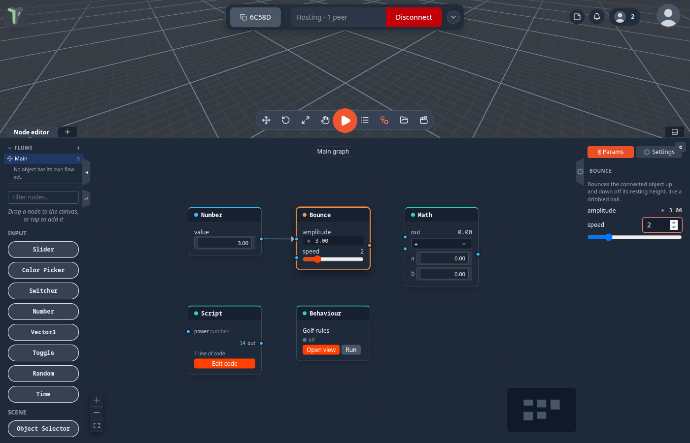

# Main graph & node properties

A scene's flow graph is now called **Main**. It is where a game's logic starts: what the game does, which code runs it
and how the pieces are wired are all reachable from here. Every node on it lists its properties in one panel, a
double-click on a node that has code opens that code, and values flow through any chain of nodes the same way on every
screen.

## Where it is

- **Node editor** (<kbd>N</kbd>) ▸ **Flows** ▸ **Main** — the first row of the list. The chip at the top of the canvas
  says *Main graph*. It is the same scene-wide graph that was called *Scene* before 1.23.
- **⚙** on the right edge of the node editor opens the side panel; its **ⓘ Params** tab shows the selected node's
  properties.
- Double-click a node, or right-click it ▸ **Open code**, to see its code.

## The Main graph

Every [game](games.md) that ships rebuilt in 1.23 keeps its rules on Main — see
[Game rules on the Main graph](game-rules.md).

When you open an **older** scene, the app adds what used to be hidden to Main, in one column on the left:

- a **Code link** node for each module the scene needs — double-click it to read the module's source;
- an **Object flow** link for each object that has a graph of its own.

Nothing about how the scene runs changes. A scene that already has these links is left alone.

## Properties panel

Select any node and open the **ⓘ Params** tab. Every node lists its properties there — ranges, numbers, toggles, colours
and choices — including:

- a [Script](nodes/script.md) node's **input values**: the value an input uses while nothing is wired into it;
- a [Behaviour](behaviours.md) node's **params**: editing one rewrites that number in the code itself, as one undo step;
- a module's node options.

A property with a wire into it shows the live incoming value (◈) instead of a control: the wire wins. Each change is one
undo step and reaches every player.

## Open code

Double-click a node (or right-click ▸ **Open code**) to see the code behind it:

| Node | Opens |
|---|---|
| **Script** | its code in the [code workspace](code-workspace.md) |
| **Behaviour** | its file in the code workspace (**Open view** on the card still shows the [live node view](behaviours.md#the-live-node-view)) |
| **Custom node** | the Node Designer |
| a **module's node**, a **kit node**, a **Code link** | the module's own source, **read-only** |

A module's files run the same for everyone, so they cannot be edited where they are. You can still read them, select
and copy from them. If the code workspace cannot show a module's file, the **Module source** window opens instead, with
**Save a copy to Explorer**.

### Make editable copy

A Script or Behaviour node that a module ships bound to one of its own files says *a module's code — read-only*, with
**Make editable copy**. The code is copied into a new Explorer script (`<name> (copy).js`) and the node now uses your
copy, which you can edit freely. The game keeps running the same code until you change it.

## Value wires

Values flow through any chain of nodes once per frame — a Slider into a [Math](nodes/math.md) node into another node's
parameter — the same on every player's screen. A loop of wires is cut safely instead of freezing the graph.

Three nodes that used to read nothing when wired into a **number** input now give a value:

| Node | Reads as |
|---|---|
| [HUD Button](nodes/hudbutton.md) | 1 for a moment after the button is pressed, otherwise 0 (like [On Click](nodes/onclick.md)) |
| **On Game State** | 1 for a moment after the game enters that state, otherwise 0 |
| **HUD Timer** | the seconds left on the timer |

The [Math](nodes/math.md) node gains powers, sine and cosine, absolute value, rounding, clamping and negation for
shaping a value between a slider and a parameter.

## Scripts: sockets follow the code

In a [Script](nodes/script.md) with typed sockets, start reading `inputs.speed` or return `{ hit: … }` and the node grows
that socket (as a number) when you save the code. Sockets are never removed for you, because a wire may hang on one;
remove them yourself in the code workspace. Scripts also get an [`api` object](nodes/script.md#the-api-object) to look at
the world, read keys and spawn objects.

## Limits

- Main is the scene's graph, named; it is not a separate document. [Groups and notes](node-editor.md#groups) on it are
  only views.
- A module's source is read-only. **Make editable copy** is for Script and Behaviour nodes bound to a module's file.
- `api.keys()` is this device's input, and `api.spawn()` acts only on the room's host — see
  [Script](nodes/script.md#the-api-object).
