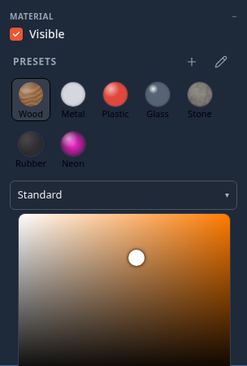
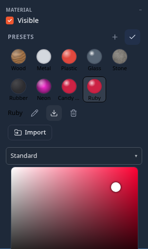

# Material Presets

A **material preset** is a named look for an object's surface — colour, roughness, metalness, glow, transparency and up
to two image maps (a texture and a normal map) — that you apply with one click. Eight come built in: **Wood**, **Metal**,
**Plastic**, **Glass**, **Stone**, **Rubber**, **Fish scales** and **Neon**. You can save your own, rename and delete them, and everyone
in your session sees your presets and can use them.

**Where:** select an object and open its properties (double-click it, or right-click ▸ **Properties**). In the
**Material** section, the **Presets** row sits at the top, above the material type.

## Using presets

- **Apply** — click a swatch. With [several objects selected](controls.md#editing-a-multi-selection) it applies to all
  of them (the row says *applies to all N*), and one **Undo** puts every object's previous material back. The swatch of
  the preset an object is wearing is outlined.
- **Save the current look** — press **+**, type a name and press <kbd>Enter</kbd>. The name must be new: if it is taken,
  the preset is saved as *Name 2*.
- **Rename, delete, export** — press the **pencil**. Your own swatches grow three small buttons: rename, download as a
  `.matpreset.json` file, and delete (it asks first). **Import** loads a `.matpreset.json` file into your library. Press
  the tick to finish.
- **A friend's presets** — when someone in the session has saved presets, they appear under **From ‹name›**. Click one
  to apply it; while editing (pencil), the copy button saves it into your own library.

## Fish scales and the look tier

**Fish scales** is an iridescent look: a thin film over the surface shifts its colour with the viewing angle (the
silver-blue flash of a turning fish), over a procedural relief of overlapping scales, with a light clear coat and a hint
of see-through (transmission) so a fin reads thin. Recolour it in the Inspector for any fish, snake, dragon or beetle
shell. The Aquarium's fish wear it.

Some of that costs more than every device can pay, so each device draws a material at its own **look tier** — decided
the way water quality is (from the headset and the automatic quality level), never written into the scene:

| Device | Draws |
|---|---|
| Desktop, full quality | everything |
| Phone (or a lowered quality level) | everything but transmission — it renders the whole scene a second time |
| Headset (or the lowest levels) | no transmission, no thin film, no sheen — the plain lit surface |

The look you chose is what is saved and what your peers receive; a device drawing less keeps the full numbers beside the
material, so saving on a headset and opening on a desktop shows the full look again.

## What gets saved, and where

- Your presets live **on this device** (browser storage). They are not part of the scene file. An object that wears a
  preset keeps that look in the scene, for everyone, like any other material edit.
- Your library is shared with the people in your session while you are connected, and leaves with you.
- The [Storage breakdown](explorer.md#storage) — the disk chip in the Explorer header, the Explorer's background menu, or
  **Settings ▸ Explorer** — lists your saved presets under **Material presets**, and can delete them.

## Limits

- Presets apply to objects with **one material**. An object with several material slots (an imported OBJ with an
  `.mtl`, a mesh you assigned slots to in the [UV editor](uv-editor.md)) is skipped, and objects driven by a
  [shader graph](shader-graph.md) are skipped with a note.
- Applying a preset keeps the object's **Side** (front / back / double) and **Wireframe** setting.
- **Glass** is a see-through, clear-coated surface rather than true refraction, so it stays cheap on a Quest. Raise
  **Transmission** on a Physical material for real refraction on a desktop.
- Very metallic surfaces look darker than in other tools, because the scene has no image-based lighting yet; the
  **Metal** preset is tuned for that.
- [Water](water.md) objects draw their own water surface: a preset changes only the material they show before the water
  is ready. Use the **Water** section's look presets for water.
