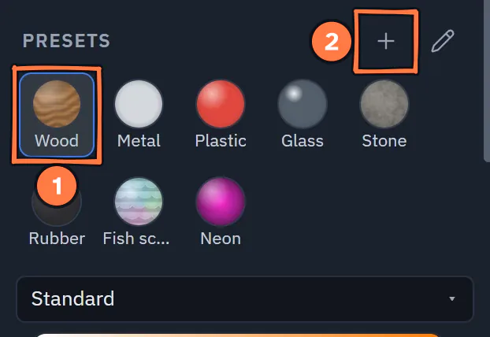
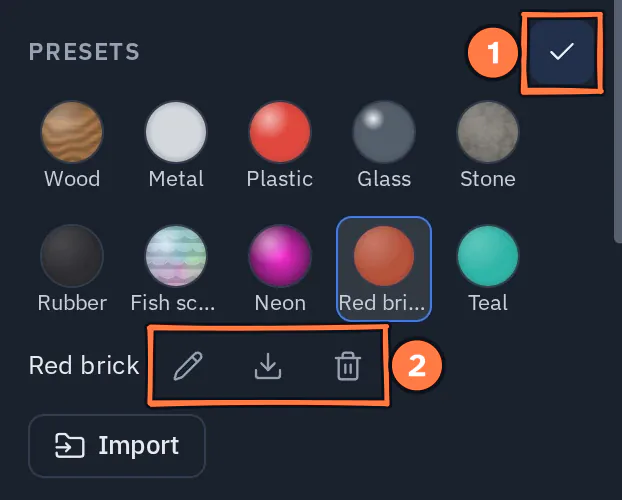
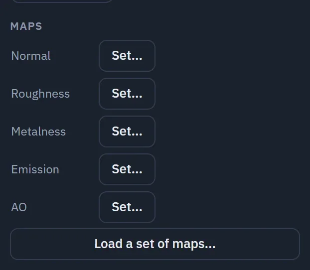

# Material Presets

A **material preset** is a named look for an object's surface — colour, roughness, metalness, glow, transparency and
its image maps (a colour texture and the [maps](#maps) below) — that you apply with one click. Eight come built in: **Wood**, **Metal**,
**Plastic**, **Glass**, **Stone**, **Rubber**, **Fish scales** and **Neon**. You can save your own, rename and delete them, and everyone
in your session sees your presets and can use them.

**Where:** select an object and open its properties (double-click it, or right-click ▸ **Properties**). In the
**Material** section, the **Presets** row sits at the top, above the material type.

{ .shot width="311" height="214" loading=lazy }
/// caption
The Presets row with Wood applied.
///

1. The swatch of the preset the object wears is **outlined**.
2. **+** saves the current look as your own preset.

## Using presets

- **Apply** — click a swatch. With [several objects selected](controls.md#editing-a-multi-selection) it applies to all
  of them (the row says *applies to all N*), and one **Undo** puts every object's previous material back. The swatch of
  the preset an object is wearing is outlined.
- **Save the current look** — press **+**, type a name and press <kbd>Enter</kbd>. The name must be new: if it is taken,
  the preset is saved as *Name 2*.
- **Rename, delete, export** — press the **pencil**. Your own swatches grow three small buttons: rename, download as a
  `.matpreset.json` file, and delete (it asks first). **Import** loads a `.matpreset.json` file into your library. Press
  the tick to finish.
- **A friend's presets** — when someone in the session has saved presets, they appear under **From ‹name›**. Click one
  to apply it; while editing (pencil), the copy button saves it into your own library.

{ .shot width="311" height="312" loading=lazy }
/// caption
Editing your presets.
///

1. The **pencil** starts editing; the tick finishes.
2. **Rename**, **download** as a `.matpreset.json` file, and **delete** (it asks first).

## Maps

*New in 1.59.* Beside its colour image (**Set texture…**), a material can carry five more image maps that give a
surface real detail: worn edges that shine, grooves between planks, a glowing panel. They are in the same
**Material** section, under the texture row, headed **Maps**:

| Row | What the image says |
|---|---|
| **Normal** | small bumps and grooves that catch the light, without changing the shape |
| **Roughness** | where the surface is rough or shiny (the image's green channel) |
| **Metalness** | where the surface is metal (the blue channel) |
| **Emission** | where the surface glows |
| **AO** | ambient occlusion: darker creases and corners (the red channel) |

A row shows only when the material type has that slot: a **Standard** or **Physical** material has all five, Phong,
Lambert and Toon have Normal, Emission and AO, and Basic has only AO.

{ .shot width="311" height="271" loading=lazy }
/// caption
The Maps rows in the Material section.
///

- **Set…** picks an image from your device: PNG, JPEG or WebP (an iPhone HEIC photo is converted to a JPEG first).
  You can also drop an image from the [Explorer](explorer.md) or from your computer onto a row. Large images are
  scaled to 1024 pixels on the long side.
- Once a map is set, its **thumbnail** replaces Set…: click it to choose another image, or press **Remove**. A map
  that came with an imported model says *From the model*.
- **Normal strength** (0 to 10, default 1) appears under Normal once it has a map, and **AO strength** (0 to 1) under
  AO.
- **Tiling** — **Tile U**, **Tile V**, **Offset U**, **Offset V** and **Rotation °** — appears once the material has
  any map. It applies to all of the material's maps together, the colour image included. A negative tile mirrors
  the image.

### Load a set of maps…

Texture sites and PBR tools hand you a material as several files: `wood_color.jpg`, `wood_normal.png`,
`wood_roughness.jpg` and so on. **Load a set of maps…** (under the rows) picks them all at once and puts each file in
the slot its name says. The **last** naming word in the file name decides, so `metal_plate_diff_1k.jpg` goes to the
colour image even though it says *metal* first:

| Slot | Words in the file name |
|---|---|
| Colour image | `color`, `colour`, `col`, `albedo`, `basecolor`, `diffuse`, `diff` |
| Normal | `normal`, `nor`, `nrm`, `norm`, `normalgl`, `normaldx` |
| Roughness | `roughness`, `rough`, `rgh` |
| Metalness | `metalness`, `metallic`, `metal`, `mtl` |
| Emission | `emissive`, `emission`, `emit`, `glow` |
| AO | `ao`, `occlusion`, `ambientocclusion` |

Words are separated by `_`, `-`, spaces, dots or a change of case (`woodNormal`). A file whose name says none of these
is named in a message, so you can set it on its own row. The whole set is one undo step.

### Shared, saved, undone

- With [several objects selected](controls.md#editing-a-multi-selection) the heading says *applies to all N*, and
  every change reaches all of them.
- Everyone in the session sees maps the moment you set them, each change is one **Undo** step, and they are saved in
  scenes, in your [presets](#using-presets) and in a glTF export.
- An [AI agent](ai/agent-look.md) can set them too.
- Removing a map that was loaded **compressed** (KTX2, for example from a [For Quest / web](publish-export.md#optimize-for-quest-web)
  file) cannot be undone: there is no image to put back.

## Fish scales and the look tier

**Fish scales** is an iridescent look: a thin film over the surface shifts its colour with the viewing angle (the
silver-blue flash of a turning fish), over a procedural relief of overlapping scales, with a light clear coat and a hint
of see-through (transmission) so a fin reads thin. Recolour it in the Inspector for any fish, snake, dragon or beetle
shell. The Aquarium's fish wear it.

Some of that costs more than every device can pay, so each device draws a material at its own **look tier** — decided
the way water quality is (from the headset and the automatic quality level), never written into the scene:

| Device | Draws |
|---|---|
| Desktop, full quality | everything |
| Phone (or a lowered quality level) | everything but transmission — it renders the whole scene a second time |
| Headset (or the lowest levels) | no transmission, no thin film, no sheen — the plain lit surface |

The look you chose is what is saved and what your peers receive; a device drawing less keeps the full numbers beside the
material, so saving on a headset and opening on a desktop shows the full look again.

## What gets saved, and where

- Your presets live **on this device** (browser storage). They are not part of the scene file. An object that wears a
  preset keeps that look in the scene, for everyone, like any other material edit.
- Your library is shared with the people in your session while you are connected, and leaves with you. Since 1.39 that
  includes large presets — a [free CC0 material](free-assets.md) with megabytes of maps arrives in their **From ‹name›**
  row in the background a few seconds after they connect, in the same order as your own row, and is sent only once.
  Saving a preset is quicker too when your library already holds big ones.
- The [Storage breakdown](explorer.md#storage) — the disk chip in the Explorer header, the Explorer's background menu, or
  **Settings ▸ Explorer** — lists your saved presets under **Material presets**, and can delete them.

## Limits

- Presets apply to objects with **one material**. An object with several material slots (an imported OBJ with an
  `.mtl`, a mesh you assigned slots to in the [UV editor](uv-editor.md)) is skipped, and objects driven by a
  [shader graph](shader-graph.md) are skipped with a note.
- Applying a preset keeps the object's **Side** (front / back / double) and **Wireframe** setting.
- **Glass** is a see-through, clear-coated surface rather than true refraction, so it stays cheap on a Quest. Raise
  **Transmission** on a Physical material for real refraction on a desktop.
- Very metallic surfaces look darker than in other tools, because the scene has no image-based lighting yet; the
  **Metal** preset is tuned for that.
- [Water](water.md) objects draw their own water surface: a preset changes only the material they show before the water
  is ready. Use the **Water** section's look presets for water.
