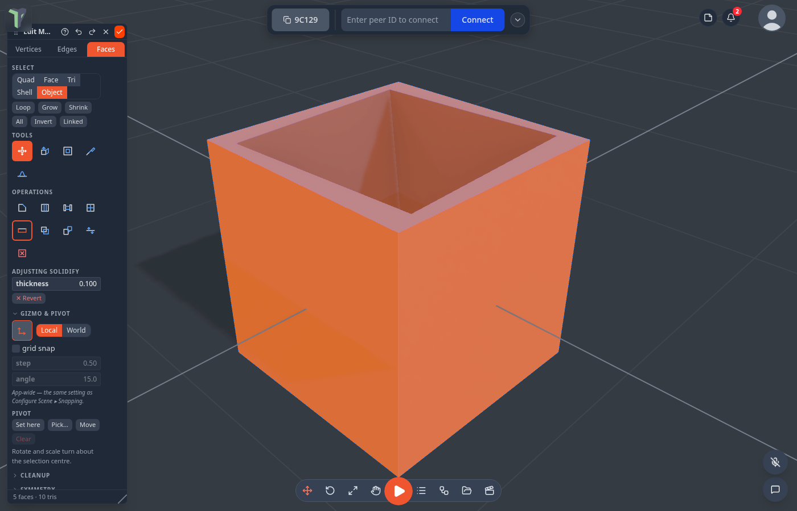
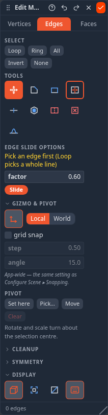
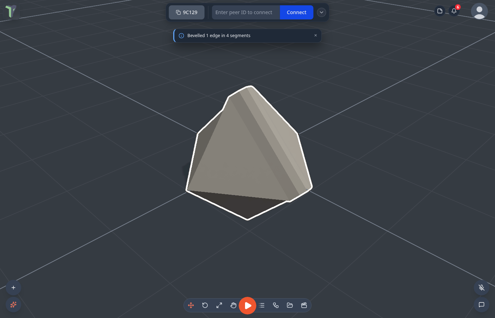
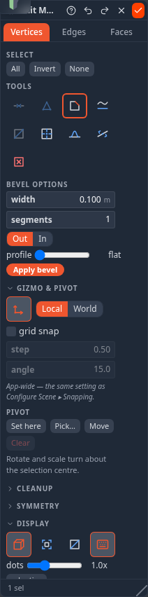
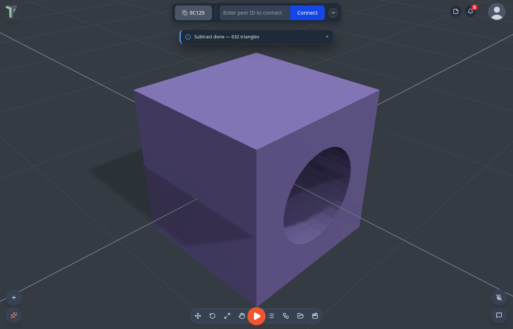

# Mesh Editing

Reshape any mesh by hand: drag its vertices, slide its edges, extrude and bevel its faces, fill holes, give a surface thickness, cut it with a knife, mirror one half onto the other — or combine two meshes with a [Boolean](#boolean). Every edit replicates to your peers and every step is undoable.

## Entering and leaving

Select a mesh, then either press <kbd>Tab</kbd> or right-click it ▸ **Edit mesh**. The **Edit Mesh** toolbox opens — a floating tool palette you can drag anywhere and resize by its right edge.

| Action | How |
|---|---|
| **Enter** | <kbd>Tab</kbd>, or right-click ▸ *Edit mesh* |
| **Done** | <kbd>Esc</kbd> or the ✓ button — keeps your work |
| **Cancel** | the ✕ button — reverts **everything** since the session opened (it asks first) |
| **Undo / redo one step** | <kbd>Ctrl</kbd>+<kbd>Z</kbd> / <kbd>Y</kbd>, or the ↶ ↷ buttons in the toolbox header |

!!! note "Cancel is not a bigger undo"
    ↶ steps back one operation. ✕ throws the **whole session** away and puts the mesh back as you found it — which is why it is marked as the destructive one and asks before it acts.

While you edit, the object is locked for your peers, and the usual selection outline steps out of the way so it can't hide your work.

### The toolbox

| Part | What it holds |
|---|---|
| **Tabs** | Vertices / Edges / Faces — they stay pinned while the rest of the panel scrolls |
| **Header** | Undo, redo, the key cheat sheet (**?**), Done and Cancel |
| **Tools & operations** | The grid for the current mode, with the selected tool's parameters right below it |
| **Sections** | Gizmo & pivot, Cleanup, Symmetry, Display (and Collider while you edit a [custom collider](colliders.md#custom-compound-colliders)) — collapsible, and available from *every* element mode |

Drag the header to move it, drag its right edge to change the width (the tool grid reflows), and double-click the grip to reset it. On a phone it becomes a **bottom sheet** you can drag taller or shorter instead of a floating window.

!!! note "One undo step for the whole session"
    Individual operations undo one at a time while you work. When you press **Done**, the whole session collapses into a *single* undo entry — so <kbd>Ctrl</kbd>+<kbd>Z</kbd> afterwards puts the mesh back the way it was before you started, not one extrude at a time.

## The three element modes

A mesh can be edited by **vertex**, **edge** or **face**. Switch with the **tabs** at the top of the toolbox, or press <kbd>Tab</kbd> to cycle forwards and <kbd>Shift</kbd>+<kbd>Tab</kbd> backwards.

Each mode remembers its own selection, so you can hop between them without losing your pick.

!!! note "<kbd>1</kbd> / <kbd>2</kbd> / <kbd>3</kbd> stay Move / Rotate / Scale"
    Those keys mean the same thing inside a mesh session as everywhere else in the app — they switch the **gizmo**, which is what you reach for mid-edit. The element modes live on <kbd>Tab</kbd>.

### Selecting

- **Click** an element to select it; **Ctrl+click** adds to the selection.
- **Shift+drag** or **Ctrl+drag** draws a **box** — every vertex, edge or face inside it joins the selection. Works in all three element modes, and a box always takes whole faces (never half a quad). An empty box changes nothing, so a stray drag cannot wipe your work.
- Selection **commands** appear as words in the *Select* row — they change what is picked, never the geometry:

| Command | Modes | What it picks |
|---|---|---|
| **Loop** (<kbd>L</kbd>) | all | Faces: the quad ring through this face — press again for the perpendicular one. Edges: the edge chain, end to end. |
| **Ring** | edges | The parallel rungs a face loop crosses — the other half of the standard pair. |
| **Grow** / **Shrink** (<kbd>Ctrl</kbd>+<kbd>+</kbd> / <kbd>-</kbd>) | faces | Add the neighbouring ring / drop the border ring. |
| **All** (<kbd>Ctrl</kbd>+<kbd>A</kbd>) | all | Every element of the mesh. |
| **Invert** (<kbd>Ctrl</kbd>+<kbd>I</kbd>) | all | Swap picked and unpicked. |
| **Linked** | faces | The whole connected island this face belongs to. |
| **None** | vertices | Deselect everything. |

Selections are **undoable** too — <kbd>Ctrl</kbd>+<kbd>Z</kbd> steps back through your picks without touching the geometry, and a selection step can never push a real edit off the undo stack.

### Pick granularity (faces)

In face mode, a **granularity** switch decides how much one click picks up:

| Setting | Picks |
|---|---|
| **Quad** (default) | The quad under the cursor — the two triangles that form it (a 3-sided face picks alone). |
| **Face** | The whole coplanar face. |
| **Tri** | The single triangle under the cursor. |
| **Shell** | The connected island under the cursor — on a one-piece mesh that is the whole object. |
| **Object** | Every triangle, including islands not connected to each other. |

!!! tip
    **Quad** is what you want almost always. A model is made of triangles underneath, but you think in quads — and so do the loop tools.

## Apply, then adjust

Most operations run the moment you press them and then let you **tune the result**: the options pane becomes an *Adjusting* panel, and changing a value re-runs the operation from the original shape rather than piling a second one on top. Nudge the width until it looks right, then carry on — or press **✕** to take the whole thing back.

- If an operation's **preconditions are met** (Bridge with two matching pieces selected, Bevel with a bordered selection), pressing it applies immediately.
- If they are not, nothing happens to your mesh and the toolbox says **why**, with an **Apply** button once you have fixed it.
- It is **one undo step** either way, however long you spend adjusting.

## Tools and operations

The face tab splits its grid in two. **Tools** are armed — they change what a viewport click does, and stay armed until you pick another. **Operations** act on the selection you already have, once.

Icons are for tools; commands that act immediately read as words. Whichever tool you select, its parameters appear right underneath it.

| Tool | Key | What it does |
|---|---|---|
| **Extrude** | <kbd>E</kbd> | Pull the face out along its normal, stitching the walls behind it. |
| **Inset** | <kbd>I</kbd> | Shrink a copy inside a stitched ring — the cap ends up selected, ready for the next step. |
| **Move** | <kbd>G</kbd> | Seat the transform gizmo on the selection (the default). |
| **Subdivide** | <kbd>S</kbd> | Split the selection into a finer grid, 2×2 per quad. |
| **Bridge** | <kbd>B</kbd> | Build a tunnel between two selected pieces. |
| **Loop cut** | <kbd>C</kbd> | Insert edge loops across the ring your selection lies on (the **cuts** field sets how many). |
| **Knife** | <kbd>K</kbd> | Cut across the mesh on screen — see below. |
| **Flip normals** | <kbd>F</kbd> | Reverse the winding, for a face that renders inside-out. |
| **Duplicate** | | Copy the selected faces in place. They start exactly on top of the originals — drag them off with the gizmo. |
| **Solidify** | | Give the selected surface thickness — see [below](#solidify). |
| **Separate** | | Move the selected faces into a **new object** of their own, in the same place, with its own copy of the material. One <kbd>Ctrl</kbd>+<kbd>Z</kbd> puts them back. |
| **Delete** | <kbd>X</kbd> | Remove the selection. |

!!! note "Move is the default, deliberately"
    With auto-apply on, a plain click commits whatever is armed — so the armed tool starts as **Move**. Clicking a face to look at it should never extrude it.

### Tool parameters

| Tool | Parameters |
|---|---|
| **Extrude** | *distance*, and **individual** — extrude each face along its own normal instead of the selection's average |
| **Inset** | *amount*, plus a *depth* that raises or lowers the cap as it goes in |
| **Bevel** | *width* (in world units), *segments*, *profile* — and the direction, in or out |
| **Loop cut** | *cuts*, *position* along the ring, and which of the two directions to run — **Along** or **Across** |
| **Bridge** | *cuts* across the tunnel, *twist* to rotate one end against the other, and **invert faces** if the walls end up the wrong way round |
| **Subdivide** | *levels* — each one splits every quad 2×2 again |
| **Solidify** | *thickness*, in world units |

### Knife

Pick **Knife**, click one end of the cut and then the other. A dashed band follows your cursor between the two clicks so you can see where the blade will land; every face the line crosses is split. <kbd>Esc</kbd> drops a cut in progress without leaving the session.

The cut is a line *on screen*, so it slices straight through the model from your point of view — orbit first to line up the angle you want.

### Solidify

**Solidify** gives the selected surface thickness: a copy behind it plus a rim joining the two. A positive **thickness**
goes *into* the surface, a negative one grows outward. It works on an **open** surface or on a whole piece — a closed box
becomes hollow. A patch of a closed mesh is refused: select the whole piece (**Shell**) or delete a face first.

Solidify uses averaged vertex normals, so sharp corners get slightly thinner walls.

### Bridge

Select **two** separate pieces and press Bridge. Their boundaries have to have the **same number of edges** — the toolbox prints both counts next to the selection so you can check. Bridging two faces of one solid punches a hole through it; bridging two separate shells builds a tube between them, and the walls are wound correctly either way.

## Edge tools

{ width=180 }

| Tool | Key | What it does |
|---|---|---|
| **Move** | | Seat the gizmo on the selected edges (X runs along the edge, Z out of the surface). The welded neighbours stretch with it. |
| **Loop** | <kbd>L</kbd> | Select the whole edge loop through this edge. |
| **Slide** | | Move the selected edges along the faces on either side, keeping the shape — see [below](#slide-edges). |
| **Fill** | <kbd>F</kbd> | Close the hole the selected border edges go around with one new face — see [below](#fill-a-hole). |
| **Bevel** | | Replace the edge with a chamfer strip (width, segments and profile below). |
| **Extrude** | | Pull a **border** edge out into a new strip of faces. A chain of edges extrudes as one piece; interior edges have nothing to extrude into, so they are refused. |
| **Subdivide** | | Split every face along the selected edge at its midpoint — both sides split at the same point, so no crack appears. |
| **Dissolve** | | Remove the edge and merge the two faces it joined. |
| **Delete** | | Remove every face touching the selected edges. |

### Slide edges

Pick a whole line first (**Select ▸ Loop**), then press **Slide**. The options pane shows **factor**: 0 is where the
edges are now, +1 and −1 are all the way onto the neighbouring line on either side. Scrub it and watch the edges move;
**✕ Revert** undoes. A vertex with no single edge to run along (a box corner) stays put — the toast says how many.

### Fill a hole

Select a **border** edge and press **Fill** (<kbd>F</kbd>): the hole it goes around is closed with one new face. One edge
of the rim is enough to fill the whole hole. The cap is wound to match the faces around it. A flat, convex hole becomes a
clean polygon; any other outline is fanned from its centre. Fill closes one rim at a time.

### Mitered corners

Since 1.24 an end where **four or more** faces meet is bevelled with a **mitered corner** — a small cap joining the
chamfer to every face there — instead of being refused. (Before, each end needed exactly three faces.)

## Vertex tools

| Tool | Key | What it does |
|---|---|---|
| **Weld** | <kbd>W</kbd> | Merge the selected vertices into one, at their centroid. |
| **Create face** | | Build a face from 3 or 4 selected vertices. |
| **Connect** | <kbd>J</kbd> | Select two corners of the same face (<kbd>Ctrl</kbd>+click adds the second): the face is cut in two along the line between them. The two must not already share an edge. |
| **Dissolve** | | Remove each selected vertex and merge the faces around it into one. A vertex in the middle of an edge just leaves that edge. Unlike Delete, the surface stays closed. |
| **Bevel** | | Cut the corner off every selected vertex and cap it. Works on any number of vertices. Since 1.24 it has **segments** (1 – 8): more segments round the corner off, and **profile** sets how far it bulges (0 is a flat, subdivided cap). |
| **Smooth** | | Relax the selected vertices toward their neighbours — *factor* sets how far each pass moves them, *iterations* how many passes. |
| **Slide** | | Constrain the drag to one of this vertex's own edges. Adjusts a profile without pulling the vertex off the surface. A marker shows where it will land, and the clamp toggle decides whether it may run past the edge's end. |
| **Delete** | | Remove every face touching the selected vertices. |
| **Deselect** | | Clear the selection. |

{ width=180 }

Vertices are drawn as dots sized in **screen** space, so they stay clickable whether you're zoomed into a cube or out of a whole terrain. The **dot size** slider multiplies that size, and turning the adaptive toggle off gives you a fixed world size instead.

## Bevel options

Bevel works in all three modes and shares one set of options:

| Option | What it does |
|---|---|
| **Width** | How far the chamfer reaches, in **world units** — the same 0.1 means the same size on a small prop and a large wall. Clamped per edge, so two bevels can never cross. |
| **Segments** | More segments = a rounder edge. |
| **Profile** | 0 is a flat chamfer, positive domes the cap out, negative dishes it in. |
| **Direction** | Whether the chamfer eats **in** to the shape or grows **out** of it. |

Tool values — the slide factor, the solidify thickness, the bevel segments — are remembered for the session, like the
other tool options.

## Boolean

Combine two meshes into one. Select exactly **two** meshes (<kbd>Ctrl</kbd>+click), then right-click the **first** one ▸
**Boolean**:

| Operation | Result |
|---|---|
| **Union** | merge them into one solid |
| **Subtract** | cut the second out of the first |
| **Intersect** | keep only the overlap |
| **Subtract, keep the cutter** | as Subtract, but the second object stays |

The first object takes the result and the second is removed (except in the *keep the cutter* variant). One
<kbd>Ctrl</kbd>+<kbd>Z</kbd> restores both. Like every mesh edit, it is one undo step and reaches everyone in the session.

!!! note "Limits"
    - The result uses the **first** object's first material.
    - The inputs should be closed meshes: a mesh with holes gives a result with holes (the toast counts them).
    - Very large results are refused by the usual [size limit](#how-big-a-model-can-you-edit).

## Proportional editing

Switch **Proportional** on and moving one element drags its neighbourhood along, fading off with distance — smooth bulges and dips instead of a single crease. It works in **all three modes**: vertices, edges and faces.

A **ring** on the model shows how far the influence reaches. Roll the **wheel while dragging** to resize it and watch the shape respond; the ring always faces you, so it stays readable from any angle.

It works for **rotate and scale** as well as move. The falloff blends the turn and the scale
toward doing nothing as it fades out, so a rotation twists the surrounding surface instead of
leaving it behind: a vertex halfway through the falloff turns halfway, which is what makes a
straight edge through the radius come out as a spiral.

**Your peers see the whole neighbourhood**, not just the vertices you had selected. A
proportional drag lands on every other screen in **one step, when you let go** — the bulge and
the crease arrive together, as a single geometry change that undoes as one. During the drag,
peers see what they always saw: the live preview if the mesh is under the streaming limit,
and otherwise the result at the end. (The commit obeys the same [size limits](#how-big-a-model-can-you-edit) as any
other topology change; past them the drag stands.)

## Pivot and gizmo

The *Gizmo & pivot* section decides what the gizmo turns around:

- With **several elements selected**, transforms happen about the **centre of the selection** — rotate a whole patch and it turns as one piece.
- **Place the pivot** yourself by dragging the gizmo: the mesh stays put and only the pivot moves, so the next rotation or scale happens exactly where you want it.
- The gizmo's **orientation** (local or world) and whether it is shown at all are session-wide, and apply to every element mode.

The Pivot row's commands are **Set here** (the centre of the current selection), **Pick…**
(click a point on the mesh; a nearby vertex wins, <kbd>Esc</kbd> cancels), **Move** (drag the
gizmo, the mesh stays put) and **Clear** (back to the selection's own centre). The line under
them always says which one is in force.

!!! note "Slide stands down while a pivot is placed"
    **Slide** measures along the vertex's own edges *from the gizmo*, and a placed pivot has
    moved the gizmo off the vertex — so with one in place slide would do nothing. It now says
    so instead of going quiet: *Vertex slide is off while a custom pivot is placed — the slide
    measures from the gizmo, and the pivot moved it off the vertex. Reset the pivot to slide.*
    Press **Clear** in the Pivot row and slide comes back.

## Clean-up

The *Cleanup* and *Symmetry* sections act on the whole object, not on your selection (Cleanup's commands are icon buttons — hover one for its name):

| Command | What it does |
|---|---|
| **Recalculate normals** | Rewind every face to point outward — the cure for patches that render dark or inside-out. |
| **Merge by distance** | Collapse vertices closer than the given distance into one and drop the faces that go degenerate. |
| **Smooth / Flat** | Switch the mesh between smooth and faceted shading. |
| **Triangulate** | Break every face down into plain triangles. |
| **Tris to quads** | Pair triangles back up into quads — the loop tools work in quads, so this is how you make an imported triangle soup workable again. |
| **Symmetrize** | Keep one half and replace the other with its mirror image, across an object-local **X / Y / Z** axis through the object's origin. Pick which half to keep. |

!!! tip "Model half of it"
    Symmetrize is a one-shot: shape the left side however you like, then mirror it. Faces that straddle the plane are cut cleanly on it, so the two halves join watertight.

## Display

| Toggle | What it does |
|---|---|
| **Wireframe** | Show the edit wireframe overlay (on by default). It draws the **quad** structure. |
| **Show triangulation** | Draw the raw triangles instead — the diagonals inside a quad are an artifact of triangulation, not edges of your model. |
| **Selection outline** | Bring the object outline back while editing (off by default). |
| **Shortcuts** | Turn the single-key shortcuts off, if they get in the way. |
| **?** | Open the key cheat sheet as its own little window you can park beside the viewport. |

The overlay **colours** — wireframe, selection outline and the edit overlay — are yours to set in *Settings ▸ Scene ▸ Wireframe & outline* (**Wireframe color**, **Selection outline color**, **Edit Mesh wireframe** — *Auto* by default — and **Reset line colors**); the edit overlay defaults to picking a colour that contrasts with the material you are editing.

## Snapping while you edit

Element [snapping](snapping.md) applies to the mesh gizmo too — switch on the **Vertex** target and a dragged vertex bites onto another one, which is how you close a seam by hand without nudging.

## Your mesh remembers its faces

Older versions worked out what a "face" was every time you clicked, by looking for triangles lying flat against each other. That guess falls apart as soon as you edit: rotate an extruded band a few degrees and its wall quads twist just enough to look like real creases, at which point the loop tools quietly stop working.

The face structure is **stored with the mesh** now. Operations describe the faces they create, so quads survive being rotated, subdivided and bridged, the loop tools keep working after any edit, and a face can have more than four corners — dissolving an edge leaves one real n-gon rather than a fan of triangles.

!!! note
    One exception: an **autosave** snapshot is stored as GLTF, which cannot carry the face structure, so a restored autosave falls back to deriving it. Saved `.tpscene` files and sessions keep it.

## Converting to a mesh

Right-click a group or a multi-selection ▸ **Convert to mesh** merges it into a single editable mesh, materials and all, as one undo step. Use it when you've assembled a shape from primitives and want to treat it as one piece.

The materials survive as **slots** on the merged mesh — see [UV & Textures](uv-editor.md) for assigning faces between them.

## Sculpting

For organic shaping there's a brush instead: right-click a mesh ▸ **Sculpt mesh** (or **Sculpt terrain** on terrain) — raise, lower, smooth and flatten with a round brush. See [Terrain & Sculpting](terrain.md).

## Keyboard reference

The same list lives behind the **?** button in the toolbox.

| Keys | Action |
|---|---|
| <kbd>Tab</kbd> / <kbd>Shift</kbd>+<kbd>Tab</kbd> | Next / previous element mode (Vertices → Edges → Faces) |
| <kbd>1</kbd> / <kbd>2</kbd> / <kbd>3</kbd> | Gizmo: Move / Rotate / Scale |
| <kbd>Ctrl</kbd>+<kbd>A</kbd> | Select all |
| <kbd>Ctrl</kbd>+<kbd>I</kbd> | Invert the selection |
| <kbd>Ctrl</kbd>+<kbd>Z</kbd> / <kbd>Y</kbd> | Undo / redo one step inside the session |
| <kbd>Tab</kbd> (outside a session) | Enter Edit Mesh on the selected object |
| <kbd>Esc</kbd> | Done — leave the session |
| <kbd>E</kbd> / <kbd>I</kbd> / <kbd>G</kbd> | Faces: arm Extrude / Inset / Move |
| <kbd>S</kbd> / <kbd>C</kbd> | Faces: Subdivide / Loop cut |
| <kbd>B</kbd> / <kbd>F</kbd> / <kbd>X</kbd> | Faces: Bridge / Flip normals / Delete |
| <kbd>F</kbd> | Edges: Fill the hole |
| <kbd>K</kbd> | Faces: Knife |
| <kbd>L</kbd> | Loop select (faces: again = perpendicular) |
| <kbd>Ctrl</kbd>+<kbd>+</kbd> / <kbd>-</kbd> | Faces: grow / shrink the selection |
| <kbd>W</kbd> | Vertices: weld the selected vertices |
| <kbd>J</kbd> | Vertices: connect two corners of a face |

These keys can be rebound in the *Mesh edit* group of **Settings ▸ Shortcuts**. Some rows serve two modes, so rebinding
one moves both: **L** is Loop in every mode, and **F** is Flip normals in Faces *and* Fill in Edges. **J** (Connect) has
its own row.

## In VR

Mesh editing works in VR too: the radial menu's **Selected ▸ Edit mesh** covers face select, extrude, inset, move and stretch, with the amount adjusted live by moving your controller. See the [VR Guide](vr.md).

## Collaboration

- Editing an object **locks it** — your peers can see it but not edit it at the same time.
- Live gestures stream a preview to peers several times a second; the final shape is committed when you let go.
- **Separate** keeps the new object's face grouping (quads and n-gons) for everyone in the session, but a peer who joins
  *later* re-derives it — the same rule as for every edited mesh.
- A topology change travels as a full geometry snapshot. That has a ceiling, but a generous one — roughly half a million vertices, which is about thirty times what earlier versions allowed.

### How big a model can you edit?

Three separate limits, and they are different questions:

| Limit | What it governs |
|---|---|
| **Commit** (~500k vertices) | The finished edit that replicates and lands in undo. |
| **Live preview** (~15k vertices) | What streams to peers *during* a gesture. Above it your edit still works and still replicates — peers just see the result when you let go instead of watching it move. |
| **Edit Mesh entry** (2500 triangles) | How dense a mesh may be before the session refuses to open, so the interaction stays responsive. Raise it in **Settings ▸ VR** if your machine can take it. |

All three come from measurement rather than caution: the numbers are what the wire, the frame budget and memory actually stood up to.
