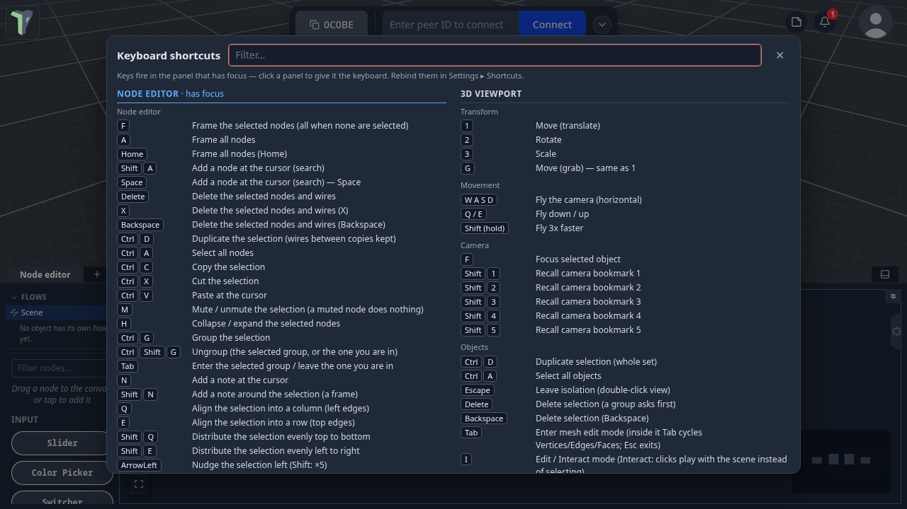
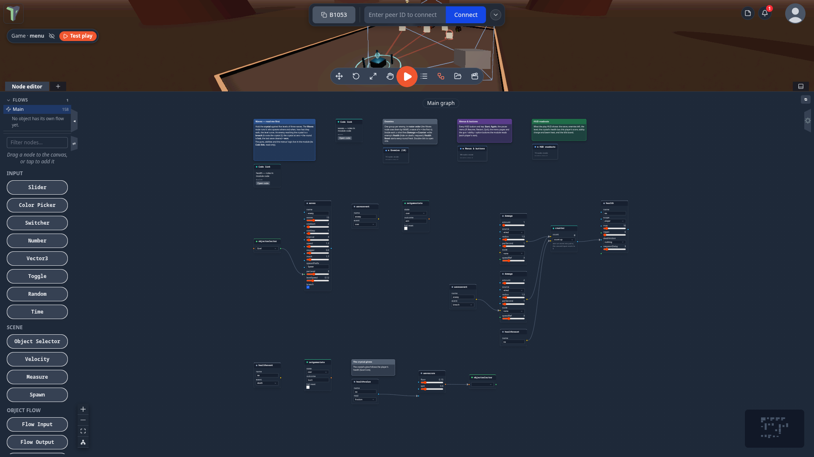
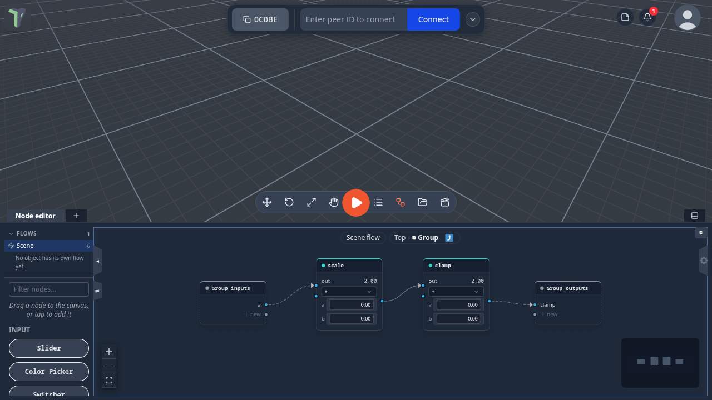

# Node editor: keyboard, groups and notes

Since 1.23 the node editor has its own keyboard: shortcuts go to the panel you are working in, so the same letter can
mean one thing among the nodes and another in the 3D view. Nodes can be **grouped** into one card and opened like a
folder, **notes** explain a graph in markdown, and right-click menus carry everything for the canvas, a node, a
selection and a group.

## Keys go to the panel you are using

A shortcut fires only in the panel that has focus — the one you last clicked. Click the node editor and its keys act on
nodes; click the 3D view and the same letters mean what they always meant there.

- <kbd>C</kbd> opens the chat only from the 3D view — never while you work on nodes or type in a field.
- <kbd>F</kbd> frames nodes in the node editor and focuses the selected object in the 3D view.
- <kbd>Delete</kbd> deletes whichever you are looking at.
- <kbd>W</kbd> <kbd>A</kbd> <kbd>S</kbd> <kbd>D</kbd> <kbd>Q</kbd> <kbd>E</kbd> fly the camera only while the 3D view
  has focus.
- Text fields and code editors keep every key for themselves.

The node editor draws a thin accent outline while it has the keyboard. Since 1.25 every other panel and tool window
owns its keys the same way — see [Keys follow the panel you are in](controls.md#keys-follow-the-panel-you-are-in).
Sliders and number fields inside a node (and the knobs in a behaviour's **Open view**) drag their value, never the node
and never the whole graph.

## The `?` cheat sheet

Press <kbd>?</kbd> anywhere to see every shortcut, grouped by panel, with the panel that has focus first. It is built
from the live keymap, so a key you rebind in **Settings ▸ Shortcuts** shows up there straight away. Type to filter;
<kbd>Esc</kbd> closes it.

## Node editor shortcuts

| Key | Does |
|---|---|
| <kbd>F</kbd> | Frame the selected nodes (all of them when none are selected) |
| <kbd>A</kbd> / <kbd>Home</kbd> | Frame all nodes |
| <kbd>Shift</kbd>+<kbd>A</kbd> / <kbd>Space</kbd> | Add a node at the cursor (opens the node search) |
| <kbd>Delete</kbd> / <kbd>X</kbd> / <kbd>Backspace</kbd> | Delete the selection (a group takes its contents with it) |
| <kbd>Ctrl</kbd>+<kbd>D</kbd> | Duplicate (wires between the copies are kept) |
| <kbd>Ctrl</kbd>+<kbd>A</kbd> | Select all |
| <kbd>Ctrl</kbd>+<kbd>C</kbd> / <kbd>Ctrl</kbd>+<kbd>X</kbd> / <kbd>Ctrl</kbd>+<kbd>V</kbd> | Copy / cut / paste at the cursor (works across scenes and tabs) |
| <kbd>M</kbd> | Mute: the node does nothing until unmuted (drawn faded) |
| <kbd>H</kbd> | Collapse / expand a card (a note collapses to its title) |
| <kbd>Ctrl</kbd>+<kbd>G</kbd> / <kbd>Ctrl</kbd>+<kbd>Shift</kbd>+<kbd>G</kbd> | Group / ungroup |
| <kbd>Tab</kbd> | Open the selected group, or leave the one you are in |
| <kbd>Esc</kbd> | Leave the group you are in |
| <kbd>N</kbd> / <kbd>Shift</kbd>+<kbd>N</kbd> | Add a note at the cursor / a note framing the selection |
| <kbd>Q</kbd> / <kbd>E</kbd> | Align the selection into a column / a row |
| <kbd>Shift</kbd>+<kbd>Q</kbd> / <kbd>Shift</kbd>+<kbd>E</kbd> | Distribute evenly top to bottom / left to right |
| <kbd>L</kbd> | [Tidy graph](#tidy-graph): lay the whole graph out |
| <kbd>Shift</kbd>+<kbd>L</kbd> | [Fix overlaps and crossings](#tidy-graph): move only the cards in the way |
| Arrow keys (<kbd>Shift</kbd>: ×5) | Nudge by one grid step |
| <kbd>Ctrl</kbd>+<kbd>Z</kbd> / <kbd>Ctrl</kbd>+<kbd>Y</kbd> | Undo / redo — every node editor edit can be undone |

All of them can be rebound in **Settings ▸ Shortcuts**. So can the [Edit Mesh](mesh-editing.md) keys, which have their
own *Mesh edit* group there since 1.23.

## Where it opens

Since 1.25, opening the node editor (<kbd>N</kbd>) — or switching to another graph, or loading a scene while it is open —
shows the **whole graph framed**, the same as pressing <kbd>A</kbd>, unless somebody left that graph at a particular
view.

- **Where it was left.** Pan or zoom a graph by hand and that view is remembered for it. Switch to another graph and
  back, or close and reopen the editor: it comes back where you left it.
- **Saved with the scene.** The views travel inside the `.tpscene`, so a scene you share opens on the view you left it
  at. Templates and examples carry no view, so they always open framed.
- Only a pan or zoom made by hand counts: **Frame all** (<kbd>A</kbd>), **Frame selection** (<kbd>F</kbd>) and the zoom
  buttons do not change the remembered view.
- Views are yours: they are not sent to other players and do not mark the scene changed.

**Settings ▸ Input ▸ Node editor ▸ Node editor opens** chooses *Where it was left (framed when new)* (the default) or
*Framed — every node in view*, which ignores saved views and always frames. Search **framed** in Settings to find it.

## Tidy graph

The node editor can lay a graph out for you.

- **Tidy graph** — the button with the network icon in the editor's corner controls, the right-click menu on the
  canvas, or <kbd>L</kbd>. It lays the graph out left to right in the direction the wires flow: nothing overlaps, no
  wire runs through a card, notes sit above the card they describe, notes about nothing nearby and unconnected cards get
  a column on the left, and group cards are moved as single blocks.
- **Fix overlaps and crossings** — right-click menu or <kbd>Shift</kbd>+<kbd>L</kbd>. It keeps your layout and only
  moves the cards that overlap something or sit on a wire, the shortest distance it can.
- Both are **one undo step** (<kbd>Ctrl</kbd>+<kbd>Z</kbd> puts every card back), and everyone in the session sees the
  result.
- Inside a group (double-click a group card), Tidy arranges that group's contents.

Every game's Main graph ships tidied — see [The Games tab](games.md#tidy-main-graphs).

## Groups

Select some nodes and press <kbd>Ctrl</kbd>+<kbd>G</kbd> (or right-click ▸ **Group**). They collapse into one card whose
sockets are the wires that cross the group's edge. Nothing about what the graph does changes: the nodes inside still run
exactly as before.

- **Double-click** the group (or press <kbd>Tab</kbd>) to open it. A breadcrumb at the top shows where you are;
  <kbd>Esc</kbd>, <kbd>Tab</kbd> or the breadcrumb take you back out.
- Inside, **Group inputs** and **Group outputs** stand for the outside. Drag an inner socket onto their **＋ new** row to
  expose it as a group socket.
- Draw a wire onto a group's socket from outside and it connects to the real socket inside.
- Rename the group and its sockets in the properties panel (**⚙ ▸ Settings**).
- Groups nest, copy and paste with their contents, and undo and redo like every other edit.
- <kbd>Ctrl</kbd>+<kbd>Shift</kbd>+<kbd>G</kbd> ungroups: the nodes stay exactly where they were.

### Node group files (.tpnode)

Right-click a group ▸ **Export group (.tpnode)…** (or any selection ▸ **Export as node group (.tpnode)…**) saves it as a
file you can reuse in another scene or give to someone. Right-click the canvas ▸ **Import node group (.tpnode)…**, or
drop the file on the canvas, to place it — one undo step. Wires to nodes that were not saved are not in the file.

## Notes

Press <kbd>N</kbd> (or right-click ▸ **Add note**) to drop a note at the cursor. Give it a title and a description in the
properties panel — the description is **markdown** (headings, lists, bold, italic, `code`, links) and renders on the
note. Pick one of six colours, and drag a corner to resize it.

<kbd>Shift</kbd>+<kbd>N</kbd> (or right-click ▸ **Add note around**) draws a **frame** around the selected nodes:
dragging the frame carries them, and moving a framed node stretches the frame to fit.

## Right-click menus

- **The canvas:** search nodes, add a note, paste, select all, frame all, **Tidy graph**, **Fix overlaps and
  crossings**, import a node group — and the full Add list.
- **A node:** open its code (see [Open code](main-graph.md#open-code)), group, add a note around, duplicate, copy, cut,
  paste, mute, collapse, frame, disconnect, delete.
- **A selection:** the same for the whole set, plus **Align** (column, row, distribute).
- **A group:** open it, ungroup, export it.

## Node types you never use

**Settings ▸ Node types** lists every node type, module nodes included, with a switch for each and one for each group.
A type you switch off leaves the palette, the add menus and the node search **on this device**; nodes of that type
already in a graph keep working. **Turn all on** brings them all back.

## Limits

- A group's sockets come from the wires that cross its edge. An input socket can feed several sockets inside; an output
  socket is wired outside the group.
- A muted node behaves as if it were not there (its value reads as unwired downstream); there is no pass-through.
- Older versions of the app draw a group's members as ordinary nodes. The logic still runs.
- Tidy judges wires as the default curved style; with the *step* or *straight* wire styles a tidied graph can still look
  different. Cards are measured as drawn, so tidy after you finish editing a big node's settings.
