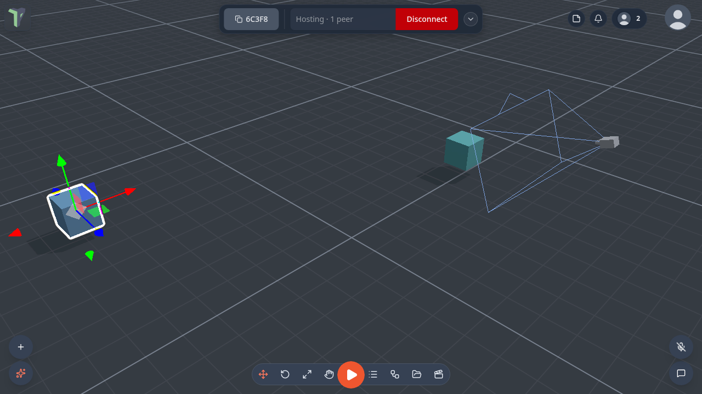

# Camera Rig

Moves a scene [camera object](../camera.md#camera-objects) so it follows a target, looks at it, or both — a chase
camera behind a car, a camera that keeps a player in frame. New in @@VER@@; find it in the palette under **Game**.

**Output:** effect (wire into an [Object Selector](objectselector.md) that picks a camera)

## Inputs

| Handle | Type | Meaning |
|---|---|---|
| target | object | what to follow and look at — an [Object Selector](objectselector.md) |
| offset | vector3 | the offset from the target; wire a [Vector3](vector3.md) here instead of using **ox / oy / oz** |

## Parameters

| Parameter | Default | Meaning |
|---|---|---|
| mode | both | **both**, **follow** (position only) or **lookat** (turn only) |
| space | world | **world**, or **target**: the offset turns with the target — use it for a chase camera that stays behind a car |
| ox / oy / oz | 0 / 2 / 5 | the offset from the target, in metres |
| damping | 0.25 | seconds of lag; 0 follows rigidly |
| aim | 0 | a height above the target to look at |

## Practical example

A chase camera for a car:

1. Add a camera: right-click ▸ **Add ▸ Camera ▸ Perspective**.
2. Add a **Camera Rig** and wire it into an **Object Selector** that picks the camera. (Or put the Camera Rig in the
   camera's own graph, where it moves that camera with no Object Selector.)
3. Wire a second **Object Selector**, picking the car, into **target**.
4. Set **space** to *target*. The offset is now measured along the car's own axes: the defaults (**oy** 2, **oz** 5)
   put the camera 2 m up and 5 m along the car's Z axis — if it ends up in front of the car, make **oz** −5. The camera
   now stays behind the car and turns with it.
5. To see through the camera, use [Set Active Camera](setcamera.md) or the camera's **Preview**.

## Limits

- It moves camera objects only. Wired to anything else it does nothing, and a toast says so.
- It never moves the editor view or another player's view. Every player's copy of the camera follows on their own
  screen.
- While a rig is attached, the rig decides where the camera is. Remove the rig and the camera goes back to where you
  placed it.

!!! tip
    The older **Camera Follow** node (under **Character**) moves the *player's* view behind an object. Camera Rig moves a
    camera object instead, so a game can cut between several rigged cameras with Set Active Camera.
