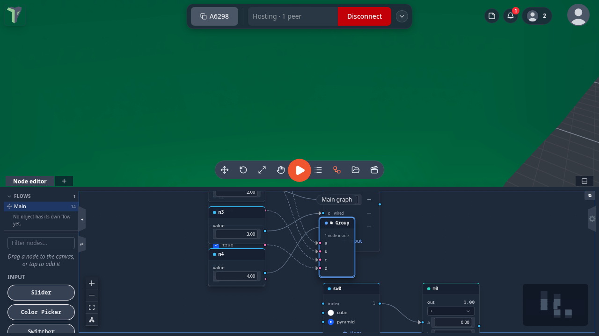

# Gate

Boolean logic — AND, OR, NOT, XOR — on two inputs, or up to eight.

**Output:** boolean

## Inputs

| Handle | Type | Meaning |
|---|---|---|
| a | boolean | first condition |
| b | boolean | second condition (ignored by `not`) |
| c … h | boolean | extra conditions, added with **+ input** (since @@VER@@) |

Unwired **a** and **b** use the card values.

### More than two inputs

Since @@VER@@ Gate takes up to eight inputs, named **a** to **h**. Press **+ input** on the card to add a socket, and
**−** on a row to remove that socket.

| op | With more than two inputs |
|---|---|
| `and` | true when **all** wired inputs are true |
| `or` | true when **any** wired input is true |
| `xor` | true when an **odd number** of wired inputs are true |

The extra inputs **c** to **h** have no value of their own: an input with no wire is skipped. Removing a socket moves the
wires after it down one name (removing **b** turns **c** into **b**), one <kbd>Ctrl</kbd>+<kbd>Z</kbd> puts it all back,
and groups around the node update their sockets too. [Compare](compare.md) stays two-input.

## Parameters

| Parameter | Default | Options |
|---|---|---|
| op | and | `and`, `or`, `not`, `xor` |

## Practical example

A door that opens only when *both* pressure plates are occupied:

1. Set up two **Proximity** nodes, one per plate (each fed by two Object Selectors).
2. Add a **Gate** (op `and`); wire the Proximities into **a** and **b**.
3. Wire Gate → a **Visibility** node's **on** input, then Visibility → an **Object Selector** targeting the door barrier — the barrier shows only while both plates are active. Flip the Gate to `or` for either-plate behavior.

!!! tip
    `not` is a simple inverter: it looks only at **a** and ignores **b** entirely — handy right before a Visibility to turn "near" into "hide".
