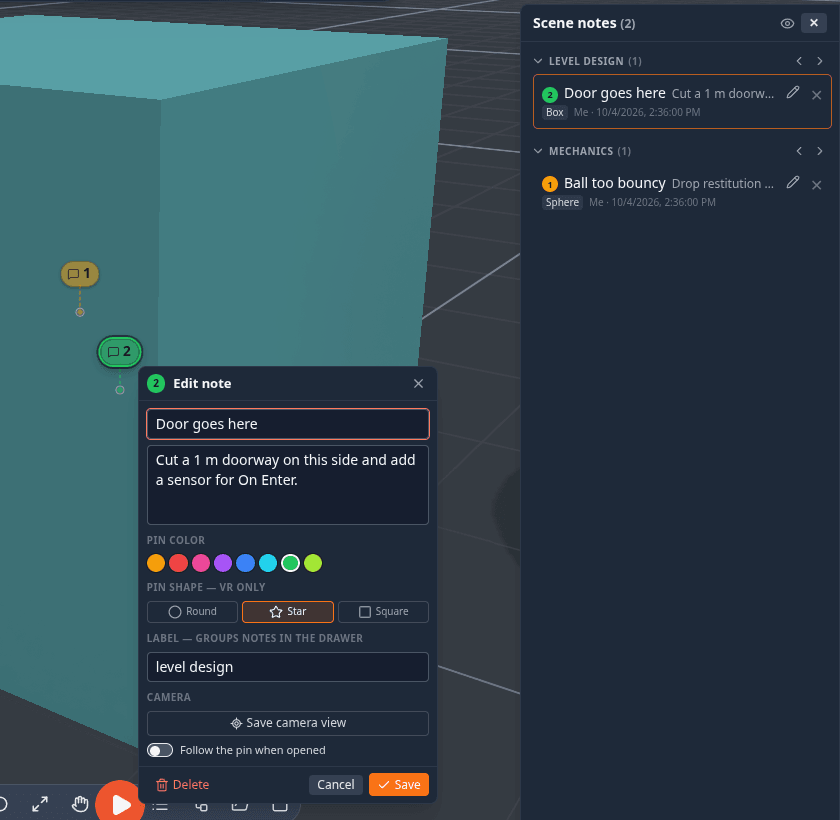

# Notifications & Notes

The top-right cluster next to your avatar holds two history surfaces — the **notification center** and the **scene-notes drawer** — plus the tools for leaving notes on objects and pinging things for everyone to see.

## Notification center

A **🔔 bell** button sits in the top-right chrome. Click it to open a dropdown listing recent notifications, newest first. When it's collapsed, a red badge shows the unread count (`9+` above nine).

Every toast the app shows — connection events, simulation start/stop, imports, warnings — is recorded here with a relative timestamp (*just now*, *5m ago*, *2h ago*, *1d ago*), so a message you missed while it was on screen is never lost. The list keeps the most recent **50** entries and survives reloads. Opening the panel clears the unread badge; **Clear all** empties the history.

The center is a read-only log — connection requests are actioned from the toast itself (see below), not from here.

## Toasts

Toasts pop up briefly for feedback. Two things are worth knowing:

- **Ordinary toasts sit *below* modals**, so an open Settings or Modules dialog is never blocked by a transient message.
- **Connection requests and approvals stay on top** — a peer asking to join is always visible, even over a modal.

Plain messages auto-dismiss after a few seconds; ones with a button (like a connection request) linger longer. At most four toasts stack at once; when more arrive, a **"+N more…"** line shows how many are hidden — find them in the notification center via the bell.

## Scene notes

Notes are little pinned comments you can attach to any object — feedback, TODOs, labels — and they're visible to everyone in the session.

### Adding a note

Right-click an object ▸ **Add note**. The note is pinned **exactly where you clicked** on the object and follows it as it
moves. The card that opens has:

| Field | What it is |
|---|---|
| **Name** | optional — a short title shown in the drawer, on the card and in the marker's hover tip |
| **Description** | the note itself (<kbd>Enter</kbd> saves, <kbd>Shift</kbd>+<kbd>Enter</kbd> adds a line, <kbd>Esc</kbd> closes) |
| **Pin color** | a swatch for the marker |
| **Pin shape** | round, star or square — used by the pins in VR; on a desktop every note is a badge in its colour |
| **Label** | a group name such as *mechanics* or *art* — suggestions come from the labels already in the scene; the drawer groups notes by it |
| **Camera ▸ Save camera view** | stores your current view with the note; **Update saved view** replaces it, **✕** forgets it |
| **Follow the pin when opened** | opening the note flies the camera to it and keeps following the pin as its object moves; <kbd>Esc</kbd> stops following |

**Save** keeps it, **Delete** removes it. Notes replicate to every peer with your name attached.

Clicking a saved note's marker opens it to read: its text, label, author and date, with **Delete**, **Follow** (fly to
the pin and keep following it) and **Edit**, which brings back the card above.

**Markers.** On a desktop a note is a small badge beside its exact spot, joined to it by a thin leader line. A note that
is behind something stays visible but faded, with a dashed leader. When several notes crowd together they merge into one
badge with a count — click it and they spread out.

### The scene-notes drawer

The **📝 notes** button in the top-right chrome (just left of the bell) opens a right-docked drawer listing **every note in the scene**, grouped by **label**:

- Each group can be collapsed, and has **‹ ›** arrows to step through its notes one at a time — a review tour.
- Each row shows the note's name and text, which object it is on, and who wrote it. **Click a row** to fly to the note
  and open it; the pencil edits it and the bin deletes it.
- The eye button in the header **shows or hides the note pins** in the viewport (on your screen only).
- On a narrow screen, where the drawer is a bottom sheet, drag its top handle to resize it.

**Settings ▸ Controls ▸ Double-click to open notes** makes a single click on a marker — and the ‹ › arrows — only fly the
camera to the note, with the card opening on a double click: handy for walking through a scene full of notes without a
card in the way.

If there are no notes yet, the drawer tells you to select an object and add one from its context menu.

## Pinging

A ping is a momentary "look here!" pulse everyone sees at once — great for pointing during a call.

- **<kbd>Ctrl</kbd>+<kbd>Alt</kbd>+click** anywhere in the scene to ping that exact spot. (Before 1.25 this was
  <kbd>Alt</kbd>+click, which now [cycles the selection](controls.md#inside-and-behind-water).)
- Right-click the viewport ▸ **Ping here**.
- Right-click an object ▸ **Ping this object** (or **Ping selection** for several) — this flashes a highlight box around the object as well as the pulse.
- In VR, click the right thumbstick (or **Tools ▸ Ping** in the radial menu) to ping where you're pointing.

Each ping carries a color and a chime. You can set your own **ping color** and **ping sound** (Ding, Chime, Pluck, Pop or Bell) so your pings are recognizably yours — profile menu ▸ **Customize Character ▸ Ping**, where **Preview** tries it out (see [Your Character](avatars.md)); leaving the color blank uses your peer color. The chime is spatial when spatial voice is on — it sounds like it's coming from the pinged spot.
