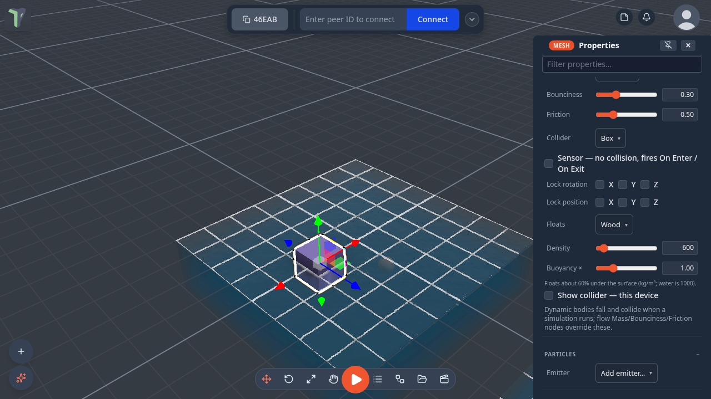

# Physics & Simulation

Drop, stack, collide, weld and throw. ThePrototype has a real-time rigid-body simulation (Rapier) you can start at any moment — objects fall, pile up and knock each other over, and everyone in the session watches the same run.

The simulation is **not always on**: you set up which objects have physics, then press play. Stopping leaves the result in place as a single undoable step.

## Giving an object physics

There are two ways to make an object participate, and they combine.

### From the Inspector

Select an object and open its **Physics** section in the Inspector. **Body** is the first choice:

- **Auto (scenery)** objects act as static obstacles the simulation can land on (the default).
- **Dynamic** objects fall and collide; give them a **Mass** (0.1–100, default 1).
- **Static** never moves.

The rest of the section — the **collider** shape, the **material** (bounciness and friction), **sensors**, **locked
axes** and **Show collider** — is described on its own page: **[Colliders](colliders.md)**. In short: the collider shape
is inferred from the object (a sphere rolls, a ramp is a ramp), a *Sensor* stops colliding and fires
[On Enter](nodes/onenter.md) / [On Exit](nodes/onexit.md) instead, and every one of these settings can be changed while
the simulation runs. A dynamic object can also [float](#things-float) in water.

To give a whole selection physics at once, **Configure Scene ▸ Physics** lists every object that will get a body
(*dynamic · 1 kg*, *static*, *collider only*; click a row to select it) and has an **Enable physics on selection** button
that makes the selected objects dynamic.

## Scene settings

Everything in **Configure Scene ▸ Physics** is shared with your peers, saved with the scene and applied live — you can change any of it mid-run.

### World

**Gravity** slides from −20 to 5 (**Reset gravity** puts it back). Drop the world into moon gravity mid-run, or invert it: positive values make things fall *up*.

**Time scale** (0.1–2) runs the whole simulation in slow motion or fast forward. Slow-mo on a collapsing tower is the point of it. Above 1.5 the panel suggests turning on continuous collision, because faster bodies travel further between steps.

### Ground & bounds

A **ground plane** is on by default at height 0. You can move it, give it **grip** (friction) and **bounce** (restitution) — a slick floor and a rubber floor are one slider apart — or switch it off entirely to build a pit. With colliders shown (Configure Scene ▸ View ▸ *Show colliders*) it draws as a translucent sheet so you can see where it is.

**Out of bounds below Y** catches anything that falls past a limit, and you choose what happens:

| Action | What it does |
|---|---|
| Return to its start | teleports the object back to where it was when the simulation started — right for a crate knocked off a table |
| Freeze in place | stops it dead where it is |
| Delete the object | removes it, replicated and undoable |

One toast reports a whole burst ("3 objects fell out of bounds — returned to spawn") rather than one per object.

### Defaults (advanced)

**Material** fills in friction and bounce for every object that does not set its own — the fastest way to make a whole scene icy, rubbery, wooden or metallic. **Drag** and **spin drag** (linear and angular damping) are what turn a jittery tower stable and stop crates sliding forever. **Continuous collision** is off by default and costs a little speed; thrown objects switch it on for themselves regardless, because a 20 m/s throw travels 0.33 m per step and would otherwise pass through a thin wall.

!!! tip "Primitives are ready to play"
    Newly added primitives (cube, sphere, stairs…) come with a **Dynamic** body (mass 1) out of the box — add a few, press <kbd>P</kbd>, and they fall, stack and throw immediately. Building scenery instead? Set **Body** back to *Auto* or *Static* in the Inspector. Terrain always spawns as scenery.

### With Mass / Bounciness / Friction nodes

The flow graph can drive the same properties: wire a [Mass](nodes/mass.md), [Bounciness](nodes/bounciness.md) or [Friction](nodes/friction.md) node into an [Object Selector](nodes/objectselector.md). A wired **Mass** node makes its object dynamic. Node values **override** the Inspector settings for that object.

!!! note
    Physics properties are not animated per frame like Spin or Bounce: they are applied when the simulation starts, and
    re-applied **live** whenever you change them mid-run — mass, material, collider, sensor and locked axes swap in place.
    Only switching an object's **Body** (Auto / Static / Dynamic) waits for the next run.

## Running a simulation

You can start and stop the sim three ways:

- **Press <kbd>P</kbd>** — toggles the simulation.
- **Right-click the viewport ▸ Tools ▸ ▶ Simulate physics** (the same entry becomes *⏹ Stop simulation*, and *Pause* / *Reset* appear while it runs).
- **The Simulation controls HUD** — a small transport at the bottom-right, if you've enabled it (see below).

While running, dynamic objects fall under gravity and collide; **Reset** restores the initial layout without an undo entry, **Pause/Resume** freezes the sim, and **Stop** ends it — after which <kbd>Ctrl</kbd>+<kbd>Z</kbd> restores the layout you started from.

If nothing has physics when you press play, the app helps you out: with an object selected it simulates just that object at mass 1 and tells you *"No Mass nodes wired — simulating the selected object with mass 1"*; with nothing selected it prompts you to wire a Mass node or select something first.

### The simulation controls HUD

The bottom-right transport (▶ / ⏸ / ⏹ / ↺) is **off by default** so it isn't confused with the main play button. Turn it on in **Settings ▸ Scene ▸ Simulation controls**. The <kbd>P</kbd> shortcut works whether or not the HUD is visible; the first time you use <kbd>P</kbd> while it's hidden, a toast reminds you where to enable it.

## Grab and throw mid-simulation

While a simulation is running you can grab a dynamic object and throw it:

- **Play mode** — enter play mode, put the crosshair on the object and hold the left button. It comes to you and follows the camera; **scroll** to push it further away or pull it closer; let go to throw. See below.
- **Desktop editor** — drag it with the move gizmo. Releasing hands it back to the physics engine with the velocity of your throw.
- **VR** — grip-grab it and let go; the release imparts the throw.

Throw speed is capped at 20 m/s, and the cap applies to the *magnitude*, so a hard diagonal throw goes where you aimed it rather than being bent toward an axis.

## Play mode is interact mode

In play mode the crosshair grows into a ring over anything you can pick up.

- **Hold the left button** to carry. The object follows a smoothed target in front of the camera, so a heavy crate lags behind a light one — mass you can feel.
- **Scroll** while carrying to push it out or pull it in (0.8–6 m). Your walking speed is untouched while you hold something.
- **Let go** to throw it with the speed you were actually moving it at.
- **A quick tap** — press and release without dragging — *clicks* the object instead, which fires [On Click](nodes/onclick.md) nodes and module buttons. Before this, play mode had no clicking at all.

Only dynamic objects can be picked up, objects another peer has locked are refused, and nothing is grabbable unless a simulation is running — so scenery and level geometry can never be dragged out of place.

**Configure Scene ▸ Physics ▸ Play mode** sets this for everyone in the scene:

| Setting | Meaning |
|---|---|
| Pointer: *Grab and throw* | the full behaviour above (default) |
| Pointer: *Click only* | taps fire On Click nodes, nothing can be picked up |
| Pointer: *Look only* | neither |
| Limit grab reach · Reach (m) | off by default; when on, you can only pick up objects within this distance of your body (0.5–5 m, 1.3 when switched on) — [Towers](games.md#towers) uses it so high pieces need steps |
| Keep players on the ground | no <kbd>Q</kbd>/<kbd>E</kbd> flying; the camera stays at eye height |
| Start the simulation when play mode opens | for scenes that are games rather than models |
| Spawn point | where desktop play starts. **Set to the view's focus** stores the point the view orbits around, facing the way the camera looks at it; **Clear** removes it |

A module can override these for its own world by publishing them on its scene group.

## The knock

Hit a floating object with your hand and it flies off. In VR your two hands are the probes; on
desktop it is the camera you walk with, so walking into something shoves it. The object leaves
at the speed you hit it, and everybody sees the same result — the hit travels as one exact
velocity message, the way a throw already does.

It is **off in every scene that does not ask for it**. A scene with no Knock block behaves
exactly as it always did: hands grip and grab, the crosshair carries and throws, and nothing
is knocked by walking into it. Switch it on in **Configure Scene ▸ Physics ▸ Knock**:

| Row | Range | What it does |
|---|---|---|
| **Hands and players knock dynamic objects** | off by default | arms the whole thing for the scene, for everyone |
| **Gain** | 0 – 5 | multiplies the speed the object leaves at. 1 is "as hard as you hit it" |
| **Max speed** | 0.5 – 20 m/s | the ceiling, whatever you do. Keep it low to keep a ball hittable rather than lost |
| **Probe radius** | 0.02 – 1 m | how big the hand (or head) is as a ball. Wider is easier to connect with, and easier to hit by accident |
| **Spin** | 0 – 2 | how much of the hit becomes rotation instead of travel |

The panel says the rest out loud: *An open VR hand, or walking into an object on desktop,
sends it off at the speed it was hit. Grip still grabs. Shared, and it needs a running
simulation.*

Three things have to be true before anything is knocked: the scene's Knock block is on, a
simulation is running somewhere, and you are **in play** (pointer lock on desktop, or
presenting in VR). Only **Dynamic** bodies can be knocked, and an object somebody is carrying
is left alone rather than fought over. The settings are scene data: they replicate, save and
undo like everything else in Configure Scene.

In VR the hand that connects gets a short buzz, harder for a harder hit. That part is local —
it is your hand, not a message.

!!! tip "The knock as a game"
    **Menu ▸ Templates ▸ Games ▸ Stars Room** is a zero-gravity room built on this: twenty-four
    stars and two planets to knock about, a chime when one is hit, and a start screen with
    **Start round** (light every star in two minutes) or **Free play**. Nothing to install.

To react to a knock in a graph, use the [On Hit](nodes/onhit.md) node: it gives you how hard
(`speed`) and whether it was you (`by me`).

## Things float (buoyancy) { #things-float }

Drop a dynamic object into [water](water.md) while a simulation runs and it floats, sinks or drifts. The water pushes it
up by as much water as it displaces, slows it down, carries it along in its flow (the River preset), and tips it back
upright. Hitting the surface makes a ripple.

Select the object and open **Properties ▸ Physics** (Body: *Dynamic*) ▸ **Floats**:

| Floats | Density (kg/m³) | Behaves like |
|---|---|---|
| **Auto** (default) | 500 | floats half under |
| **Foam** | 150 | rides high on the surface |
| **Cork** | 240 | floats, mostly above |
| **Wood** | 600 | floats a little more than half under |
| **Ice** | 917 | floats almost all under |
| **Rubber** | 1100 | sinks slowly |
| **Stone** · **Metal** | 2500 · 7800 | sinks |
| **From mass ÷ volume** | from the object | works it out from the object's mass and size |
| **Off** | — | ignores water |

**Density** (kg/m³; water is 1000) and **Buoyancy ×** fine-tune it, and the hint under the sliders says how deep it will
sit — *Floats about 60% under the surface*. How deep something floats depends on its density, not its mass, so a light and
a heavy crate of the same wood float equally.

The peer running the simulation computes the floating, and everyone sees the same motion; each player draws the ripples
for themselves. Water volumes are in the *Water* [collision group](colliders.md#collision-groups), which is why things
fall **into** them instead of landing on top. For a tank of particle fluid you can pour, see
[Fluid tank](simulation.md#fluid-tank).

## Joints

Joints tie two objects together so they move as one, or hinge around an axis. Select **exactly two objects**, then use their right-click menu ▸ **Physics**:

| Entry | Joint |
|---|---|
| **Weld together** | A fixed joint — the two move as one rigid body during simulations. |
| **Hinge (X / Y / Z axis)** | A revolute joint about the first object's local axis, anchored at the second object — a door, a lever, a wheel. |
| **Detach joints (N)** | Removes joints touching the selection. |

Joints replicate to everyone, undo as a single step, persist in saved scenes and `.tpscene` files, and are removed automatically if one of their objects is deleted. Hinges can also be motorized programmatically (for example by the drivable-car module) to spin under power.

## How it stays in sync

Physics uses an **authoritative** model: the peer who starts the run is the only one stepping the simulation, and it broadcasts the resulting motion. Everyone else just watches.

- **One run at a time** — if someone else is simulating, your play button is disabled and a toast names who's running it.
- **Two people pressing play at the same moment** both start a run for an instant; the one with the lower peer id keeps it, and the other sees *"‹name› is simulating too — handing the physics over (lower id keeps it)"*.
- **Someone joining mid-run is told the run is happening**, so their grab and their [knock](#the-knock) work from the first second instead of after the next restart.
- **Watching peers interpolate.** The simulating peer sends about ten poses a second per moving body; everyone else eases between them instead of snapping, so a fast throw looks smooth rather than stepped. It costs nothing on the wire and never changes *where* an object ends up — only how it gets there.
- **A throw you make is applied exactly.** When you are not the peer running the simulation, releasing an object sends the release velocity itself, so the object leaves your hand immediately and in the direction you threw it rather than being reconstructed from position updates.
- The sim uses a fixed timestep, so it runs at the same speed for everyone even when a browser tab is throttled in the background.
- Kinematic platforms that are themselves animated by the flow graph need no extra traffic — every peer computes their motion identically.

!!! tip
    Build a Rube-Goldberg contraption: weld a few blocks into a paddle, hinge it to a post, give a ball [Mass](nodes/mass.md) and [Bounciness](nodes/bounciness.md), then press <kbd>P</kbd> and watch it play out the same on every screen.
