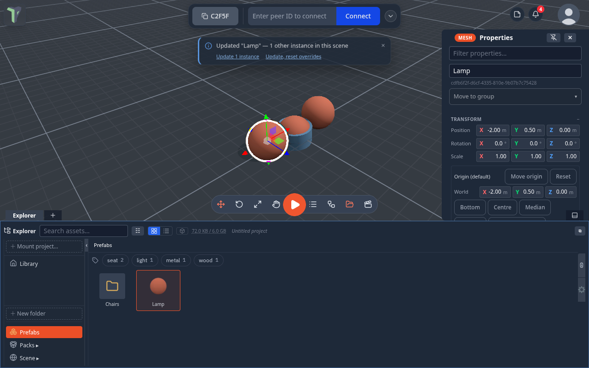
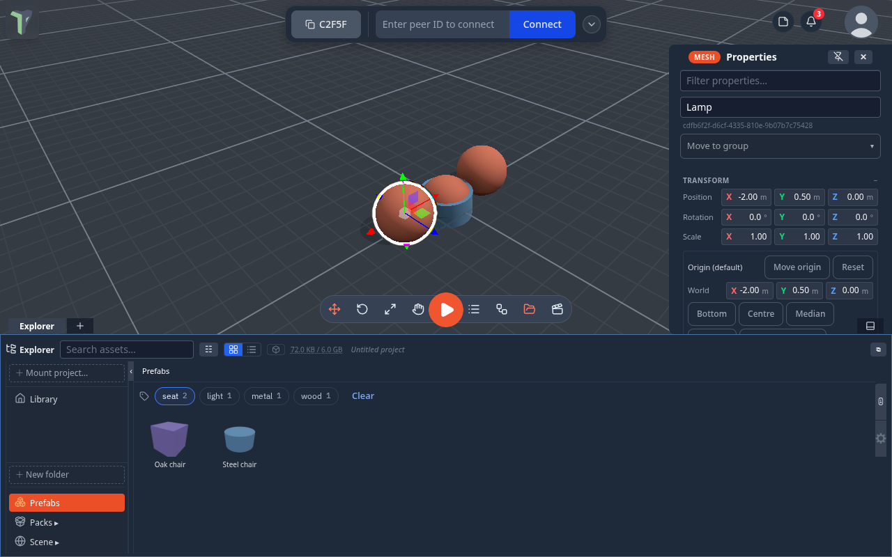

# Prefabs

Prefabs are objects (or whole groups) you save once and reuse anywhere — your personal building blocks.

## Saving a prefab

Right-click any object in the viewport or the object list and choose **Save as…**, then a format:

| Entry | What it makes |
|---|---|
| **Prefab** | the classic reusable copy in your Library — a snapshot of the object with its materials and children |
| **Prefab (.glb)** | a prefab that *is* a `.glb` file: geometry, materials and baked animation. Node shaders and object flow graphs are not part of glTF, so they stay behind |
| **Prefab (.tpscene)** | a prefab that *is* a `.tpscene`: the objects plus their animation clips, object flow graphs, shader graphs and the joints between them. The scene itself — sky, look, gravity, music, HUD — stays behind |
| **glTF binary (.glb)** | just downloads the selection. Nothing is stored in your Library |
| **glTF (.gltf)** | the same as text glTF |

With several objects selected, **Save as…** saves the whole selection as one prefab. A thumbnail is rendered for the
card. Very large objects (over 5 MB serialized) are refused with a toast.

## Where prefabs live

Prefabs live in the **Prefabs** section of the [Explorer](explorer.md). You can also drop a 3D model or a scene file on
that row to make one; it keeps its own format. Right-click a prefab for **Add to scene**, **Duplicate**
(<kbd>Ctrl</kbd>+<kbd>D</kbd>), **Export**, **Update from selection** (replace it with what you have selected), **Properties**,
**Rename** and **Delete** (to the Deleted bin).

Prefabs are stored in your browser. A prefab saved as `.glb` or `.tpscene` can be dragged onto a Library folder to become an
ordinary file, which you can then [share with the session](explorer.md#sharing-with-the-session); a plain **Prefab** cannot.

## Placing a prefab

- **Drag** a prefab from the Explorer into the viewport — it is placed at the point you drop it, on the surface under the
  cursor.
- Or right-click it ▸ **Add to scene**.

Every placed copy gets fresh identities, replicates to all connected peers like any created object, and is undoable.
Since @@VER@@ a copy placed from your prefab library — dragged from the Explorer's Prefabs tab, **Add to scene**, or the VR
prefab panel — also **remembers which prefab it came from**, so a later edit of the prefab can reach it (see
[Updating every copy](#updating-every-copy)). A copy is still yours to change: what you change on it is kept.

## Updating every copy

Edit a prefab either way below and the app offers to update the copies already in the scene:

- in the Explorer, right-click the prefab ▸ **Update from selection** (replace the prefab with the objects selected in
  the scene), or
- right-click a placed copy in the scene ▸ **Prefab: ‹name› ▸ Apply changes to prefab**.

A toast says how many other copies use it and offers:

| Choice | What happens |
|---|---|
| **Update N instances** | each copy takes the new version but **keeps its own changes** — a colour you changed on just that copy, a moved part, a deleted part, objects you added under it |
| **Update, reset overrides** | each copy matches the prefab exactly |
| **Undo** | puts the prefab's previous version back in your library |

Where each copy stands is always kept. The update is **one undo step** (<kbd>Ctrl</kbd>+<kbd>Z</kbd> puts every copy
back) and everyone in the session sees it. Your peers do not need the prefab — only you do.

### The Prefab submenu

Right-click a placed copy ▸ **Prefab: ‹name›**:

| Entry | What it does |
|---|---|
| **Update from prefab** | shown when the prefab has a newer version — updates this copy only, keeping its changes |
| **Apply changes to prefab** | this copy becomes the prefab's new version |
| **Reset overrides** | back to the prefab, where it stands kept |
| **Select all instances** | selects every copy of this prefab in the scene |
| **Unlink from prefab** | an ordinary object from now on; updates no longer reach it |

A copy of someone else's prefab shows only **Unlink**. A prefab card's own menu in the Explorer has **Instances in scene
(N) ▸ Update / Update, reset overrides / Select**.

### A prefab carries its logic

Saving an object that has a flow graph as a prefab keeps the graph: every placed copy gets its own copy of it, and an
update brings graph changes along (a copy whose graph you edited keeps yours). In the prefab's **Properties ▸ Logic**,
**Export .tpnode** saves that logic as a node group file.

### Limits

- A material counts as one change: if you recoloured a copy, an update keeps that copy's whole material.
- A copy placed before @@VER@@ is not linked — place it again to link it.
- If a copy was placed from a version older than the last 8 the library keeps, its own changes cannot be told apart,
  and the update keeps nothing as an override.

## Folders and tags

The Explorer's **Prefabs** tab can be sorted into folders and tagged.

- **Folders** — right-click empty space in the tab ▸ **New folder**. Right-click a prefab ▸ **Move to folder**, or drag
  it onto a folder card. The breadcrumb shows where you are (*Prefabs / Folder / Sub-folder*). Right-click a folder card
  ▸ **Rename** or **Delete folder** — what it held moves up a level; nothing is deleted.
- **Tags** — select a prefab, type tags in its **Properties** (commas separate several) and press <kbd>Enter</kbd>; or
  right-click it ▸ **Edit tags…**.
- **Filter** — the tag chips under the breadcrumb filter the tab, and pressed chips combine (*seat* + *wood*). The
  search box matches names and tags. Both reach into folders; **Clear** resets the filter.

Folders and tags are part of your own library, on this device, like the prefabs themselves.

## Exporting a prefab

Right-click a prefab ▸ **Export**:

- **The original file** — only for a prefab saved as `.glb` or `.tpscene`: the exact bytes it was saved as, nothing
  converted.
- **GLTF** — a `.gltf` model file other tools can open.
- **prefab (.json)** — this prefab as a file; import it back on any machine.
- **scene (.tpscene)** — a scene whose entire content is this prefab, which the app itself can open.

For moving whole scenes with their assets, use a [Scene bundle](saving.md) instead.

!!! tip
    Save structured groups — a furnished room, a rigged button with its wall — not just single meshes. A prefab keeps the
    entire hierarchy, and **Prefab (.tpscene)** keeps its flow graphs and joints too.
