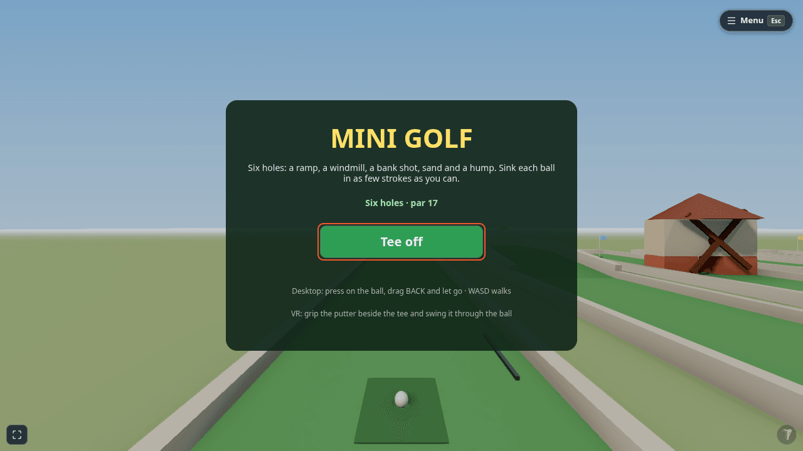
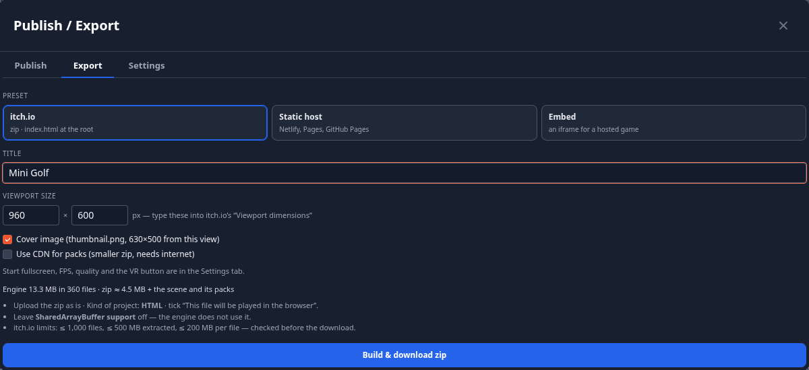

# Publish & Export

**Menu ▸ Publish / Export** puts a scene somewhere other people can play it. The window has three tabs:

| Tab | What it does |
|---|---|
| **Publish** | puts the scene on theprototype.app's community, with its own page and a **play link** that opens straight into the game. Needs you signed in on theprototype.app (a self-hosted build says where publishing lives) |
| **Export** | builds the game as a **zip of plain HTML** you can host anywhere — itch.io, your own site, any static host — or an `<iframe>` snippet |
| **Settings** | how an exported or embedded game starts: fullscreen, FPS counter, quality, VR button (also in **Settings ▸ Export**) |

<!-- 36-docs: images are the 36-export lane's e2e captures; re-shoot from the 1.21 preview before release -->

## Publish: the play link

Publishing works as before — sign in, title, tags, license, visibility, contest (see [Community](community.md#publish)).
When it is done you get two links:

- **Play link** — `https://theprototype.app/p/‹id›`: opens straight into the game, with no editor around it. **Copy** it,
  or scan its **QR code** with a phone or a headset. Unlisted scenes have a play link too; only people with the link can
  open it.
- **Scene page** — `https://theprototype.app/s/‹id›`: likes, comments, remix, download. Its **Play** button now uses the
  play link.

In a self-hosted copy of the app the Publish tab only says where publishing lives. **Export works everywhere.**

## What a player sees

A play link, an embed and an exported game all open the same **player**:

- Before play starts (and after <kbd>Esc</kbd>) a start card offers **▶ Play** — and, in a headset's browser,
  **Enter VR** — with the hint *Click to look around · Esc to pause*. The click is needed: a browser only locks the
  pointer, goes fullscreen or enters VR after a real click.
- A **fullscreen** button sits in the bottom-left corner where the page may go fullscreen.
- A play link or embed also has *Open in theprototype.app ↗*, which opens the same scene in the full editor.
- The **Made with ThePrototype** badge — a small, semi-transparent TP logo with solid dark-grey accents, so a game's colours never tint it — sits in the bottom-right corner; hovering
  shows *Made with ThePrototype*, clicking opens theprototype.app in a new tab. It moves up out of the way of a game's
  touch buttons and is not drawn inside a VR headset.

The badge is **always on** in play links, embeds and exports. An exported file is yours to edit, so this is a request,
not a lock — please keep it: it is how other people find the tool you made your game with. Clicks on the badge are
counted per game, with no personal data, so we can see how many people arrive from games made here.

## Export: a game in a zip

1. Open the scene, then **Menu ▸ Publish / Export ▸ Export**.
2. Pick a **preset**:

    | Preset | Use it for |
    |---|---|
    | **itch.io** | an HTML5 game page on itch.io: a zip with `index.html` at the root (guide below) |
    | **Static host** | the same zip plus a `.nojekyll` file — Netlify, Cloudflare Pages, GitHub Pages, any web server |
    | **Embed** | an `<iframe>` snippet for a game that is already online (below) |

3. Set the **Title** (the page title and the zip's name) and the **Viewport size** (the size of the game's frame — for itch.io, the numbers you type into its
   *Viewport dimensions*).
4. Options: **Cover image** (a `thumbnail.png`, 630 × 500, taken from your current view) and **Use CDN for packs**
   (a smaller zip: kit pieces load from the packs CDN when the game starts, so it needs internet; off, every pack file the
   scene uses is copied into the zip).
5. The panel shows how big the engine is and estimates the zip. Press **Build & download zip**.

The build is **checked before it downloads** (relative paths only, the file limits of the preset); the result line names
the file, its size and its file count, and says *checked OK*. The zip holds `index.html`, the engine (the same build the
app runs), your scene, the installed modules it uses, the pack files it uses and a README. All paths are relative, there
is no service worker, and nothing loads from another site unless you chose the packs CDN. The game starts in Play on its
own. A typical game export is about 5 MB in about 365 files.

Some web hosts add their own scripts to the pages they serve (Cloudflare's Web Analytics beacon, for example). The
exporter copies the app from the site you are on, so it removes any such script or link that points at another site
before the check, and lists each removal under the result line.

### Hosting it elsewhere

Unzip it into any folder of any static host — a subfolder works too. It does **not** run from `file://` (browsers refuse
module scripts there); for a quick local look, run `npx serve .` in the folder.

### Limits

- Exporting needs a built copy of the app (theprototype.app, a preview, or `npm run build`); a development server cannot
  export.
- An exported game is **single player** — multiplayer is off.
- Models the scene loads from absolute web addresses (the Khronos sample models, for example) still load from there.
- Texture compression is not available yet: textures go into the zip exactly as authored.

## Publishing on itch.io

1. Export with the **itch.io** preset and download the zip.
2. On [itch.io](https://itch.io), open **Upload new project** (the menu under your name, or *Dashboard*).
3. Give it a title, and set **Kind of project** to **HTML**.
4. Under **Uploads**, upload the zip **as it is**, and tick **This file will be played in the browser**.
5. Under **Embed options**, type the export's **Viewport size** into *Viewport dimensions*, tick **Fullscreen button** —
   and **Mobile friendly** if your game has [touch controls](touch-controls.md). Leave **SharedArrayBuffer support** off;
   the engine does not use it.
6. Save as a **Draft**, open the page and play it once; then set **Visibility** to *Public*.

itch.io's limits — at most 1,000 files, 500 MB unzipped, 200 MB per file and 240 characters per file path — are checked
by the export before it downloads. From the command line, `butler push mygame-itch.zip ‹user›/‹game›:html5` uploads it.

!!! tip "Updating the game"
    Upload the new zip and delete the old one (or use itch.io's `butler push`, which uploads only what changed). Keep the
    same project page, so the link people have keeps working.

## Embedding on your own site

Choose the **Embed** preset and paste the game's address into **Game URL** — a play link from the Publish tab (it is
filled in for you once you have published), or the address where you host a static export. The panel shows the
`<iframe>` snippet, sized from the **Viewport size**; **Copy snippet** and paste it into your page.

A public community scene also has an **Embed** button on its page — see [Embedding a scene](community.md#embedding-a-scene).

## Export settings

**Publish / Export ▸ Settings**, also in **Settings ▸ Export** (all per device, used by the next export):

| Setting | Default | What it does |
|---|---|---|
| Show Made with ThePrototype badge | on (always) | cannot be switched off — see above |
| Start fullscreen | off | the first Play press also asks the browser for fullscreen |
| Show FPS | off | the game starts with its frame counter on; players can still switch it in the game's menu |
| Quality | Auto | the quality a player starts at — Auto, High, Medium, Low. Auto steps down by itself when frames run slow |
| Include VR button | on | on a headset browser the start card offers **Enter VR**; off, the game always plays on the screen |
| Use CDN for packs | off | as in the Export tab |
| Compress textures | — | not in this release |
