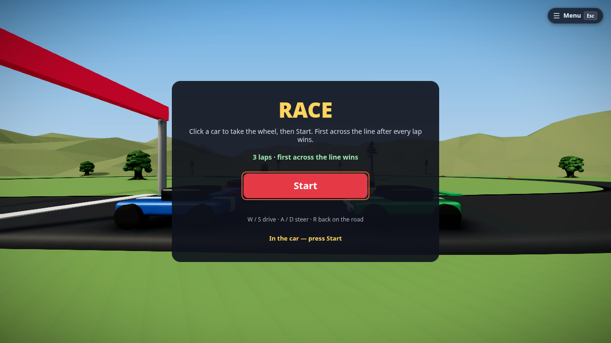
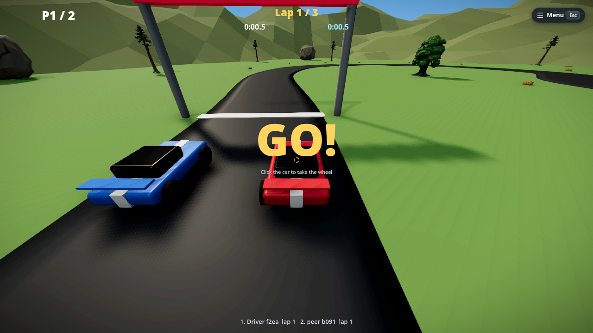

# Race

A racing game for up to four players: a circuit in a valley of mountains, four cars, three laps. The first driver
across the line after every lap wins; everyone else gets 30 seconds to finish. It works with one player too.

**Templates ▸ Games ▸ Race.** Race is built into the app — it needs no module.

## How to play

1. Press **▶ Play** (the simulation starts by itself).
2. **Click a car** to take the wheel. Players still on foot when the race starts get a free car.
3. Press **Start**. A 3-2-1 countdown, then go.
4. Drive:

    | Key | Does |
    |---|---|
    | <kbd>W</kbd> / <kbd>S</kbd> | drive / brake |
    | <kbd>A</kbd> / <kbd>D</kbd> | steer |
    | <kbd>R</kbd> | puts you back on the road where you are |

The HUD shows your lap, the race clock, the current lap time, your position and your best lap. The results screen lists
everyone's laps; your best race and best lap are saved on this device.

!!! note "A lap only counts when you have driven all of it"
    Cutting across the infield, or reversing back and forth over the line, counts nothing: the game follows your
    progress along the road, not the line alone.

## Make it yours

Everything the race runs on is on the **Main graph** (node editor, <kbd>N</kbd> — see [Main graph](main-graph.md)):

- **Race rules** node: laps, countdown seconds, top speed, acceleration, braking, turn rate and grip. Change a number and
  the next race uses it.
- **The road is a spline** (`Race road`): move its points with the [spline tool](splines.md) and the starting grid, the
  lap counting and the "back on the road" reset all follow. There are no gates to re-place.
- **Finish line** is a sensor: its **On Enter** node beeps; wire it to anything — particles, a sound.
- **Race info** nodes feed the HUD texts (lap, clock, lap clock, position, best, countdown, status, standings, result);
  the **Leaderboard** node shows the laps on the results screen.
- The mountains are one parametric [Terrain](terrain.md) (Inspector ▸ Geometry: seed, height, detail…).

## Limits

- The cars are arcade cars (one body, they cannot flip). They drive on the flat valley floor and can climb the mountain
  slopes a little.
- The desktop is the tested way to drive. Touch screens and VR headsets are not tuned yet: the left stick is read for
  throttle and steering, there is no pedal button and no in-car view in VR.
