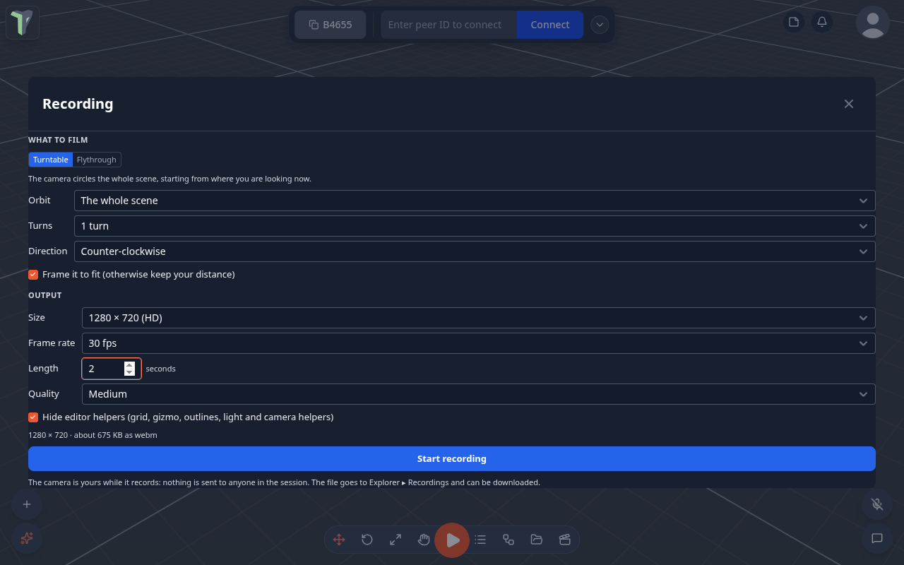
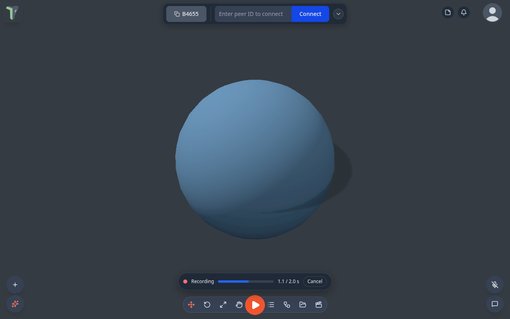
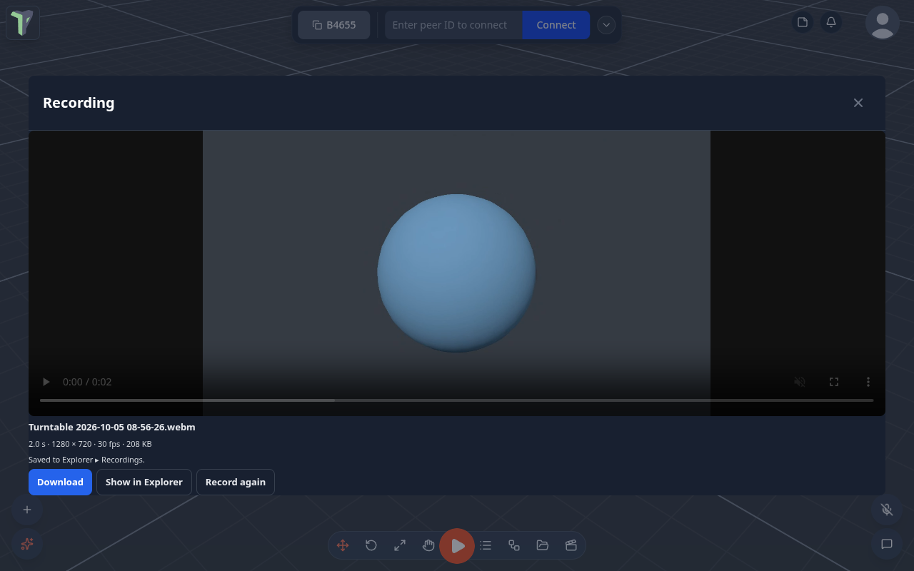

# Recording a Video

Record a short video of the viewport while the recorder drives the camera: a **turntable** round your model, or a
**flythrough** of your saved views. The result is a `.webm` file in your Explorer, ready to download and share.

Right-click the viewport ▸ **Tools ▸ Recording…**

## What to film

| Mode | What the camera does | Options |
|---|---|---|
| **Turntable** | circles the selection (or the whole scene), starting from where you are looking | **Turns** (¼ – 3), **Direction**, **Frame it to fit** (otherwise it keeps your distance) |
| **Flythrough** | flies through your saved camera views in order, passing through each one and blending the lens (field of view) between them | — |

A flythrough needs at least two saved views: right-click the viewport ▸ **Camera bookmarks ▸ Save current view**.

## Output

| Option | Choices |
|---|---|
| **Size** | the viewport, 1280 × 720, 1920 × 1080, square 1080, vertical 1080 × 1920 |
| **Frame rate** | 24 / 30 / 60 fps |
| **Length** | 1 – 60 seconds |
| **Quality** | low / medium / high |
| **Hide editor helpers** | on by default: hides the grid, the gizmo, selection outlines and light and camera helpers for the take |

The dialog estimates the file size before you start.

## While it records

A small bar shows the progress, with **Cancel**. The camera is yours alone: nothing is sent to anyone in the session, and
your view comes back where it was afterwards.

## The file

The video is saved to **Explorer ▸ Recordings** (double-click it to play it) and offered as **Download**.

## Limits

- Not in VR or Play — the recorder drives the editor camera.
- Hiding the browser tab stops the take.
- Files over the Explorer's 25 MB item limit can still be downloaded but are not kept in the library.
- A small viewport is rendered at a higher pixel ratio during the take (up to 3×), so a 1080p video stays sharp.

!!! note
    This page is about video. **Performance** recordings — frame time and draw calls — are in the
    [Profiler](profiler.md).
