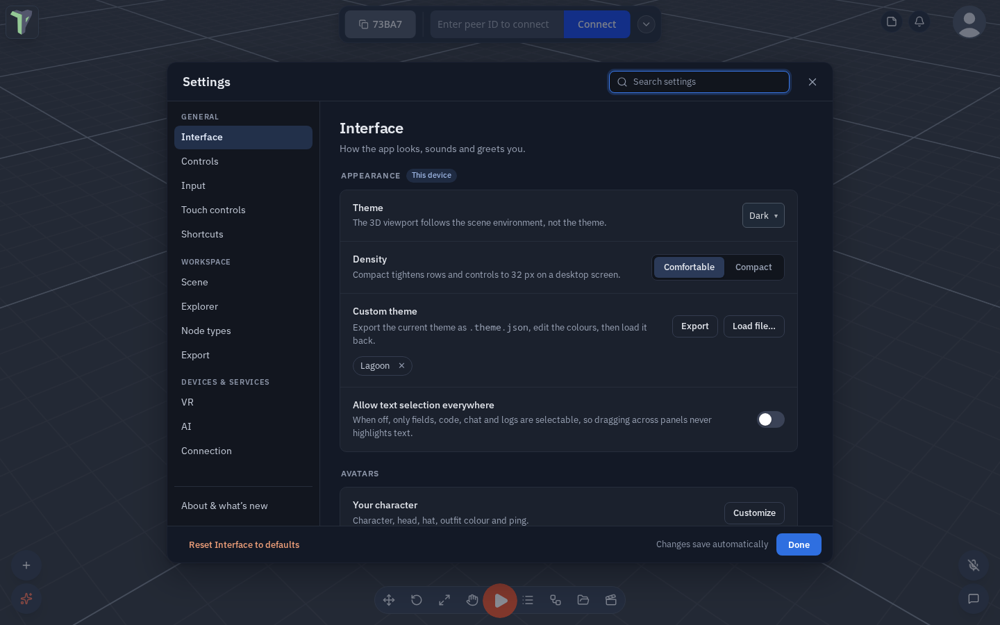
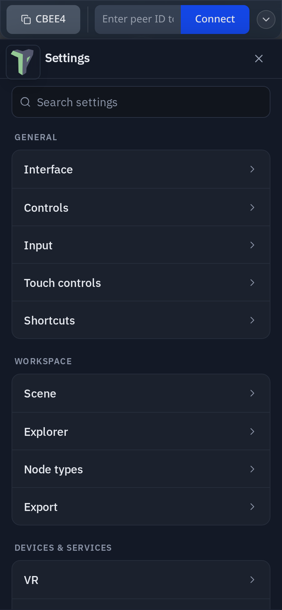

# Settings

**Settings** holds everything that is yours to set: how the app looks, your keys and controllers, the scene defaults,
VR, AI and the connection. Open it from the **logo menu ▸ Settings**, or follow a link that names a page — the Connect
drawer's *Connection settings*, the HUD's AI button, a VR edit-limit toast — and it opens on that page.

Since 1.26 Settings has a new layout. No setting was lost or changed meaning: every switch keeps the value it had.

## Finding your way

- **On a computer** the window has a menu on the left in three groups, with **About & what's new** pinned at the bottom:

    | Group | Categories |
    |---|---|
    | **General** | Interface, Controls, Input, Touch controls, Shortcuts |
    | **Workspace** | Scene, Explorer, Node types, Export |
    | **Devices & services** | VR, AI, Connection |

    A dot on **About & what's new** means there is an update you have not read. <kbd>↑</kbd> / <kbd>↓</kbd> walk the menu.

- **On a phone** Settings opens on the list of categories. Tap one to open it; **‹ Settings** goes back.

- **Sub-pages.** Some rows open a page of their own instead of a pop-up: **VR ▸ Remap buttons**, a touch button's look
  (**Touch controls ▸ Jump**), an AI provider, the voice-typing server, a custom signaling server, a node group
  (**Node types ▸ Physics**), **About ▸ What's new**. A breadcrumb (*VR › Remap buttons*) or **‹ Back** returns, and
  <kbd>Esc</kbd> backs out of a sub-page first.

{ width="300" }

### Search

The search box sits in the header (on a phone, at the top of the list). It finds a setting by its name, its description
or the words people use for it — **dark** finds Theme, **southpaw** finds Swap sticks. Each match shows where it lives
(*INTERFACE › APPEARANCE*); click a setting's **name** to jump to it on its page. <kbd>Esc</kbd> clears the search, a
second <kbd>Esc</kbd> closes Settings.

## Reading a row

Every setting is one row: its name and a one-line description on the left, the control on the right. Switches are
on / off; two to four choices are a segmented control; a value with a range is a slider with its number beside it.

| Badge | Means |
|---|---|
| **This device** | the setting is kept only on this computer or headset |
| **Shared** | other people see its effect — your ping colour and sound, your VR hands, shared materials |

## Saving and resetting

Changes save as you make them — there is no Save button; **Done** closes the window.

- **Reset ‹Category› to defaults** — bottom left on a computer, at the end of the page on a phone — puts every setting
  on that page back, after asking. There is no undo for it. It never touches your work: the AI page keeps your saved
  providers and keys, the Interface page keeps the themes you loaded.
- **About ▸ Danger zone** holds the two big ones, each asking first:
    - **Clear saved session** — the autosaved copy of your work (see [Autosave](saving.md#autosave)).
    - **Reset all settings** — every setting on this device, in every category at once. A toast then offers **Undo**
      for about 8 seconds (see [Undo after Clear, Delete, Remove](notifications.md#undo-after-clear-delete-remove)).

## Density

**Settings ▸ Interface ▸ Density** chooses how tightly the interface is packed:

- **Comfortable** (the default).
- **Compact** — tighter 32 px rows and controls on a computer screen. Phones keep finger-sized targets.

## Where things moved

| Setting | Was | Now |
|---|---|---|
| What's new | the bottom of the window | **About ▸ What's new** |
| Reset settings | the bottom of the window | **About ▸ Danger zone ▸ Reset all settings** |
| Clear saved session | the bottom of the window | **About ▸ Danger zone ▸ Clear saved session** |
| Workspace layouts | new | **Interface ▸ Windows & chrome ▸ Workspace layouts** — see [Workspace layouts](controls.md#workspace-layouts) |
| Knocked-off idle | new | **Interface ▸ Avatars ▸ Knocked-off idle** — see [Knocked-off idle](avatars.md#knocked-off-idle) |
| Density | new | **Interface ▸ Density** — see [above](#density) |
| Sky image quality | new in 1.27 | **Scene ▸ Performance ▸ Sky image quality** — **Auto** / **Full (1k)** / **Low (headset)**, this device only; see [Sky image quality](camera.md#sky-image-quality) |
