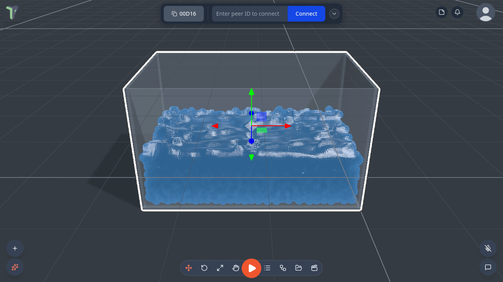
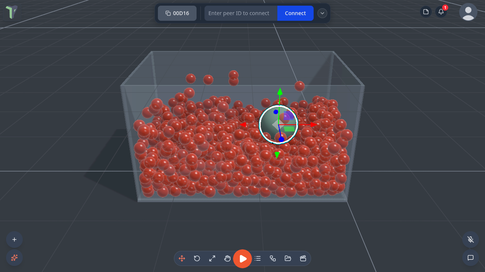
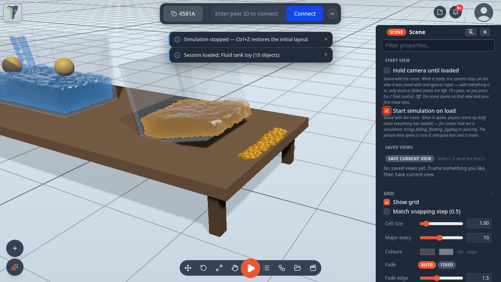
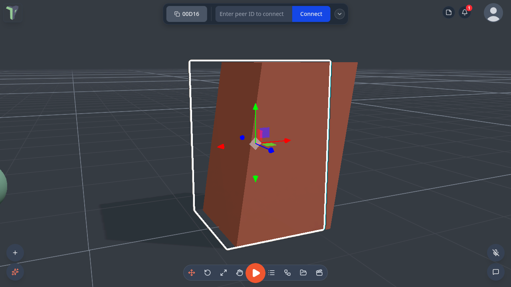

# Fluid Tank & Jiggle

Two kinds of motion that are about the look more than the rules: a **fluid tank** of particle liquid you can slosh,
pour and drain, and the **Jiggle** node, which makes any object lag, wobble and sway. For water you can swim through and
things that float, see [Water](water.md) and [Things float](physics.md#things-float); for particle water poured into
the open scene, rivers and pipes, see [Fluids](fluids.md).

## Fluid tank

A glass tank of particle fluid. Move or tilt the tank and the fluid sloshes; pour more in, drain it out; toys dropped in
float and are pushed around.

### Where it is

- **Add ▸ Simulation ▸ Fluid tank** (right-click the viewport, the **+** button, or <kbd>Shift</kbd>+<kbd>A</kbd> if you
  switched quick add on).
- Its settings are in **Properties ▸ Fluid tank**.

### Settings

| Setting | What it does |
|---|---|
| **Particles** | how many particles make up the fluid, 200 – 8000 |
| **Fill** | how full the tank is, 0 – 0.95 |
| **Viscosity** | 0 – 1: thin like water, or thick like honey |
| **Surface tension** | 0 – 2: how much the fluid holds together |
| **Gravity ×** | −2 – 4: how strongly the fluid falls; below 0 it rises |
| **Colour** · **Clarity** | the fluid's colour, and how see-through it is |
| **Look** | *Auto* (smooth surface on a desktop, drops on a Quest), *Smooth surface*, or *Drops* (the cheapest) |
| **Pour (emitter)** | tick it to pour fluid in, with a **Pour rate** and **Pour speed** |
| **Drain** | tick it to let fluid out, at a **Drain rate** |
| **Spill when tipped** | on by default: tip the tank and the fluid pours out over the rim (see below) |
| **Max spilled drops** · **Drop lifetime** | the limits on spilled fluid, so it never builds up |
| **Refill** | starts the tank again, filled to its **Fill** level |

### Spilling

Since 1.25 a tank **spills when tipped**: rotate it (the Water or Honey tank in *Fluid tank toy*) and the fluid pours out
over the rim, falls, splashes into any water below and settles. The tank holds less afterwards — **Refill** fills it
again. The simulation transport's **Pause** holds the tank and its spilled drops still, and **Reset** refills it (see
[The simulation controls HUD](physics.md#the-simulation-controls-hud)).

### Limits

- Each player simulates their own fluid; only the settings are shared. Splashes differ slightly between players. The push
  on floating toys comes from the player running the [physics simulation](physics.md#how-it-stays-in-sync).
- A tank pauses while it is off-screen.
- On a Quest, and on slow devices, the fluid draws as drops, with at most 1500 particles. On a phone the tank follows
  the device's quality level live: a phone that keeps its frames steps up to the smooth surface after the scene has
  loaded (see [Water ▸ Quality](water.md#quality)).
- Spilled drops settle on the ground and on the tops of objects' bounding boxes, not on slopes.
- Scaling the tank resizes the fluid box.

## Jiggle

**Secondary motion** for any object: it lags behind when you move it, overshoots when it stops, wobbles like jelly when it
lands or is hit, and sags and sways in the wind. A rigged (skinned) model swings its bone chains instead: tails, hair,
antennae.

Add it from the node editor: **Effects ▸ Jiggle**. Put it in an object's own graph, or wire it to an
[Object Selector](nodes/objectselector.md). Every setting is on the [Jiggle node page](nodes/jiggle.md).

Jiggle is a **look only**. It never changes the object's real position, so physics, saving and the other players are
unaffected. The settings are shared, and each player sees their own jiggle from the motion they see.

## Examples

**Menu ▸ Templates ▸ Examples** has **Jelly room** (Jiggle on a room of jelly blocks) and **Fluid tank toy** (a tank to
pour into and drop toys in). **Pool party** shows floating toys in a pool. Since 1.25 Jelly room renders its jellies again
(they were black), and all three start moving as soon as they open
([Start simulation on load](physics.md#start-simulation-on-load)).
