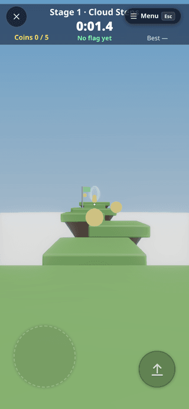
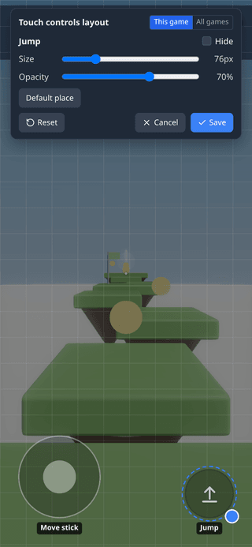

# Touch Controls

On a phone or tablet, Play shows a **move stick** on the left, a **look drag** on the right and the game's own **action
buttons** — Jump, Throw, Grab, Use… — exactly the actions the game needs. Every control can be moved, resized and faded,
and any button can wear your own pressed and released images.

<!-- 36-docs: images are the 36-touch lane's emulated-phone captures; re-shoot from the 1.21 preview before release -->

<div style="display:flex;gap:16px;flex-wrap:wrap" markdown>


</div>

## When they show

**Settings ▸ Touch controls ▸ Show touch controls**:

- **Auto** (default) — on a touch screen, or as soon as you touch the screen (a touchscreen laptop, say).
- **Always** — on, even with a mouse.
- **Never** — hidden everywhere.

**Show in edit** also draws the action buttons while you edit (they press their keys there too); the stick and the look
drag only exist in Play. Touch controls are screen controls, so they never show in VR.

## Playing with them

- **Several fingers at once**: hold the stick and press Jump — or two buttons — at the same time.
- **The stick**: touch its drawn circle to steer from the circle's centre, or touch anywhere else on the left half and the
  stick appears under your thumb.
- **A still tap** on the view uses what the crosshair is on; a drag looks around. **Look speed** sets how far a drag turns
  the view.
- **Haptic tick** gives a short vibration on each press, on phones that support it.

## Which buttons a game gets

Games that declare their actions show exactly those:

| Game | Controls |
|---|---|
| **Sky Run** | stick + **Jump** |
| **Target Toss** | **Throw** — hold to charge, let go to throw; drag anywhere to aim |
| **Mini Golf** | stick + look; putt by dragging back from the ball |
| **Marble Maze** | no stick — drag on the board to tilt it |
| **Towers** | **Grab** — hold it to carry a block |
| **The Alchemist's Escape** | **Use** + **Hint** |
| **Race** | on foot: walk controls; in a car: stick steers, **Gas**, **Brake**, **Reset** — see [Race on a phone](race.md#on-a-phone) |

Any other scene gets buttons from what it already has: a walking
[Character Controller](build-a-game.md#3-a-character-that-walks) gives **Jump**, a flying one **Up** / **Down** (only
where the scene [allows flying](physics.md#flying)), and every
key a [Key Press](nodes/keypress.md) node listens for (other than WASD and the arrows) becomes a labelled button — up to
six. The games that come as modules (Dungeon Realms, Football, Untangle, Waves) get these automatic buttons until they
declare their own.

## Arranging them

Open the layout editor from **Settings ▸ Touch controls ▸ Edit layout**, or during a game from the pause menu's
**Touch controls** row:

- **Drag** any control to move it. **Select** it to change its **Size** and **Opacity** or **Hide** it — resize also with
  the round corner grip, or by pinching it with a second finger. **Default place** puts it back.
- **This game / All games** chooses where **Save** stores the layout; a game's own layout wins over the all-games one.
- **Reset** returns to the default arrangement; **Cancel** (or <kbd>Esc</kbd>) discards your changes.

Layouts are saved **on this device** — they never travel to other players or into the scene.

## Button looks

**Settings ▸ Touch controls ▸ Button looks** lists every button with a preview of both states. For each button: a
**Released** and a **Pressed** image (**Upload** a PNG or SVG of up to 160 KB, or pick an image from the
[Explorer](explorer.md)), a **Tint** for the built-in icon, and the icon **Size**. **Default look** goes back to the themed
icons. Images are kept in the browser's local storage, which is why they must stay small.

## Settings

| Setting | Default | What it does |
|---|---|---|
| Show touch controls | Auto | Auto / Always / Never |
| Show in edit | off | action buttons while editing too |
| Haptic tick | on | a short vibration on each press, where supported |
| Look speed | 1× (0.25–3) | how far a drag turns the view |
| Edit layout · Reset | — | the layout editor; Reset clears every saved layout |
| Button looks | themed icons | per button: released / pressed image, tint, icon size |

Search Settings for *touch*, *joystick*, *buttons* or *haptic* to find this section.

## Trackpads

In the editor viewport a laptop trackpad's **two-finger swipe pans** and a **pinch zooms** — Safari's pinch gesture on a
Mac included — while a mouse wheel keeps zooming as before. **Settings ▸ Controls** has the pan and pinch switches; see
[The mouse wheel](controls.md#the-mouse-wheel).

## For module authors: declaring actions

```js
register(api) {
  // call it when your game becomes active; keep the returned off() and call it when it ends
  const off = api.input?.actions?.(
    [
      'jump',                                    // a built-in: jump, fire, interact, grab,
                                                 // crouch, sprint, reload, up, down
      { id: 'boost', label: 'Boost', keys: ['ShiftLeft'] },             // presses a key while held
      { id: 'fire', label: 'Throw', onPress: charge, onRelease: release } // your own handlers
    ],
    { preset: 'shooter' }  // platformer | shooter | toss | golf | fly | explore | drive | custom
                           // optional: stick: false, look: false
  );
}
```

- `keys` send real key events (KeyboardEvent codes), so anything that already reads the keyboard — `api.onInput`,
  `api.input().codes`, Key Press nodes — works with no extra code.
- `pointer: 'press' | 'tap'` makes a button a primary click at the crosshair (held, or a single tap).
- `onPress` / `onRelease` run **on this peer only**; send your own message if others must know.
- A second call replaces your set; everything is removed when the module unloads.
- `preset: 'drive'` (since @@VER@@) is the vehicle layout: the stick steers, there is no look drag, and the pedals sit
  under the right thumb. A stick the module declared stays live under its own `claimInput('keys')`.
- `api.input().touch` reads the on-screen move stick as `{x, y}` from -1 to 1 (up is -y).
- Feature-detect (`api.input?.actions?.(…)`) to stay compatible with older cores.

See the [Module SDK](module-sdk.md).
