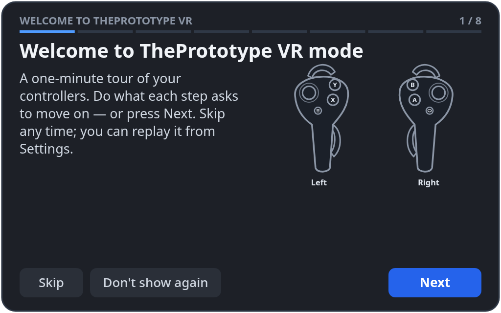
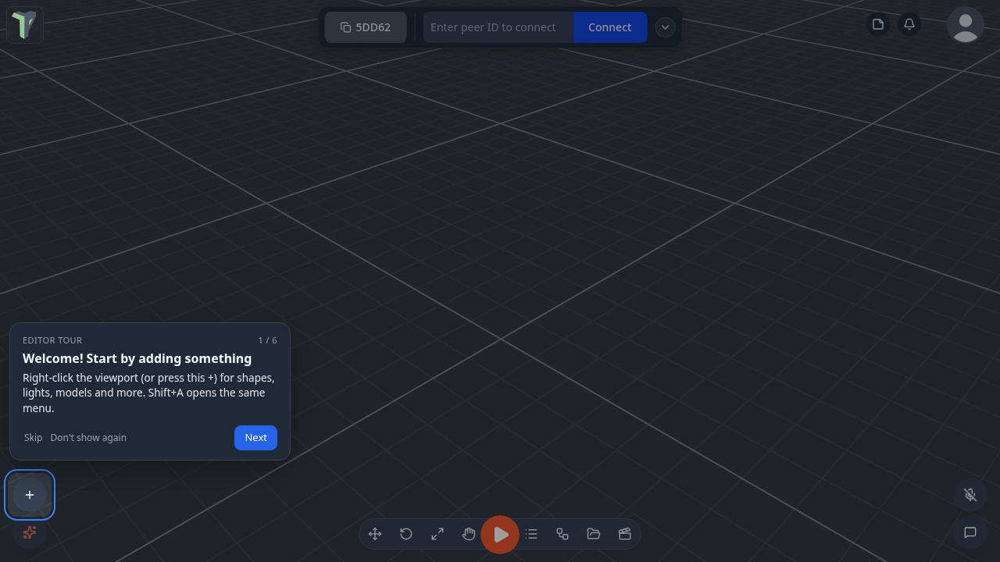
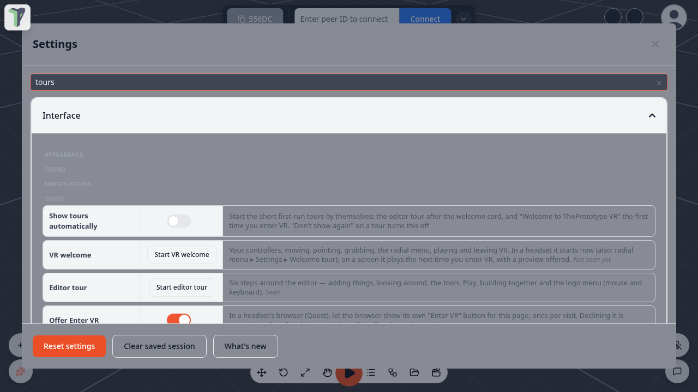

# Tours

Short first-run tours show you around: **Welcome to ThePrototype VR mode** in the headset, and the **editor tour** on a
screen. Every tour has **Skip**, **Back**, **Next** and **Don't show again**. A tour you leave half-way — you take the
headset off, or reload the page — picks up where you stopped.

## Welcome to ThePrototype VR

The first time you enter VR on a device, the welcome plays on a panel in front of you, a little below eye level. Turn away
and it comes back in front of you. Point at its buttons and pull the trigger.

It has eight steps:

1. Welcome
2. Your controllers
3. Move and turn
4. Point and click
5. Grab
6. Your menu
7. Play a game
8. Leaving VR

Each step shows a drawing of your controllers with the button to use lit up. The step moves on when you do that thing —
push a thumbstick, pull a trigger, squeeze a grip, press **B**… — or when you press **Next**.

The drawing matches your controllers: **Quest 2** Touch controllers (with the ring) or **Quest 3 / 3S** Touch Plus. The
app reads which pair you have from the browser. The text and the lit buttons follow your own button layout, so if you
[remapped a button](vr.md#remapping-your-buttons), the tour names and lights the new one.

## The editor tour

Six steps on the screen: adding things, looking around, your tools, Play, building together, and the logo menu. It starts
after the first-visit Welcome card closes.

On a touch screen you get the **touch version**: the same steps with finger gestures, shown as a sheet at the bottom or
top of the screen.

## Starting a tour again

- **Settings ▸ Interface ▸ Tours**: **Start VR welcome**, **Start editor tour**, **Reset all**.
- **Logo menu ▸ Tours** starts the editor tour.
- In the headset: the radial menu's **Settings ▸ Welcome tour** (see the [VR Guide](vr.md#settings)).

**Start VR welcome** on a screen sets the welcome to play the next time you enter VR. A toast also offers **Preview it
here**, which shows the same steps and drawings on the screen. You can switch between the Quest 2 and Quest 3 / 3S
drawings, and the preview does not count as having seen the welcome.

## Settings

All in **Settings ▸ Interface ▸ Tours**:

| Setting | Default | What it does |
|---|---|---|
| **Show tours automatically** | on | Starts tours by themselves the first time they apply. **Don't show again** on any tour turns this off. |
| **Offer Enter VR** | on | In a headset's browser (Quest), lets the browser show its own **Enter VR** button for the page, once per visit. If you decline it, this device remembers that; turning the setting off and on again asks again. With passthrough on, it offers AR instead, the same as Play. |
| **Reset tours ▸ Reset all** | — | Forgets which tours you have seen or skipped, and turns automatic tours back on. |

Search Settings for *tour*, *welcome*, *tutorial* or *enter vr* to find these rows.

## Limits

- The VR welcome starts on its own only the **first** time you enter VR on a device, after a short delay so your
  controllers can be recognised. After that, replay it from the menu.
- On a page opened from an invite or a scene link, the Welcome card does not appear, so the editor tour does not start
  either — you came for the session.
- The drawing cannot tell a Quest 3 from a Quest 3S: both use the same Touch Plus controllers. Hand tracking, or a
  headset the app does not know, gets a generic drawing.
