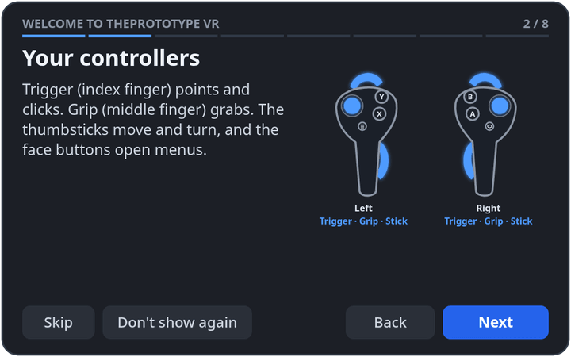
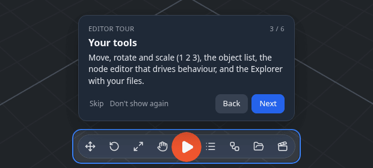

# Tours

Short first-run tours show you around, on the desktop and in the headset. They all work the same way: **Skip**,
**Back**, **Next** and **Don't show again** on every step, and a tour you leave half-way — you take the headset off, or
reload — picks up where you stopped.

## Welcome to ThePrototype VR

The first time you enter VR on a device, an eight-step welcome plays in front of you: **welcome**, **your controllers**,
**move and turn**, **point and click**, **grab**, **your menu**, **play a game** and **leaving VR**.

- Each step shows a drawing of **your** controllers with the button to use lit up — Quest 2 Touch (with the ring) or
  Quest 3 / 3S Touch Plus, read from the browser's WebXR input profiles. Hand tracking, or a headset the app doesn't know,
  gets a generic drawing.
- The step moves on when you **do** the thing — push a thumbstick, pull a trigger, squeeze a grip, press B — or when you
  press **Next**.
- The panel hangs in front of you a little below eye level, and comes back in front of you when you turn away. Point at
  its buttons and pull the trigger.

It starts by itself only the **first** time, after a short delay so your controllers can be recognised. After that,
replay it from **radial menu ▸ Settings ▸ Welcome tour**, or from Settings (below).

## The editor tour

Six steps on the desktop: **adding things**, **looking around**, **your tools**, **Play**, **building together** and the
**logo menu**. It starts after the first-visit Welcome card closes, and each step points at the part of the screen it is
about.

On a touch screen you get the **touch** version, which talks in finger gestures and appears as a sheet at the bottom or
top of the screen.

A page opened from an invite or a scene link shows no Welcome card, so the editor tour does not start either — you came
for the session.

## Starting a tour again

- **Settings ▸ Interface ▸ Tours**: **Start VR welcome**, **Start editor tour**, **Reset all**.
- **Logo menu ▸ Tours** starts the editor tour.
- In the headset: **radial menu ▸ Settings ▸ Welcome tour**.

**Start VR welcome** on a desktop sets the welcome to play the next time you enter VR, and a toast offers
**Preview it here**: the same steps and drawings on your screen, with a switch between the Quest 2 and Quest 3 / 3S
drawings. Previewing does not mark the welcome as seen.

## Settings

| Setting | Default | What it does |
|---|---|---|
| **Show tours automatically** | on | starts tours by themselves the first time they apply. **Don't show again** on any tour turns this off |
| **Offer Enter VR** | on | in a headset's browser (Quest), lets the browser show its own **Enter VR** button for the page, once per visit. If you decline it, this device remembers; switching the setting off and on asks again. With passthrough on it offers AR instead, as Play does |
| **Reset tours ▸ Reset all** | — | forgets which tours you have seen or skipped and turns automatic tours back on |

Search Settings for *tour*, *welcome*, *tutorial* or *enter vr* to find these rows.

!!! note
    The step text and drawings follow your button layout: if you [remap a button](vr.md#remapping-your-buttons), the tour
    names and lights the new one. The drawing cannot tell a Quest 3 from a Quest 3S — both use the same Touch Plus
    controllers.
