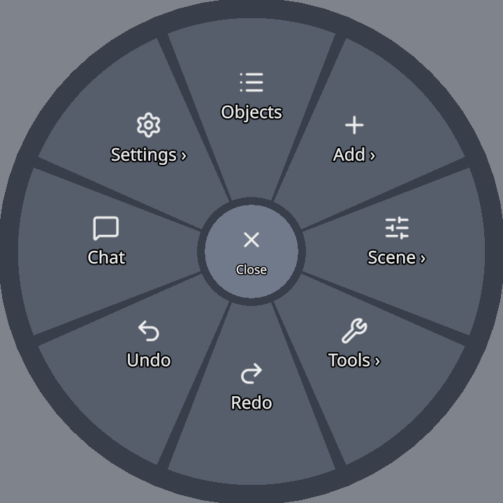
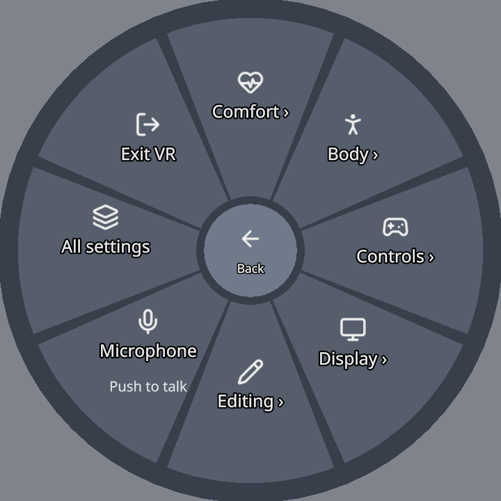
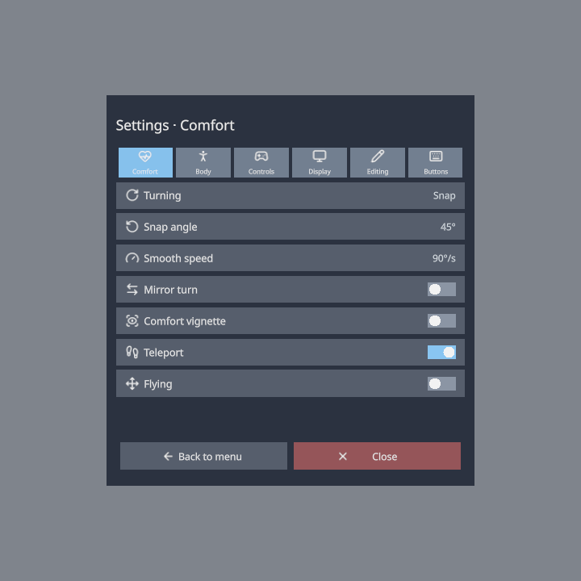

# VR Guide

ThePrototype runs in a WebXR headset browser — build, edit and collaborate in room-scale with the same scene your desktop peers see. This page maps out the controls, the radial menu and the VR-specific settings.

!!! note
    VR is fully collaborative: your movement, hands, selections, edits, notes and pings all replicate. Desktop and VR peers share one scene.

## Entering VR

Open the app in your headset browser and press the on-screen **Play** button. When a headset is present the button wears a pair of goggles instead of the play triangle, so you can see where the press is about to take you — and with passthrough on it shows **A** and **R** in the lenses. Passthrough/mixed-reality is a Settings toggle that keeps your room visible behind the scene.

In a Quest's browser the page can also offer the browser's own **Enter VR** button, once per visit (the **Offer Enter VR**
setting — see [Tours](tours.md#settings)). The first time you enter VR on a device, the [welcome tour](#welcome-tour)
shows you your controllers.

If someone is in the room **with** you, see [Colocation](colocation.md) — a short calibration puts the same objects on the same real table for both of you.

**Refresh rate** — under **Settings ▸ VR ▸ Display** (or radial **Settings ▸ Display**) you can pick **Max / 90 / 120 Hz**. *Max* uses the highest your headset reports; 120 Hz needs the Quest 120 Hz system setting enabled and applies on VR entry.

## The controllers at a glance

| Input | Does |
|---|---|
| **Trigger** | Point & select — pick objects, press menu tiles, paint colors, draw, pick faces/vertices. |
| **Grip / squeeze** | Grab the pointed object and move it. |
| **Both grips (empty air)** | Grab the *world* — move, rotate and scale yourself relative to the scene. |
| **Left thumbstick** | Move / strafe (forward follows your aim while VR flying is on). |
| **Right thumbstick up** | Aim & fire a teleport arc. |
| **Right thumbstick left/right** | Turn — in snap steps or smoothly (**Settings ▸ Comfort ▸ Turning**). |
| **Right-hand B button** | Toggle the radial menu (**Y** on the left hand if your menu hand is the left). |
| **Right-hand A button (hold)** | Push-to-talk voice. In a game (Interact or Play) whose character can jump, **A** jumps instead. |
| **Left-hand X button** | In a game, opens the game's pause menu (Resume, Restart, Levels, Settings, How to play, Main menu). |
| **Right thumbstick click** | Ping where you're pointing. |

One hand is the **menu/pointer hand** (right by default; **Settings ▸ Controls ▸ Menu hand**), the other drives
locomotion. These are the default buttons: every action except grab and select can be
[remapped](#remapping-your-buttons).

## Playing games in VR: Edit and Interact

A **game** (a scene with a menu screen, a start spot, or a game module) opens in **Interact** when
you put the headset on:

- your **grips grab and knock** things. They do not move the world — unless the game asks for it: Untangle and the
  Jam Room let a grip in empty air move, turn and scale the whole scene, as in Edit (a grip on something you can hold
  still holds it);
- the **left stick walks** you: walls stop you, gravity keeps you on the floor, small steps climb.
  No flying or teleporting unless the scene allows it. Where a game allows teleport it **keeps you inside**: you land
  only on walkable ground inside the play area, never through a wall — a **red arc** means that spot is refused and
  releasing does nothing;
- editor helpers (the grid, light and collider wireframes, outlines) are hidden;
- the game's menu, pause and results screens float in front of you — point the laser and pull the
  trigger (or poke them); the score sits on your **left wrist** (turn it to read) and on a
  **top strip** across the top of your view. The board's **Top strip** button switches the strip off or on (remembered on
  this device). The laser ends in a solid dot and the button under it lights up, and menus are drawn over the scene so
  a floor or a wall never hides them;
- the left **X** button opens the game's pause menu;
- **hold the trigger and sweep** across piano keys, drum steps, pads, mixer mutes or pedal
  footswitches — each one you pass fires once;
- the controllers vibrate for touches, presses, grabs and knocks.

Press **Y** on the left controller (B on the right if your radial menu is on the left hand, or the
button you mapped to **Edit / Interact**) to switch to **Edit** — a tick in your hand and a small wrist label say which mode you are in. In
Edit your grips move, turn and scale the world again, you can fly and teleport, and the helpers
come back. Press it again to return to Interact; the game puts you back on its start spot. The
menu board's **Edit mode** button does the same.

On a desktop, press **Esc** to leave Play, then the bar's Edit/Interact cell (or **I**).

## The radial menu

Press **B** on the right controller (or the button you [mapped](#remapping-your-buttons) to it) to open the radial menu on
that hand. On hand-tracked hands, which have no buttons, **pinch and hold** for about half a second instead; a quick pinch
stays a normal click.

Point at a sector with the other hand's laser, or push either thumbstick toward it, then pull the trigger or press the
stick. The hovered sector lifts toward you and a picked one flashes. The ring you are in is named above the menu, and
nothing is more than two rings below the first one.

The **centre hub** is:

- **Close** on the first ring,
- **Selected** on the first ring when something is selected — everything you can do to the selection,
- **Back** in every other ring.

With **Hold to open menu** on (Settings ▸ Controls), hold the menu button and let go over a sector. Letting go over a
sector that opens another ring opens that ring and keeps the menu up.

### The first ring

The names and icons match the desktop menus:

| Sector | Does |
|---|---|
| **Objects** | opens the scene object list panel |
| **Add ▸** | the viewport menu's Add: Cube, Wedge, Stairs, Sphere, Cylinder, Torus, and **Prefabs** |
| **Scene ▸** | **Environment ▸** (Studio, Daylight, Sunset, Night, Classic), **Colocate ▸** (see [Colocation](colocation.md)), **Grid**, **World 1:1** (undo a scaled or rotated world grab) |
| **Tools ▸** | Select, Box select, Draw mode, Ping, Simulate physics, **Profile ▸** |
| **Redo** · **Undo** | step through history |
| **Chat** | opens the VR chat panel |
| **Settings ▸** | every VR setting, the microphone, the welcome tour and Exit VR ([below](#settings)) |

**Tools ▸ Profile ▸** holds **Record** and **Record detailed** (**Stop recording** while one runs) and **Report moment** —
see [Profiling the headset](profiler.md#profiling-the-headset-from-the-desktop).

### Selected

With something selected, press the hub. The **Selected** ring follows the desktop object menu's order, with **Delete**
last:

**Duplicate** · **Edit mesh** · **Properties** · **Color** · **Snapping** · **Wireframe** · **Save prefab** ·
**Edit collider** · **Delete**

- **Edit mesh** opens the face and vertex tools (Extrude, Inset, Move, Delete — see [below](#editing-meshes-in-vr)). Its
  slot shows **Ungroup** for a group, **Edit spline** for a spline, and **Group selection** when several objects are
  selected.
- **Color** opens a live palette, **Snapping** its side-menu.
- **Edit collider** shapes the object's collider in the headset — see
  [Colliders](colliders.md#editing-a-collider-in-vr).
- With several objects selected, Duplicate, Save prefab and Delete act on all of them and show how many.

### Settings

**Settings ▸** has a ring per page — **Comfort**, **Body**, **Controls**, **Display** and **Editing** — plus:

- **Microphone** — press to cycle *Push to talk* / *Open* / *Off*;
- **Welcome tour** — plays the [VR welcome](tours.md#welcome-to-theprototype-vr) again;
- **All settings** — the settings panel;
- **Exit VR**.

Each sector in a page's ring shows the setting's current value. Pressing it flips, cycles or steps the value, and the ring
stays open so you can see the change.

**All settings** opens a panel with the same rows, one page per tab, plus a **Buttons** tab
([remapping](#remapping-your-buttons)). Point and pull the trigger, or use a stick: up and down move between rows, left
and right change a value (or the page, on the tab strip), and a stick press presses the row. **Back to menu** returns you
to the Settings ring.

## Getting around

- **Move** — push the left thumbstick. With **VR flying** on, forward follows where your controller aims; otherwise it stays level. Hold the **left grip** to switch the stick to panning and elevation.
- **Teleport** — push the **right thumbstick up** to arc a beam, release to blink to the landing spot (in Edit: the ground or any upward-facing surface; in a game, only walkable ground inside the play area — a red arc is refused). Toggle teleport in Settings.
- **Turn** — push the right thumbstick left/right. **Turning** is *Snap* (fixed steps of the **Snap angle**, 15–90°, default 45°), *Smooth* (a steady turn at the **Smooth speed**) or *Off*, in **Settings ▸ Comfort**; **Mirror turn** flips the direction, and the **Comfort vignette** darkens the edges of your view while you turn or move. This works in Edit and in games alike.
- **World grab** — grip with **both hands in empty air** to grab the whole world: pull your hands apart/together to scale, twist to rotate, move to reposition. **Scene ▸ World 1:1** snaps it back to normal. Holding the world with **one** grip, push the stick **up/down** to send it away or bring it closer, as with an object.

## Grabbing, scaling and stretching

- **Grip** an object to grab it. The default *rigid* grab treats the controller as a handle — the grabbing hand's thumbstick reels the object nearer/farther and scales it. (Other grab styles: **Settings ▸ Controls ▸ Grab style**.)
- **Two hands** on the same object scales it uniformly by the distance between them. Two hands on **two different** objects hold one each (Towers' blocks): letting go of one never freezes the other.
- In **Edit**, walls and floors are scenery and a grip on them moves the world — **select** one first to grip it.
- **VR Stretch** — non-uniform, per-axis scaling. From the Edit menu, grab the **W/H/D slider handles** and drag horizontally to stretch that axis; the result is baked when you confirm.
- **Box select** (Tools ▸ Box select) — pull the trigger to anchor one corner, drag out a box, release to select everything inside it.

## Editing meshes in VR

VR supports both face and vertex editing:

- **Faces** — point at a face and Extrude, Inset, Move or Delete it. Extrude/Inset become a live adjust you drive by moving the controller; you can also grip a face to grab it directly.
- **Vertices** — pick vertex handles with the ray, or grip-drag them. *Hold to move vertex* (Settings) chooses between hold-style and toggle-style dragging.

!!! warning "Density caps"
    To stay smooth in VR, mesh editing is limited to **2500 triangles** for face editing and **800 vertices** for vertex editing by default; denser meshes refuse with a toast. Both limits are yours to change in **Settings ▸ VR ▸ Editing ▸ Face edit limit / Vertex edit limit** (also radial **Settings ▸ Editing**). The full-featured mesh editor is desktop-only.

## Floating panels

The menu opens follower panels that hang in space — Objects, Properties, Color palette, Prefabs, Keyboard, Chat, Stats, plus the Edit/Snap/Settings menus. Every panel is **grip-grabbable**: hold the grip on a panel to detach and reposition it, and the gripping hand's stick resizes it. Your layout is remembered; **Reset panel positions** (VR Settings, or the desktop Settings button) restores the defaults.

Typing uses the **VR keyboard** — it pops up for renaming an object and for chat messages; point at keys and press with the trigger.

## The sleeve palette

**Settings ▸ VR ▸ Editing ▸ Sleeve palette** (experimental, off by default; also radial **Settings ▸ Editing**) puts a strip
of ghost primitives along the forearm of your other hand (not the menu hand), like a bracer. Point at one and **trigger-drag** it off: it follows your
controller, the stick scales it and your wrist turns it; release the trigger to place it (one undo step). **Grip-drop** an
object of yours onto the strip to keep it as a personal slot — those are saved on this device only.

## Hand models

How you see hand-tracked *peers* is a local choice — **Settings ▸ VR ▸ Display ▸ Peer hands** (also radial **Settings ▸ Display**):

- **Model** — rounded capsule hands,
- **Hands** — cuboid finger bones,
- **Spheres** — a sphere per joint.

You can also set **My hand model** to a GLB from your Explorer library — it becomes part of your identity, pushed to peers so they see your custom hands rigidly posed at your wrists.

## Pinging in VR

Click the **right thumbstick** (or **Tools ▸ Ping**) to ping where you're pointing. If the ray hits an object, the ping flashes a highlight on it for everyone; otherwise it marks the point on the ground. Pings carry your chosen color and chime and buzz a short haptic pulse — see [Pinging](notifications.md#pinging).

## Voice in VR

Hold the **right-hand A button** for push-to-talk, or set a mic mode (**Push to talk / Open / Off**) with the radial menu's **Settings ▸ Microphone**. A mic dot in the corner glows green while you transmit. Voice is spatial — peers hear you from where your avatar stands.

## VR settings reference

The same settings, with the same names and in the same order, are in the radial menu's **Settings ▸** rings, the
headset's **All settings** panel, and desktop **Settings ▸ VR**. Search desktop Settings by any word in a row — *vr*,
*seated*, *smooth turn*, *vignette*, *remap* — or by what it is for (*wheelchair* finds **Stance**).

| Page | Settings |
|---|---|
| **Comfort** | **Turning** (Snap / Smooth / Off), **Snap angle** (15 – 90°, default 45°), **Smooth speed** (45 – 180°/s, default 90°/s), **Mirror turn**, **Comfort vignette**, **Teleport**, **Flying** |
| **Body** | **Stance** (Standing / Seated), **Height** (±50 cm in 5 cm steps) |
| **Controls** | **Menu hand** (Right / Left), **Hold to open menu**, **Left-handed**, **Grab style**, **Remap buttons**, **Reset buttons** |
| **Display** | **Refresh rate** (Max / 90 / 120 Hz), **FPS and draw calls**, **Statistics card**, **Peer hands**, **Passthrough** (applies the next time you enter), **Selection wireframe**, **Reset panel positions** |
| **Editing** | **Hold to move vertex**, **Sleeve palette** (experimental), **Face edit limit** (2500), **Vertex edit limit** (800) |

- **Smooth turning** and the **comfort vignette** (the edges of your view darken while the stick moves or turns you) work
  everywhere — in Edit as well as in games. Before 1.22 they only worked inside games. A game whose own Turning setting is
  *Default* follows yours.
- **Seated** lifts your view to a standing eye height, measured from your head when you switch to it. **Height** adds to
  that. While you walk in a game your feet stay on the floor.

## Remapping your buttons

**Settings ▸ VR ▸ Controls** on the desktop, or **Settings ▸ Controls ▸ Remap buttons** in the headset (the **Buttons** tab
of All settings), lists every VR action with its hand and button:

**Move** · **Turn** · **Teleport** · **Radial menu** · **Edit / Interact** · **Game menu** · **Talk / jump** · **Ping** ·
**Drag the world**

**Grab** and **Select / use** are not on the list: they are always either grip and either trigger.

- If you pick a button another action already uses, you get a warning and nothing changes. Choose **Swap them**, or press
  the row again in the headset, to trade places. For example, moving Move to the right hand takes Turn and Teleport over
  to the left stick.
- **Left-handed** mirrors every button to the other hand. **Reset buttons** brings back the defaults.
- Remapping is saved on this device only. Your peers keep their own buttons.
- The [welcome tour](tours.md) names and lights *your* buttons, not the defaults.

!!! note
    The Quest's **≡ menu button** (left hand) is reserved by the system and is not available to web apps, so the radial
    menu uses **B** / **Y** instead.

## Welcome tour

The first time you enter VR on a device, **Welcome to ThePrototype VR mode** walks you through your controllers in eight
short steps; each one moves on when you do what it asks. Replay it from the radial menu's **Settings ▸ Welcome tour**, or
from desktop **Settings ▸ Interface ▸ Tours**. See [Tours](tours.md).

!!! note
    On-device feel — comfort, reach, turning speed — is best judged in the headset. If motion bothers you, start with
    teleport on, **Snap** turning and the **Comfort vignette**, or switch **Stance** to **Seated**.
