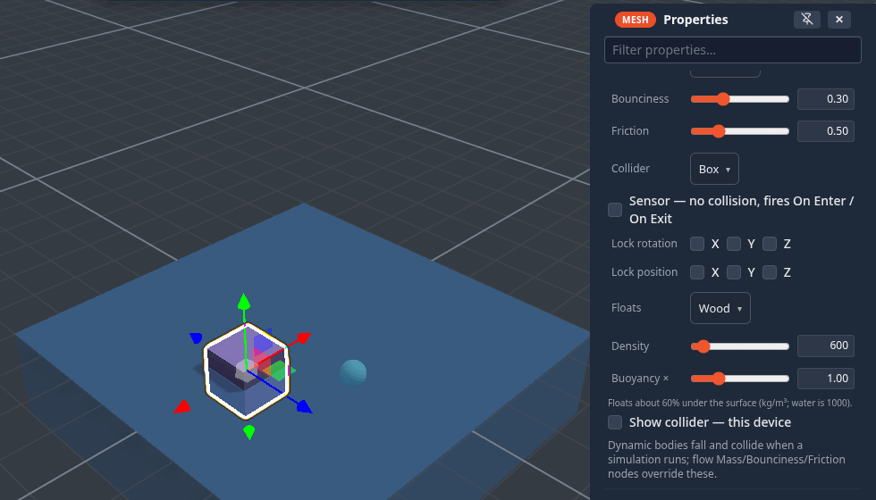
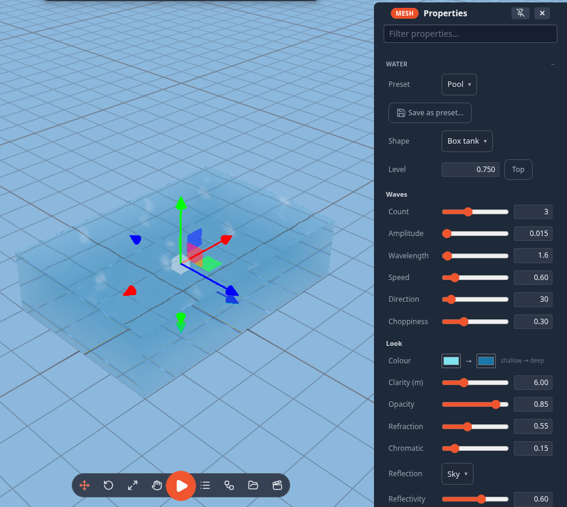

# Water

Any object can be water: a tank, a pool, a lake, an ocean, a pool of lava. Water has waves, see-through refraction, light
patterns (caustics) on the floor, foam on wave crests and along the shore, a sky or mirror reflection, underwater fog when
your camera goes inside, and bubbles that rise and pop at the surface. Everyone in the session sees the same water, and
the waves move in step on every screen.

<!-- 36-docs: written from the 36-water fragment; images are the lane's captures — re-shoot from the 1.22 preview -->

## Adding water

- **Add ▸ Water** (right-click the viewport, or the **+** button on a phone): **Water tank**, **Pool**, **Ocean**,
  **Round pool**, and **Bubbles** — a bubble emitter you can drop into any water.
- Or select any object and use **Properties ▸ Water ▸ Make it water…** — that object's shape becomes a water volume.
- **In VR**, the Properties panel shows **Make it water** for a dry object, and Water rows (preset, level, waves, clarity,
  refraction, foam, caustics, bubbles, remove) for a water object.

The water object stays an ordinary object: move, scale and rotate it with the gizmo. It is a pass-through physics
[sensor](colliders.md#sensors-trigger-volumes), so things fall into it — and, with a simulation running, [float](#things-float).

## Things float

While a simulation runs, every **dynamic** object inside a water volume floats, sinks or drifts: it is pushed up by the
water it displaces, slowed by the water, carried by the water's flow (rivers), and tips back upright. Hitting the surface
makes a ripple.

Choose how in **Properties ▸ Physics ▸ Floats** (Body: Dynamic):

| Floats | Behaves like |
|---|---|
| **Auto** (default) | floats half under |
| **Foam**, **Cork**, **Wood**, **Ice** | float, lightest first |
| **Rubber** | sinks slowly |
| **Stone**, **Metal** | sink |
| **From mass ÷ volume** | worked out from the object's Mass and size |
| **Off** | ignores water |

**Density** (kg/m³ — water is 1000) and **Buoyancy ×** fine-tune it, and the hint under the sliders says how deep it will
sit. How deep something floats depends on its **density**, not its mass, so a light and a heavy crate of the same wood
float equally. The peer running the simulation computes it and everyone sees the same motion; each player draws their own
ripples.

## Presets

**Preset**: **Pool**, **Aquarium**, **Ocean**, **Lake**, **River** (it flows), **Lava** (glows, opaque), **Swamp**,
**Toxic**, **Ice** (frozen). **Save as preset…** keeps your own look on this device under a name; it then appears in the
Preset list with a ★.

## Tuning it

| Group | Rows |
|---|---|
| **Shape** | Box tank, Cylinder, Ocean (no floor) |
| **Level** | how full it is; **Top** fills it |
| **Waves** | count, amplitude, wavelength, speed, direction, choppiness |
| **Look** | shallow → deep colour, clarity, opacity, refraction, chromatic split, reflection (Sky / Planar mirror / None) and reflectivity, foam, caustics, ripples, glow, underwater colour and visibility, frozen |
| **Flow & physics** | flow speed, density, drag |
| **Bubbles** | count, rate, size, rise speed, wobble, spread, colour, pop at the surface, continuous or **Burst now** |

Every edit replicates to the session and is one undo step per slider drag.

## Quality

**Settings ▸ Performance ▸ Water quality**: **Auto**, **High**, **Medium**, **Low**.

- On **Medium** the view through the water is drawn at half resolution.
- **Low** — and every headset — skips refracting the real scene, caustics and the planar mirror. The water still has
  waves, ripples, colour by depth, foam on crests and the sky reflection.

## Limits

- Keep water upright: the surface is the object's own level plane, so tilting the object tilts the water.
- Refraction shows what the camera can see — something hidden behind another object will not appear through the water.
- One planar mirror at a time: the nearest water that asks for it; the others use the sky reflection.
- An imported model with water keeps its own look; the water draws inside its bounds.

## For module authors

`api.water` creates and configures water, applies presets, queries a point (depth, surface height, flow), disturbs the
surface (ripples), bursts bubbles and reports changes with `onChange`. See the [Module SDK](module-sdk.md) and
`MODULES.md ▸ Water` in the core repository.
