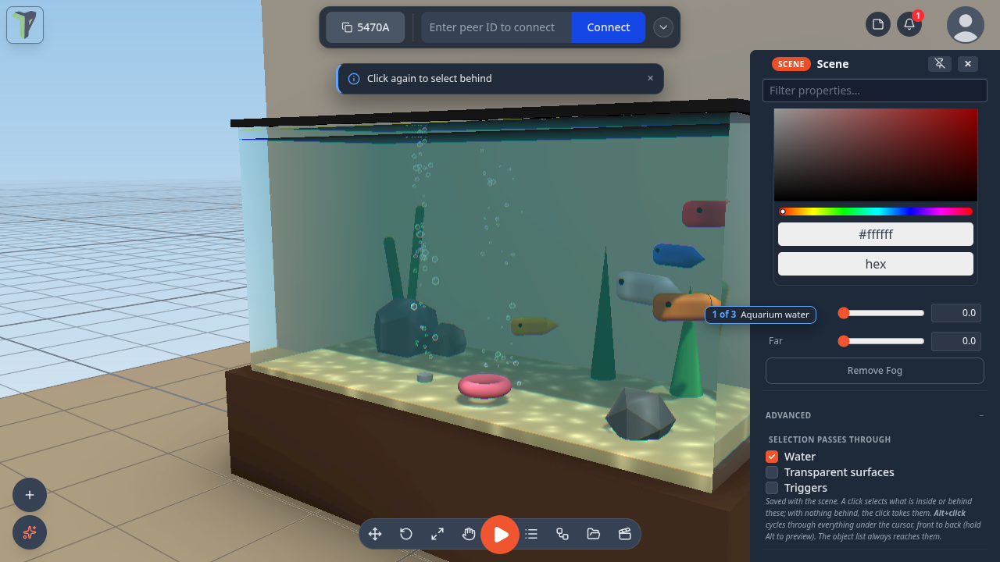
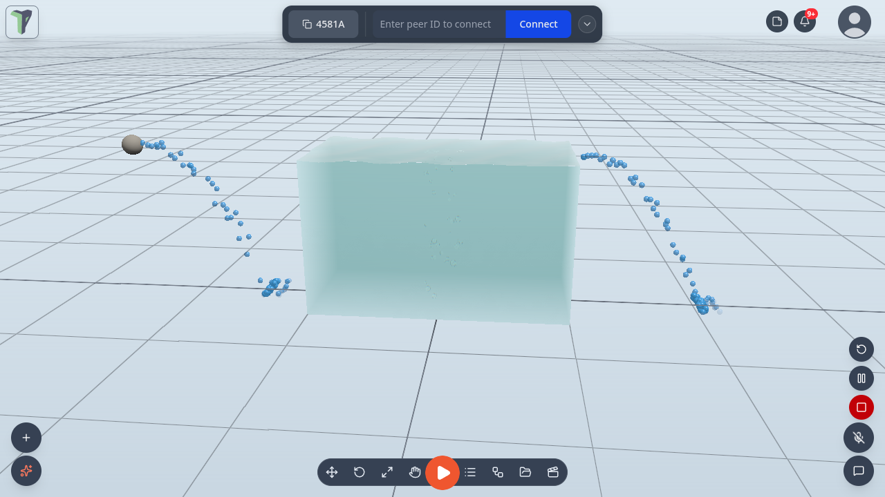
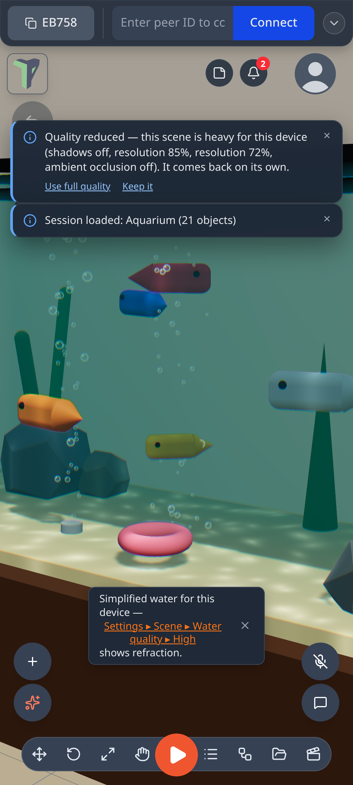

# Water

Any object can be water: a tank, a pool, a lake, an ocean, a pit of lava. Water has waves, see-through refraction, light
patterns (**caustics**) on the floor, foam on the wave crests and along the shore, a sky or mirror reflection,
underwater fog when your camera goes inside, and bubbles that rise and pop at the surface. Everyone in the session sees
the same water, and the waves move in step on every screen.

## Where it is

- **Add ▸ Water** (right-click the viewport, or the **+** button on a phone): *Water tank*, *Pool*, *Ocean*, *Round pool*,
  *Bubbles* (a bubble emitter you can drop into any water) and *Pour* (a spout — see [Pour emitters](#pour-emitters)).
  *Fluid* and *Flow path* add particle water and rivers — see [Fluids](fluids.md).
- **Properties ▸ Water** on any selected object: **Make it water…** turns that object's shape into a water volume;
  **Add bubble emitter** and **Add pour emitter** give any object bubbles or a spout.
- **In VR**: the Properties panel shows *Make it water* for a dry object, and Water rows (preset, level, waves, clarity,
  refraction, foam, caustics, bubbles, remove) for a water object.
- **Settings ▸ Scene ▸ Water quality**: Auto / High / Medium / Low, for this device only (see [Quality](#quality)).

## Making water

1. **Add ▸ Water ▸ Pool**. The pool is selected and its properties open.
2. Pick a **Preset** (below).
3. Tune it, section by section:

    | Section | What you set |
    |---|---|
    | **Shape** | Box tank, Cylinder, or Ocean (no floor) |
    | **Level** | how full it is; **Top** fills it to the brim |
    | **Waves** | count, amplitude, wavelength, speed, direction, choppiness |
    | **Look** | shallow → deep colour, clarity, opacity, refraction, chromatic split, reflection (*Sky*, *Planar mirror* or *None*), foam, caustics, ripples, glow, underwater colour and visibility, frozen |
    | **Flow & physics** | flow speed, density, drag, **flow up** (an upward current: a bubbler, a fountain basin) and **bob damping** (lower = things keep bobbing longer; 4 is the default) |
    | **Bubbles** | count, rate, size, rise speed, wobble, spread, colour, pop at the surface, continuous or **Burst now** |

4. **Save as preset…** keeps your look on this device under a name. It then appears in the Preset list, marked ★.

Every edit replicates to the session, and one slider drag is one undo step. The water object stays a normal object: move,
scale and rotate it with the gizmo.

Since 1.25 every Water setting changes the picture on every preset and shape (a test fails if one ever stops). A few
that used to do little:

- **Opacity** — 0 is clear glass, 1 is a solid colour; the presets keep their value.
- **Visibility (m)** — how far you see through the water: from inside it (underwater fog) and now also from outside —
  anything further through the water than this fades into the fog colour.
- **Foam** — a tank or pool now foams along the line where its surface meets its walls, as well as on wave crests and
  around things poking through the surface, on the desktop and on a Quest.

## Presets

| Preset | Looks like |
|---|---|
| **Pool** | clear blue water with caustics on the floor |
| **Aquarium** | a glass tank of clear water with bubbles |
| **Ocean** | big rolling waves with no floor, out to the horizon |
| **Lake** | calm green-blue water that mirrors the sky |
| **River** | water that **flows**, and carries floating things with it |
| **Lava** | glowing and opaque |
| **Swamp** | murky green, short visibility |
| **Toxic** | bright green and glowing |
| **Ice** | frozen solid |

## Underwater

Put the camera inside the water and the view fogs over in the water's **underwater colour**, as far as its
**visibility** reaches. Bubbles rise past you and pop at the surface.

## Things in the water

A water object is a pass-through physics **sensor** in the *Water* [collision group](colliders.md#collision-groups):
things fall **into** it instead of landing on it, and it still fires [On Enter](nodes/onenter.md) and
[On Exit](nodes/onexit.md). While a simulation runs, dynamic objects in it rise, float, sink or drift with the flow by
their density, wherever you put them under the surface — see [Things float](physics.md#things-float). A pool sunk into
the ground works too: the scene ground has a hole wherever water goes below it. A
[Fluid tank](simulation.md#fluid-tank) is a different thing: a glass box of particle fluid you can pour.

### Selecting things in the water

Since 1.25 a click selects what is **inside or behind** the water — a fish in the Aquarium, a toy in a pool — and
<kbd>Alt</kbd>+click cycles through everything under the cursor, front to back. **Configure Scene ▸ Advanced ▸ Selection
passes through ▸ Water** (on by default) turns this off for a scene. See
[Inside and behind water](controls.md#inside-and-behind-water).

The selected object is drawn un-refracted, exactly under its outline; the rest of the water still refracts. (Before,
the outline sat beside the refracted fish.)

## Bubble emitters

**Properties ▸ Water ▸ Add bubble emitter** on any object makes bubbles you can see: they rise from the object's top
across its whole footprint, bigger by default, with a thin darker rim so they read against a bright sky or a white
floor.

## Pour emitters

**Add ▸ Water ▸ Pour** places a spout; **Properties ▸ Water ▸ Add pour emitter** adds one to any object — a Water tank
gets a spout on its rim.

- Settings: **Pouring** (on/off), **Rate**, **Speed**, **Spread**, **Heading**, **Tilt**, **Spout height**, **Colour**,
  **Drop size**, and two limits, **Max drops** and **Lifetime**, so it never builds up.
- Drops arc out, **splash into water** (a ripple) and **settle** where they land, then dry up.
- Each player sees their own drops; the settings are shared. An emitter is one draw call, cheap enough for a Quest.

For particle water that pools, splashes and flows, use a [Fluid emitter](fluids.md#fluid-emitter).

## Rain and snow

**Rain** and **Snow** are particle presets: **Add ▸ Effects ▸ Rain** or **Snow**, or the **Effects** menu of any object.
They work like every other emitter — see [Particle Effects](particles.md).

## Quality

**Settings ▸ Scene ▸ Water quality** applies to this device only and is never saved into a scene:

| Quality | What you get |
|---|---|
| **High** | refraction, caustics, shoreline foam and the planar mirror at full resolution |
| **Medium** | the same at half resolution |
| **Low** | the headset look: waves, ripples, colour by depth, foam on crests and the sky reflection — no refraction of the scene and no planar mirror. Since 1.25 it still bends the light: lensing bands follow the waves and ripples (one side of a band tints, the other focuses light onto the floor) and caustic glints play on the floor seen through the water |
| **Auto** (default) | follows this device's current quality level — Low in a headset or when the scene is heavy |

**On a phone** (since 1.25) water and [fluid tanks](simulation.md#fluid-tank) follow the device's current quality level
live. At a phone's start level the water refracts at half resolution. A phone that keeps its frames steps the quality
back up by itself in the seconds after a scene has loaded — full refraction on the water, a smooth surface on the fluid
tanks; one that cannot keep up gets the lighter look. On the lighter look, **Refraction**, **Ripples** and **Caustics**
control the lensing bands and glints.

When the quality level simplifies the water, a small notice says so once per session: *Simplified water for this device
— Settings ▸ Scene ▸ Water quality ▸ High shows refraction*. Tap the path to open the setting, **✕** to dismiss. It never
shows in Play or in VR.

Search Settings for *water*, *caustics* or *refraction* to find the row.

## Examples

**Menu ▸ Templates ▸ Examples** has three water scenes: **Aquarium**, **Pool party** and **Island ocean** (its boat
floats and rides the swell). Pool party and Island ocean have
[Start simulation on load](physics.md#start-simulation-on-load) on, so they move as soon as they open. For particle
water, see **Water works** on the [Fluids](fluids.md#example-water-works) page.

## For module authors

Modules get `api.water`: create and configure water, apply a preset, query depth, surface height and flow at a point,
disturb the surface with ripples, burst bubbles, and listen for changes. See [Module SDK](module-sdk.md) and MODULES.md
▸ Water.

## Limits

- Keep water upright: the surface is the object's own level plane, so tilting the object tilts the water.
- Refraction shows what the camera can see. Something hidden behind another object does not appear through the water.
  On Medium the view through water is half resolution.
- Low, and every headset, skips refraction of the scene and the planar mirror. The water still has waves, ripples,
  colour by depth, foam on crests, the sky reflection, lensing bands and caustic glints.
- A rotated pool cuts the scene ground by the box around it (a little more than its footprint). The hole is in the
  physics ground only: a walking player in a scene with no physics running still walks on the flat ground plane.
- Pour drops settle on the ground and on the tops of objects' bounding boxes, not on slopes.
- One planar mirror at a time: the nearest water that asks for it gets it, and the others use the sky reflection.
- An imported model made into water keeps its own look; the water draws inside its bounds.
