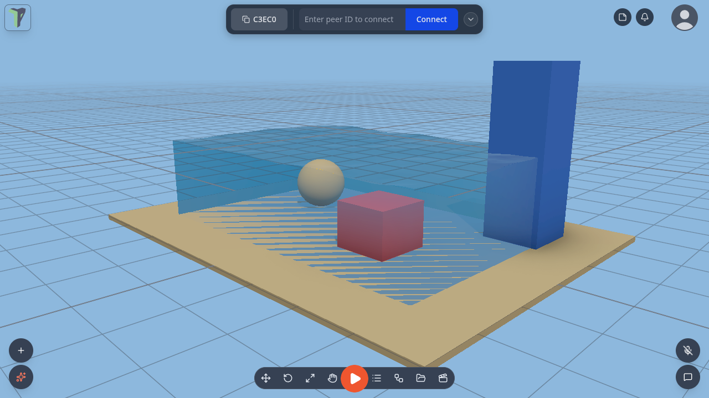
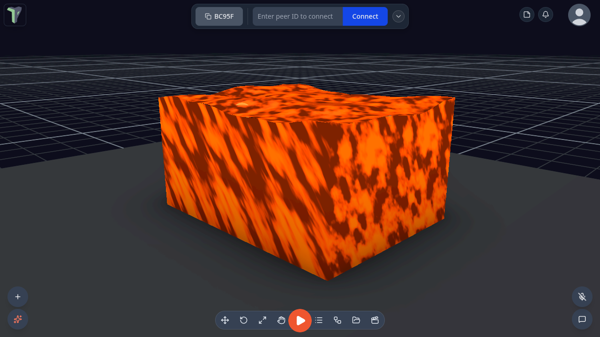
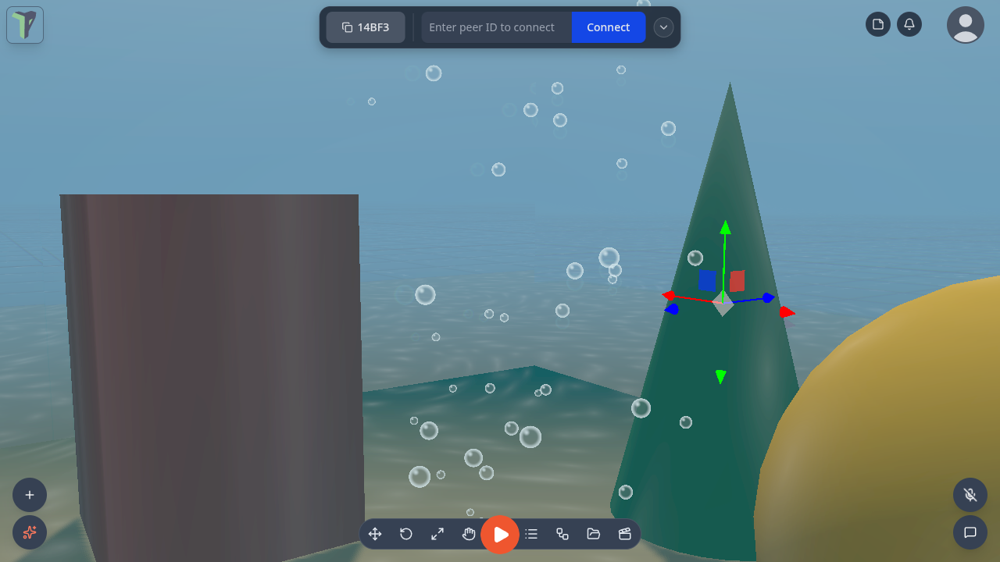

# Water

Any object can be water: a tank, a pool, a lake, an ocean, a pit of lava. Water has waves, see-through refraction, light
patterns (**caustics**) on the floor, foam on the wave crests and along the shore, a sky or mirror reflection,
underwater fog when your camera goes inside, and bubbles that rise and pop at the surface. Everyone in the session sees
the same water, and the waves move in step on every screen.

## Where it is

- **Add ▸ Water** (right-click the viewport, or the **+** button on a phone): *Water tank*, *Pool*, *Ocean*, *Round pool*
  and *Bubbles* (a bubble emitter you can drop into any water).
- **Properties ▸ Water** on any selected object: **Make it water…** turns that object's shape into a water volume.
- **In VR**: the Properties panel shows *Make it water* for a dry object, and Water rows (preset, level, waves, clarity,
  refraction, foam, caustics, bubbles, remove) for a water object.
- **Settings ▸ Scene ▸ Water quality**: Auto / High / Medium / Low, for this device only (see [Quality](#quality)).

## Making water

1. **Add ▸ Water ▸ Pool**. The pool is selected and its properties open.
2. Pick a **Preset** (below).
3. Tune it, section by section:

    | Section | What you set |
    |---|---|
    | **Shape** | Box tank, Cylinder, or Ocean (no floor) |
    | **Level** | how full it is; **Top** fills it to the brim |
    | **Waves** | count, amplitude, wavelength, speed, direction, choppiness |
    | **Look** | shallow → deep colour, clarity, opacity, refraction, chromatic split, reflection (*Sky*, *Planar mirror* or *None*), foam, caustics, ripples, glow, underwater colour and visibility, frozen |
    | **Flow & physics** | flow speed, density, drag |
    | **Bubbles** | count, rate, size, rise speed, wobble, spread, colour, pop at the surface, continuous or **Burst now** |

4. **Save as preset…** keeps your look on this device under a name. It then appears in the Preset list, marked ★.

Every edit replicates to the session, and one slider drag is one undo step. The water object stays a normal object: move,
scale and rotate it with the gizmo.

## Presets

| Preset | Looks like |
|---|---|
| **Pool** | clear blue water with caustics on the floor |
| **Aquarium** | a glass tank of clear water with bubbles |
| **Ocean** | big rolling waves with no floor, out to the horizon |
| **Lake** | calm green-blue water that mirrors the sky |
| **River** | water that **flows**, and carries floating things with it |
| **Lava** | glowing and opaque |
| **Swamp** | murky green, short visibility |
| **Toxic** | bright green and glowing |
| **Ice** | frozen solid |

## Underwater

Put the camera inside the water and the view fogs over in the water's **underwater colour**, as far as its
**visibility** reaches. Bubbles rise past you and pop at the surface.

## Things in the water

A water object is a pass-through physics **sensor** in the *Water* [collision group](colliders.md#collision-groups):
things fall **into** it instead of landing on it, and it still fires [On Enter](nodes/onenter.md) and
[On Exit](nodes/onexit.md). While a simulation runs, dynamic objects in it float, sink or drift with the flow — see
[Things float](physics.md#things-float). A [Fluid tank](simulation.md#fluid-tank) is a different thing: a glass box of
particle fluid you can pour.

## Rain and snow

**Rain** and **Snow** are particle presets: **Add ▸ Effects ▸ Rain** or **Snow**, or the **Effects** menu of any object.
They work like every other emitter — see [Particle Effects](particles.md).

## Quality

**Settings ▸ Scene ▸ Water quality** applies to this device only and is never saved into a scene:

| Quality | What you get |
|---|---|
| **High** | refraction, caustics, shoreline foam and the planar mirror at full resolution |
| **Medium** | the same at half resolution |
| **Low** | the headset look: waves, ripples, colour by depth, foam on crests and the sky reflection — no refraction of the scene, no caustics, no planar mirror |
| **Auto** (default) | picks Low in a headset, on a phone or when the scene is heavy |

Search Settings for *water*, *caustics* or *refraction* to find the row.

## Examples

**Menu ▸ Templates ▸ Examples** has three water scenes: **Aquarium**, **Pool party** and **Island ocean**.

## For module authors

Modules get `api.water`: create and configure water, apply a preset, query depth, surface height and flow at a point,
disturb the surface with ripples, burst bubbles, and listen for changes. See [Module SDK](module-sdk.md) and MODULES.md
▸ Water.

## Limits

- Keep water upright: the surface is the object's own level plane, so tilting the object tilts the water.
- Refraction shows what the camera can see. Something hidden behind another object does not appear through the water.
  On Medium the view through water is half resolution.
- Low, and every headset, skips refraction of the scene, caustics and the planar mirror. The water still has waves,
  ripples, colour by depth, foam on crests and the sky reflection.
- One planar mirror at a time: the nearest water that asks for it gets it, and the others use the sky reflection.
- An imported model made into water keeps its own look; the water draws inside its bounds.
